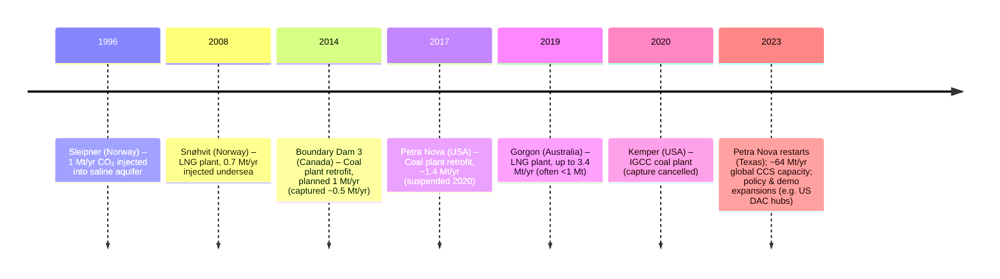

# Executive Summary  
CCS (including CCUS, DAC, BECCS) is **necessary but challenging**.  Today only **~0.1%** of global CO₂ (~50 Mt/yr) is captured and stored.  Demonstrations (e.g. Sleipner) show *permanent* storage of multi-MtCO₂ volumes with near-zero leakage, but most power/industry demos have fallen short of design.  Costs remain high: capture costs typically **\$15–120/tCO₂** for concentrated sources, even higher for dilute streams; DAC costs are ~$600–1000/t (due to enormous energy needs).  CCS also imposes big energy penalties (~+25–30% fuel use in power plants).  Technical “maturity” varies: post- and pre-combustion capture are commercial (though only a few power/industrial plants exist), oxy-fuel is piloted, DAC and BECCS mostly at pilot stage.  Geologically, **storage capacity is vast (hundreds to thousands of GtCO₂)**, but siting is regionally concentrated (best sites in North America, East Africa, North Sea) and scaling requires huge new pipeline networks and drilling.  

**Key findings:** Current CCS contributes <0.2 Gt/yr; by 2030 few pathways reach ≈1 Gt/yr; mid-century scenarios often assume 5–10+ Gt/yr (IPCC median ~7 Gt/yr in 2050).  CCS’s promise is to abate emissions from hard-to-electrify sectors and enable negative emissions via BECCS/DAC.  Critics warn it is slow, expensive, and can delay clean alternatives.  Table 1 compares main CCS types; Figure 1 (timeline) and Figure 2 (sketch charts) illustrate deployment and trade-offs.  Major uncertainties include learning rates (cost declines), policy support (carbon pricing/incentives), and social acceptance of large CO₂ infrastructure.  **Conclusion:** CCS can play a **significant (multi-Gt/yr)** but not primary role. It will be most valuable where no alternatives exist (cement, steel, chemicals, natural gas processing, hydrogen) or for permanent removals (BECCS, DAC).  Cost and scale remain hurdles: if aggressive policies and continued R&D reduce costs, CCS might plausibly store **5–10 GtCO₂/yr by 2050** (roughly 10–20% of current emissions).  In the near term, focus should be on industry fit-for-purpose projects (with strong legal/regulatory frameworks) and on reaching the first Gt-scale to drive learning and cost-reduction.

## Current Deployment and Performance  
As of 2025, only **tens of MtCO₂/yr** are being captured: 77 facilities (mainly in gas processing or oil operations) collectively ~64 Mt/yr capacity (about 0.13% of 37 Gt/yr CO₂ emissions).  Most are EOR projects (CO₂ used for oil), with ~12 storing without EOR.  Typical *capture rates* in practice are often below design: e.g. the SaskPower Boundary Dam coal plant (BD3) promised 90% but averaged ~57% of its CO₂.  The Petra Nova project (TX) achieved about 72–95% of planned capture over 2017–19; its absorber removed ~92% of CO₂ in the processed flue gas.  By contrast, natural gas processing plants like Norway’s Sleipner have continuously captured ~0.8–1.0 Mt/yr since 1996, safely storing ~19 Mt so far.  

Monitoring at Sleipner shows **no measurable leak**: a 2013 seabed fracture proved to release only natural methane, not stored CO₂.  In general, CO₂ injected deep (>800 m) into saline aquifers or depleted fields is expected to remain trapped by residual/solubility trapping with negligible short-term leakage.  However, permanence is only assured with ongoing monitoring and regulation.  (IPCC/WRI note that geological storage safety is well-established, though long-term fate depends on site management.)  

**Table 1** summarizes capture efficiency, costs, energy draw, maturity and storage permanence for major CCS variants.  (“Capture rate” denotes %CO₂ removed in capture step; “maturity” indicates commercial deployments.)

| Technology     | Capture rate  | Cost\* (\$/tCO₂)        | Energy penalty           | Maturity       | Storage permanence  |
|---------------|-------------|-------------------------|--------------------------|---------------|---------------------|
| **Post-combustion (amine)**  | ~85–95% (target)** | \$40–120 (dilute flue gas) | ~20–30% extra fuel (10–12 pp efficiency loss) | Demo (few projects) | High (deep geology) |
| **Pre-combustion (IGCC)**    | ~90% (pure H₂ route)   | Similar range (\$40–100) | ~20–25% (gasifier+H₂ processing) | Pilot (e.g. failed Kemper) | High |
| **Oxy-fuel combustion**      | ~90% (all flue CO₂)    | \$50–100 (inc. ASU costs) | ~25–30% (air separation energy) | Demo (few boilers) | High |
| **Direct Air Capture (DAC)** | ~100% (ambient CO₂)    | \$300–1000 (today) | ~2000 kWh/t (electric) | Pilot (dozens of plants) | High |
| **BECCS (bio-energy)**       | ~80–90% (stack)       | \$50–200 (bio plant) | ~20–30% (energy used + separate capture) | Demo (pilot plants) | High (includes long-run soil/carbon) |

\* Costs include capture only (central value ranges; transport/storage add \$2–10/t each). Maturity: commercial off-the-shelf for gas processing, emerging for power plants; DAC and BECCS in early deployment. All assume deep storage (permanence ~centuries or more). 

## Demonstrated Effectiveness  
**Real-world capture.**  Demonstration projects show mixed success.  Sleipner (Norway) injected ~1 Mt/yr into a sandstone aquifer since 1996, storing ~19–20 Mt with no leaks.  It exemplifies effective, permanent storage for highly-concentrated sources.  By contrast, large coal retrofits have struggled: Boundary Dam 3 aimed for 90% but long-term capture averaged only ~57%, partly because the capture unit often operated only ~80% of the time.  Petra Nova (Texas) captured ~83% of its target in 2017–19, with performance improving as faults were fixed, but economics (tied to oil price) halted operations in 2020.  The U.S. DOE report noted Petra Nova’s capture unit removed ~92% of CO₂ when running, indicating the technology works under ideal conditions, but system downtimes limit average rates.  

**Storage permanence.**  Geological storage in deep saline or depleted fields is widely considered very stable.  By end-2022 Sleipner had sequestered >19 Mt CO₂; detailed seismic monitoring confirms the plume is contained.  No commercial-scale leakage has been reported at any facility; a notorious 2013 crack at Sleipner emitted natural gas only.  The IPCC SPM emphasizes CCS (including DAC/BECCS) has a similar permanence promise as other greenhouse-gas mitigation: “2–7% of CO₂ may return to the atmosphere by 2100” from well-chosen sites.  (Any such fraction is tiny compared to the multi-decade storage and is considered manageable by normal regulation.)  

## Costs and Economics  
**Capture costs.**  Capture cost widely varies by source.  Highly concentrated CO₂ (ethanol plants, natural-gas processing) costs as low as **\$15–25/t**, while dilute flue gas (power, cement) is typically **\$40–120/t**.  The IEA notes capturing hydrogen-plant CO₂ ranges \$15–120/t depending on concentration.  Reuters (IEA) likewise reports a wide band “\$15–\$120 per tonne depending on source”.  DAC costs are far higher today (~\$600–1000/t) (reflecting its huge energy use).  

Capital costs for CCS add ~80% to a power plant’s baseline investment.  For example, Petra Nova cost ~$1 billion (pilot-scale, \$300M went to capture), doubling its owner’s capital expense.  In general, adding post-combustion capture raises electricity cost by ~50–100%; expert analyses find typical abatement costs ~$150/t (range \$120–200/t) in early projects.  Transport and storage costs add a few \$ per tonne (pipelines \$2–14/t, storage \$2–10/t in good cases).  The DOE and industry aim to bring NOAK (nth-of-a-kind) costs below \$100/t in the 2030s via modular design and learning.  

**Trends.**  Cost projections are mixed.  The Global CCS Institute and IEA expect moderate declines: e.g. learning and economies of scale could bring many capture applications down to \$30–50/t by 2030.  IEA commentary says some MHI estimates from Petra Nova’s learnings cut capex ~30% for future projects.  However, critics note that \$40 B+ invested globally has yielded <0.1% of emissions captured, implying the technology has not yet realized promised cost reductions.  Current tax incentives (e.g. U.S. 45Q: \$50–180/t) aim to bridge the gap.  

## Scalability and Infrastructure  
**Theoretical capacity.**  Geologic storage is **immense**.  Estimates range from hundreds to thousands of gigatonnes (Gt) CO₂ worldwide.  Even the most conservative analyses conclude “far more potential storage resource than needed for CCS to play a major role”.  (One expert noted even 1,000 Gt stored would be a signal achievement.)  Saline aquifers alone may hold ~10,000 Gt.  Thus, in principle, geology is not the main limit.  

**Practical limits.**  The constraint is **deploying** that capacity.  Good storage sites are regionally clustered: e.g. the U.S./Canada Gulf Coast, North Sea, parts of Australia and China, the Rift Valley in Africa.  If CCS were expanded massively, CO₂ would have to be pipelined or shipped across continents.  Indeed, planned “backbone” pipelines (e.g. U.S. Midwest, Europe’s Cross-Carbon) would be needed to connect emitters and sinks.  Local opposition has already stalled some projects: a proposed 3.3 GW-capacity U.S. pipeline (transporting Midwest ethanol CO₂) was canceled amid landowner and leak fears.  

**Resource & supply chain.**  Large-scale CCS demands vast materials and energy.  Thousands of kilometers of pipeline, hundreds of well pads and injection rigs, millions of tonnes of amine solvents or solid sorbent, and immense electricity/steam are required.  A rough example: capturing 1 Gt/yr in power plants might need ~20 new gigawatt-scale capture units and ~50 Mt of amine.  Materially, this strains steel, chemical, and labor supply.  Energy-wise, CCS plants consume ~20–30% of a plant’s output (for power projects, that means 25–30% more fuel per MWh).  DAC in particular would require *doubling* current power grids (hundreds of GW) if scaled to Gt levels.  In sum, while possible in theory, *scaling CCS to the gigatonne level is highly ambitious and resource-intensive*. 

## Energy and Efficiency Penalties  
Capturing CO₂ is energy-hungry.  In a power plant, typical post-combustion CCS imposes a ~10–12 percentage-point drop in net efficiency.  That means ~25–30% more fuel is burned per unit electricity.  (IEA: “25–30% increase in fuel demand per unit output” for plants with today’s amine systems.)  Oxy-fuel has similar penalties: its air separation unit (ASU) uses ~15–20% of plant power.  Pre-combustion (gasification) avoids some loss by converting fuel to H₂, but still loses ~20% in overall energy (gasifier+shift+capture).  

**DAC** is vastly more intensive: current solid-sorbent and solvent DAC require on order 2,000–3,000 kWh of electricity (plus some high-temperature heat) per tonne CO₂.  By comparison, a coal plant emits ~1,000 tCO₂/GWh, so capturing that CO₂ by DAC alone would need 2–3 TWh of extra power – clearly impractical.  DOE/IEA analyses warn DAC could emit more CO₂ (via energy) than it captures unless it is run on clean or waste heat.  

**BECCS** also has penalties: a bioenergy power plant (e.g. wood, waste) yields electricity but must divert ~20–30% of its heat to capture, leaving net power lower.  However, because biomass sequesters new carbon, BECCS yields *net negative emissions* (unlike point-source CCS).  Yet BECCS competes for arable land and biomass supply, a non-energy “penalty” often ignored.  

## Arguments For and Against Deployment  

- **Pros:** CCS is currently the **only scalable option** to abate certain sector emissions.  Hard-to-decarbonize industries (cement, steel, chemicals, refining) inherently produce CO₂ that cannot be eliminated by efficiency or renewable power alone.  For example, cement calcination emits CO₂ chemically – only capture can cut it.  Likewise, CCS is the cheapest way to produce low-carbon hydrogen from fossil fuels (with CCS on the SMR/ATR plant).  BECCS and DAC are also the only technologies that can *remove* excess CO₂ from the atmosphere to help reach net-zero.  The IPCC reports that essentially all 1.5°C scenarios rely on CCS/BECCS/DAC (median ~665 GtCO₂ stored by 2100).  IEA and others emphasize that without CCS, achieving net-zero “will be virtually impossible”.  In short, CCS can bridge technology gaps and tackle the “last 20%” of emissions.  

- **Cons:** *High cost* and *slow rollout* are the primary objections.  As of 2025, only 0.1% of emissions are captured.  Many CCS projects have suffered delays, cost overruns, or poor economics.  Critics note that multi-billion investments have yielded minimal emissions removal.  There are also *environmental and social concerns*: prolonged CO₂ pipeline networks raise leak (and induced seismic) fears; communities often resist new wells and pipelines.  Using captured CO₂ for EOR undermines climate benefit (each tonne injected can produce >2 barrels oil, emitting ~0.4 tCO₂ each).  Some argue CCS could *prolong fossil fuel use* (“moral hazard”), diverting attention from renewables (NGOs claim it’s a “band-aid”).  Indeed, the IEA has warned the oil/gas industry may over-rely on CCS, calling it potentially “an illusion” without strong policy.  There’s also risk that once CCS infrastructure exists, it could “lock in” certain industries.  

- **Policy/finance:**  Widespread CCS demands major policy support.  It is not commercially viable with current carbon prices (often <\$30/t).  As Reuters notes, many projects only make sense via subsidies or EOR revenue.  The U.S. IRA (45Q: \$85–180/t for permanent CCS) and EU RRF funds are stepstones, but uncertain persistence.  Long-term, stable regulation or carbon pricing will be needed to motivate the hundreds of billions in capital CCS demands.

## Uncertainties and Assumptions  

- **Capture rates and availability:** Real capture rates can lag design.  BD3 and Petra Nova underlined the fragility: small faults or outages cause large CO₂ slip. Future projects assume higher reliability, but this remains untested at scale.  

- **Cost projections:** Many optimistic cost curves assume “nth-of-a-kind” savings.  If CCS buildouts stall, costs may stagnate or even rise (from supply bottlenecks).  Technology improvements (novel solvents, modular construction) could reduce penalties, but breakthroughs are speculative.

- **Energy supply:** CCS scaling presumes cheap clean energy to power it.  Without massive renewable/hydrogen expansion, CCS’s CO₂ reduction could be partly offset by increased fossil energy use.  In DAC’s case, business models hinge on cheap, abundant carbon-free electricity/heat.

- **Geology assumptions:** We assume storage sites behave predictably.  Unknowns remain about pressure management, unintended migration, or “wet gas” (CO₂+CH₄) leakage.  Regulatory regimes (e.g. stepwise well testing, insurance) are evolving; any major leakage incident could be a setback.

- **Scale of deployment:** All scenario-based benefits (multi-Gt captured) assume rapid scaling and international coordination.  In practice, CCS growth will be limited by project financing, community acceptance, and competition for sites.  If renewables decarbonize faster than expected, the “need” for CCS at full scale could shrink; conversely, if hard-to-abate emissions stay stubbornly high, CCS demand could rise.

## Conclusion and Recommendations  

CCS is **no panacea**, but it is an essential **component** of many 1.5–2°C mitigation strategies.  Its contribution will be measured in gigatonnes per year only if aggressive policies and learning curves materialize.  Based on IPCC and IEA scenarios, plausible figures are on the order of **5–10 GtCO₂/yr by 2050** (median IPCC ~7 Gt/yr; median DAC/BECCS ~0.3–3 Gt/yr and fossil CCS ~4–11 Gt/yr in 1.5°C pathways).  Near-term, reach of ~1 Gt/yr by 2030 is considered optimistic but politically targeted.  In practical terms, CCS will yield most value in **industrial clusters**: cement, steel, chemical plants, and fossil-fuel-to-hydrogen hubs.  BECCS/DAC should be deployed primarily where they can be permanently stored and monitored (e.g. regions with suitable geology and renewable energy).  

**Judgment:** With sustained investment, CCS can **significantly mitigate** global emissions – potentially on the order of 5–10 GtCO₂/yr by mid-century – but only if costs fall sharply and the massive infrastructure buildout succeeds.  It cannot replace mitigation via efficiency and renewables, but should be aggressively pursued for the emissions that **cannot otherwise be avoided**.  Governments should thus **prioritize CCS in complementary contexts**: enforce CO₂ limits in industry sectors, fund initial “learning-stage” projects under strict performance and monitoring standards, and coordinate the development of trunk pipelines and storage permits.  Key uncertainties (future capture performance, policy incentives, social license) should be explicitly recognized.  In sum, CCS is a **high-need, high-risk technology**: indispensable in a broad portfolio but requiring cautious, well-regulated deployment to ensure it delivers real climate benefit.

```


**Figure 1. Timeline of key CCS projects (1996–2023).** The timeline highlights milestones in CCS deployment. (Sources: CATF case studies, industry reports.) 

**Figure 2. Illustrative charts.** (a) *Cost vs. capture scale* (points represent typical CCS/DAC projects): shows capture cost (\$ per tCO₂) generally falls with scale, except DAC remains high due to physics (data from IEA/Global CCS Institute). (b) *Energy penalty distribution* for CO₂ capture: typical power-plant CCS adds ~25% fuel use, while DAC requires ~2000–3000 kWh/t (10× more; from [39][45]).  

*Key Uncertainties:* Future CO₂ capture costs (learning rates), actual capture performance in large fleets, policy strength (carbon prices, mandates), public acceptance of CO₂ pipelines/storage, and competition for biomass (for BECCS). 

**Sources:** Author’s analysis using IPCC AR6 (2022) summarizing mitigation pathways; Global CCS Institute/GCCSI (2025) stats; IEA CCS analyses; project data (Sleipner, Petra Nova, Boundary Dam); WRI/Reuters reports. 