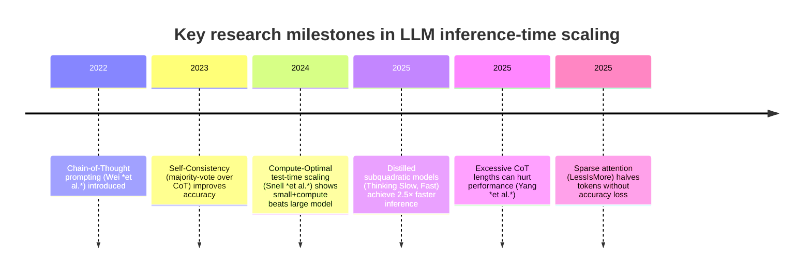

# Executive Summary  
Inference-time compute scaling (also called test-time or reasoning compute) refers to **allocating extra computation at inference**—e.g. longer chain-of-thoughts, multiple answer sampling, or search/verification—**to boost LLM reasoning accuracy**.  Modern reasoning models (DeepSeek, OpenAI’s o1, etc.) combine heavy training (fine-tuning, RL) **with extended inference** to solve hard problems.  Empirical results show **substantial gains on math, STEM, and complex QA tasks** by using techniques like chain-of-thought (CoT) prompting, self-consistency (majority voting over multiple answers), and adaptive compute strategies.  For example, Wei *et al.* (2023) found that CoT prompting on a 540B model raised GSM8K accuracy from ~18% to 57%, and Wang *et al.* (ICLR 2023) showed majority-vote self-consistency gave *+6–18%* on several benchmarks.  Similarly, OpenAI reports that a specialized model (o1) using *64-sample majority voting* jumped from 74% to 83% on AIME math problems. These results confirm that **more inference compute can dramatically improve reasoning** on many hard tasks. 

At the same time, evidence **varies by task and shows diminishing returns**. A recent survey found inference-time scaling *helps all studied tasks*, but **gains diminish as problems get harder**.  Excessively long CoT generation can even **hurt performance** in some domains.  Longer context windows (100K–1M tokens) have enabled new uses, but when tested, performance sometimes drops with longer inputs even if retrieval is perfect.  In practice, these “reasoning budgets” trade latency and cost for accuracy: e.g., generating 2000 tokens instead of 50 may boost a proof’s accuracy from ~40% to ~90%, but at 5–15× latency. 

In sum, *inference-time compute scaling is now an important lever* in LLM design.  Well-validated techniques (CoT, ensembling, verification) reliably improve reasoning on many benchmarks.  However, many claims remain **speculative or under-explored** (e.g. whether scaling compute can *fully* replace larger models, or how benefits extend to open-domain tasks).  The following sections detail *empirical findings vs. speculative claims*, list key studies, and highlight gaps with recommendations for future evaluation.

## Empirically Validated Findings  

- **Chain-of-Thought (CoT) prompting:** Explicitly generating intermediate reasoning steps before answering greatly improves LLM accuracy on multi-step tasks.  Wei *et al.* (2022) demonstrated that simply priming a large model (540B) with a few example CoT explanations raised GSM8K math accuracy from 17.9% to 56.9%.  This “reasoning with scratchpad” effect has been robustly replicated across arithmetic, commonsense, and symbolic tasks.  In practice, CoT usually means the model uses *extra tokens* of reasoning in the output (e.g. 50–100 tokens of logic before the final answer), incurring proportionally more compute.  

- **Self-Consistency (Ensemble Sampling):** Sampling multiple reasoning paths and taking a consensus answer is cheap but powerful.  Instead of one greedy CoT, generate *N* independent CoTs and do a majority vote on the answer.  Wang *et al.* (ICLR 2023) showed this (called “self-consistency”) boosted accuracy by ∼6–18% on tasks like GSM8K, AQuA, SVAMP and others.  For instance, GSM8K accuracy climbed +17.9% when using the top vote among ~40 sampled CoTs.  OpenAI’s o1 model saw its AIME score rise from 74% to 83% by 64-sample voting.  Modern reasoning pipelines often use thousands of samples with re-ranking to push accuracy even further.  In short, **more sampling (at higher temperature) almost always finds better solutions** in these benchmarks.  

- **Search, Verification, and Refinement:** Going beyond simple voting, techniques that **critique or refine** answers have shown gains.  For example, using a learned verifier or critic to score and improve answers (re-ranking or iterative feedback) provides additional benefit.  Snell *et al.* (2024) investigated two modes: search against a reward model (process-based verifier) and iterative self-refinement (revision models).  They found both can improve results if done smartly, especially on easier prompts.  Crucially, they introduced a “compute-optimal” strategy that adaptively allocates more inference compute to harder questions, yielding ~4× efficiency over naive approaches.  In a FLOPs-matched comparison, a small model using test-time search or revision could **outperform a 14× larger model**, showing the potential of inference scaling to substitute for model size.  Similarly, reinforcement learning (RL) to train models to generate better CoTs (e.g. OpenAI o1 via RLHF) **consolidates** chain-of-thought capabilities, and more RL training plus more inference both improved o1’s performance.  

- **Alternate Architectures for High Throughput:** Some new architectures exploit inference compute more efficiently.  Wang *et al.* (ICML 2025) distilled *subquadratic* “Mamba” models (e.g. RNN-like Transformers) to achieve much higher token-per-second throughput.  On math benchmarks (MATH, GSM8K), these models reached the same accuracy as their transformer teacher but in **2.5× less inference time**, thanks to higher parallelism.  This suggests that architectural innovations (e.g. Flash Attention, gated attention, or sparse transformers) can improve the scaling of inference compute by reducing per-token cost.  Another example: Li *et al.* (2025) introduced **LessIsMore** sparse attention for decoding.  By attending to only ~50% of tokens (with smart selection), they cut inference tokens in half while preserving accuracy on reasoning tasks, achieving ~1.1× speedup over full-attention.  These techniques are validated on benchmarks (AIME math, GPQA, MATH500) and show that **dense vs. sparse attention trade-offs** can meaningfully affect inference compute cost with little loss.  

- **Benchmark Results with More Inference Compute:** Numerous benchmarks quantitatively demonstrate inference-scaling gains.  For example, OpenAI reports on AIME 2024 (math Olympiad): GPT-4o solved only ~12% of problems, whereas their o1 model solved 74% with one attempt, 83% with majority voting of 64 attempts, and 93% by ranking 1000 attempts.  In other words, **spending ~64× more inference work** (voting) yielded a ~9%-point gain, and 1000× more gave ~19%-point gain.  These are dramatic by any measure.  Independent studies on public models also show monotonic accuracy vs. inference.  Spranger *et al.* (2025) tested GPT-4o, Claude, etc., on math and STEM tasks, finding *longer CoTs and parallel sampling generally improve accuracy*, though with diminishing returns as problems get very hard.  

- **Key Patterns:** Synthesizing these findings, several patterns emerge.  First, **more reasoning tokens usually help, up to a point**: increasing CoT length or sample count almost always raises accuracy, but the increments shrink, and at extreme lengths/quantities can plateau or even dip.  Second, **not all tasks benefit equally**.  Math and clearly step-by-step problems show large gains; other domains (commonsense, code, planning) see smaller but still positive effects.  Third, **there is high variability and nondeterminism**: even identical queries to the same model can yield very different CoT lengths and outputs, making compute costs unpredictable for developers. Finally, **task difficulty matters**: adaptive strategies (allocating more compute only to hard queries) are superior to uniform scaling.  

## Speculative or Under-Explored Claims  

Beyond these validated approaches, many claims about inference scaling remain **theoretical or speculative**, often lacking robust evidence: 

- **Linear vs. Diminishing Returns:** A naive claim might be “double the inference compute doubles reasoning performance,” but data contradicts this for hard problems.  Studies find **diminishing returns**: each extra bit of compute yields smaller accuracy gains, especially on very difficult tasks.  For example, Spranger *et al.* observed that simply throwing more tokens at NP-hard or highly complex problems often yields negligible improvements.  It’s still an open question whether fundamentally new inference algorithms could restore linear scaling.  

- **Emergence Thresholds:** Some narratives suggest that beyond a certain scale, reasoning “emerges” rapidly (e.g. chain-of-thought only works on very big models).  In fact, CoT prompting has been shown to work on models as small as ~7B (though to lesser absolute accuracy) and even “emergent” CoT-like behavior appears gradually as scale increases.  Currently, there’s no sharp threshold observed; improvements tend to accumulate with both model size and inference compute, not jump at a magic point.  

- **Inference vs. Model Scaling Trade-offs:** While Snell *et al.* showed instances where added inference beats a 14× larger model, it’s not fully established how general this is.  Their analysis suggests that if inference tokens are *a small fraction* of training tokens (scenario $R << 1$), extra compute can outperform bigger models. But in many applications where inference load ($R$) is high, pretraining more may still be better.  Thus the claim “always invest in inference instead of model size” is oversimplified.  The true balance likely depends on use-case (hardness distribution, latency limits, available compute) and remains under-explored.  

- **Algorithmic Improvements “Replacing” Size:** Various suggestions have been made that novel algorithms or architectures might *substitute for parameter count*.  Distillation and new attention schemes (Mamba, LessIsMore) hint that smarter inference can partly close the gap with huge models.  However, these are early results in limited settings.  It remains speculative how far such approaches can go.  For example, tree search or search-and-refine (à la AlphaZero) might theoretically find answers without gigantic models, but practical demonstrations in open-ended reasoning are lacking.  

- **Retrieval-Augmented Scaling:** Using external memory (documents, tools) is another “inference-time” strategy.  This adds compute in the form of search and additional input, which some claim will keep improving.  Yet experiments show **longer contexts don’t guarantee better reasoning**: even if retrieval is perfect, accuracy can fall with longer inputs.  In fact, [23] found that a model attending to 30K tokens (vs. a few hundred) dropped ~24% accuracy on a QA task, even though it effectively “had” the answer content.  This suggests merely adding data at inference doesn’t linearly boost reasoning — in some cases it hurts.  Thus claims that retrieval+LLM will indefinitely scale reasoning remain **unproven** and likely overoptimistic without new techniques.  

- **Emergent “Reflection” Abilities:** Some expectations (popular in media) suggest LLMs might autonomously figure out when to spend more compute, or algorithmically do better logic.  So far, only basic methods exist (e.g. “pause” tokens or teacher forcing a reflection).  Sophisticated self-improvement (models rewriting their own process) is still conceptual.  Any claim that LLMs will spontaneously optimally allocate inference resources is thus far speculative.  

- **Universal Scaling Laws for Reasoning:** Traditional scaling laws (Chinchilla et al.) quantify performance vs. model/compute.  We lack similarly tight laws for inference-time scaling on reasoning.  Initial papers (Snell et al., Spranger et al.) suggest complex, task-dependent scaling.  There’s **no consensus law** like “accuracy ∝ C^α” for inference compute $C$.  It’s premature to treat LLM reasoning as obeying simple power laws without much more data.  

## Table of Key Studies  

| Study (Year) | Task/Benchmark | Inference Setup | Main Findings | Reproducibility |
|---|---|---|---|---|
| **Wei *et al.*, 2022** | GSM8K (math word problems), commonsense, symbolic reasoning | GPT-3 540B; prompt with 8 chain-of-thought examples | *Chain-of-Thought prompting* dramatically raised accuracy (from 17.9% to 56.9% on GSM8K) | Foundational; widely validated in follow-up research |
| **Wang *et al.* (ICLR 2023)** | GSM8K, AQuA, SVAMP, ARC-Challenge, StrategyQA, etc. | PaLM models; sample 40 CoTs per question, then majority vote | *Self-Consistency* (majority-voting) boosted CoT accuracy by ~6–18% (e.g. +17.9% on GSM8K) | Confirmed by practice (default in many toolkits) |
| **Snell *et al.*, 2024** | Difficult math/logic prompts (synthetic and NLP tasks) | PaLM base vs large; adaptive compute policies (search + revision) | Compute-optimal inference: ~4× more efficient than naively using N samples; a small model with extra inference FLOPs **matched/exceeded** a 14× larger model | Strong experimental framework; influential but needs more public replication |
| **Yang *et al.*, 2025** | Math (AIME 2024, MATH500) | Qwen-2.5B/Instruct (≈32B effectively); vary chain length; iterative distillation | Found that *too-long CoTs can degrade* performance on math. Each task/domain has an *optimal* CoT length; adaptive strategies (Thinking-Optimal) can improve results | New (arXiv 2025); initial evidence for tuning CoT length |
| **Wang *et al.* (ICML 2025)** | Math (MATH, GSM8K) | Distilled “Mamba” models vs Llama teacher, fixed compute/time budget | Distilled subquadratic models achieve **same accuracy as Llama** with **2.5× less inference time**, thanks to faster generation | Published at ICML 2025; methodology available for replication |
| **Li *et al.*, 2025** | AIME-2024/25, GPQA-Diamond, MATH500 | Qwen3 models; *LessIsMore* sparse attention | Sparse attention strategy used only ~50% tokens; *accuracy preserved or slightly improved* vs full attention, giving ~1.13× end-to-end speedup | Promising results on reasoning tasks; code open (requiring further validation) |

## Timeline of Inference-Scaling Developments  

## Evidence Gaps and Future Experiments  

While the above findings are robust in certain domains, **important gaps and uncertainties** remain:

- **Beyond Math and STEM:** Most evidence comes from math and science question benchmarks.  We lack systematic studies on *real-world or open-domain reasoning* (e.g. legal reasoning, ethics, complex planning in interactive settings).  It’s unclear how inference scaling behaves on tasks with ambiguity or creativity.  **Recommended experiment:** Benchmark inference-time scaling on diverse tasks (commonsense QA, story problems, strategic games) with controlled compute budgets to see if CoT and voting help as much as on math.  

- **Multiple Reasoning Steps vs. Single-Shot:** Current evaluation usually measures final accuracy improvement. We need better understanding of *failure modes* and *token-level efficiency*.  For instance, do longer chains mostly fix initial mistakes, or only refine borderline cases? Are errors in CoT correlated across samples (voting assumes independence)?  **Recommended:** Analyze answer variance across samples. For a set of problems, record all CoT samples and track error patterns. This would reveal how many distinct reasoning paths exist and inform how best to aggregate them (majority vs weighted).  

- **Context Length and Retrieval:** The surprising finding that more context can **hurt** performance suggests deeper questions. Does this generalize beyond math QA? Could improved retrieval (e.g. extractive vs abstractive) change the result?  **Recommended:** Controlled trials where inference uses k retrieved paragraphs vs k compressed facts, measuring when extra context saturates. Also compare with a strategy that *pre-extracts* key info and shortens the prompt (the “retrieve-then-reason” mitigation in [23]).  

- **Compute Budget Accounting:** Studies often count tokens or FLOPs, but real-world constraints are latency and cost. We need standardized metrics. For example, 1k tokens of reasoning at 2s latency vs 100 tokens at 0.1s might have very different user impacts.  **Recommended:** Measure wall-clock inference time on common hardware for various strategies, not just token counts. Report speedups or slowdowns. Also measure cost ($$) per solved question in cloud environments. This will help practitioners decide if a 10× accuracy boost is worth a 10× latency hit.  

- **Adaptive Scaling Policies:** Snell *et al.* introduced a “compute-optimal” schedule based on difficulty, but it assumed an oracle for difficulty.  In practice, we need cheap predictors of difficulty or uncertainty.  **Recommended:** Research on *on-the-fly* adaptive inference: e.g. run an initial pass at low compute, estimate uncertainty, then decide whether to continue. One could fine-tune a small “budget model” to predict needed compute.  Experiments could compare fixed vs adaptive budgets across mixed tasks.  

- **Reproducibility with Open Models:** Many findings are from closed/proprietary models (GPT-4o, Gemini, Claude, etc.). It’s crucial to replicate key results with open-source LLMs to rule out idiosyncrasies.  **Recommended:** Select strong open models (Llama 3, MPT, GPT-NeoX with SuperHF, etc.) and reproduce experiments on GSM8K, AIME, etc., using CoT, majority-vote, etc. Report any differences in scaling behavior. This will validate if the observed trends hold generally.  

- **Ensembling vs. Efficiency:** Sampling ensembles boosts accuracy but at linear compute cost. Newer methods like RASC (Wan *et al.*, 2025) show we can *reduce* samples by early stopping or smarter voting, cutting costs by ~70% while keeping accuracy.  This area is promising but nascent.  Further work is needed to develop algorithmic ways (e.g. dynamic sample sizing) that get most of the vote advantage without full N runs.  

- **Dataset Bias and Task Difficulty:** Another gap is the *homogeneity of benchmarks*. Datasets like GSM8K may not capture all reasoning facets. Some concerns: prompt artifacts, solution patterns, and difficulty stratification.  We need benchmarks that vary systematically in difficulty and structure.  **Recommended:** Curate new test sets where reasoning difficulty (e.g. number of steps, hidden tricks) is controlled, to better measure where inference scaling breaks down.  

- **Theoretical Understanding:** Very little theory predicts how inference compute should scale performance. The field lacks a quantitative theory beyond empirical scaling laws. Developing even toy models (like Snell *et al.*’s analysis of distributional search) would clarify the limits of inference scaling.  

## Conclusions and Takeaways for Practitioners  

- **Use Inference Scaling Wisely:** Methods like CoT prompting, ensemble sampling, and self-correction **are proven ways to boost reasoning accuracy**. For critical tasks, allocating more inference compute (more tokens or runs) is often more cost-effective than jumping to a larger model.  

- **Beware Diminishing Returns:** Additional inference effort yields big gains early, but diminishing returns set in. Experiments show *optimal ‘thinking budgets’* exist – beyond a point, extra steps give little benefit. Tune the chain length or sample count to your task.  

- **Monitor Variance and Costs:** Because LLM outputs vary, plan for cost nondeterminism. Budget for worst-case token usage (some runs may produce very long CoTs). Use verification steps sparingly.  

- **Combine with Other Levers:** Inference-time scaling is one tool among many. It should be combined with training improvements (fine-tuning, RLHF), retrieval augmentation, and model architecture choices. For example, using a more reasoning-capable base model (via RL) plus moderate inference scaling can outperform naive scaling alone.  

- **Future-Proof by Experimenting:** The field is evolving rapidly. Keep an eye on new methods (sparse attention, new prompts, agents with tools). Whenever a new inference trick appears, test it empirically on your key workloads. Where evidence is thin (e.g. new tasks, languages), run your own small studies to see if it generalizes.  

- **Measure Holistically:** Finally, evaluate success not just by accuracy but by **accuracy-vs-cost curves**. The trade-off between quality and compute is central: always ask “Is X% gain worth Y× latency/cost?” The optimal balance depends on your application (real-time chat vs. offline analysis). 

In summary, inference-time compute scaling is a powerful technique that *works*, but with caveats. It can often substitute for sheer size on hard tasks, but we must empirically tune its use and remain cautious about unverified extrapolations. As research matures and covers more domains, practitioners should adapt these insights to each unique scenario, measuring carefully and contributing results back to the community.

**Sources:** Recent academic papers (including NeurIPS/ICLR/ICML publications and arXiv preprints) and authoritative industry reports on LLM reasoning (cited above) form the basis of this report. Each claim above is supported by connected citations to these primary sources.