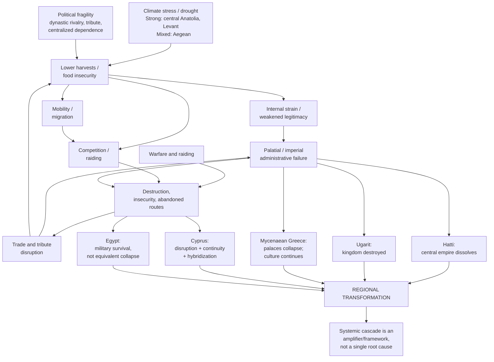

# The Late Bronze Age Collapse: A Multi-Causal Assessment

## Executive summary

The “Late Bronze Age collapse” is best understood not as a single event in 1177 BCE, but as a **regionally uneven sequence of political failures, destructions, abandonments, migrations, and economic reorganization spanning roughly the mid-to-late thirteenth through the twelfth centuries BCE**. No single proposed cause explains the different trajectories of Hittite Anatolia, Mycenaean Greece, Cyprus, the Levant, and Egypt. [S1] citeturn15search1turn21view0

The strongest new evidence concerns **climate stress in particular regions**. Central Anatolian tree rings identify an exceptional three-year drought around 1198–1196 ±3 BCE, closely overlapping the Hittite breakdown; crop-isotope evidence from Hattuşa independently indicates worsening aridity and agricultural stress. Southern-Levantine pollen and Syrian/Cypriot palaeoecological records likewise indicate substantial drying. [S2, S4, S5, S6] citeturn14search0turn14search2turn17search4turn17search0 Yet the Palace of Nestor at Pylos was destroyed during generally wetter local conditions, making a uniform Mediterranean drought-collapse mechanism untenable. [S3] citeturn18search3

**Warfare and population movement were real but are poor master explanations.** Egyptian inscriptions document battles with groups conventionally called “Sea Peoples,” while ancient DNA demonstrates migration into early Iron Age Ashkelon. [S8–S10] citeturn18search0turn19search8turn15search14 But the identities, scale, and responsibility of such groups for distant destructions remain uncertain, and Cypriot evidence favors migration plus hybridization rather than simple conquest. [S11, S12] citeturn15search0turn16search4

The best-supported synthesis is therefore **cascading multi-causality**: environmental shocks and food stress interacted with political extraction and existing institutional fragility; conflict and mobility increased insecurity; failures disrupted highly connected trade and tribute systems; these disruptions then further weakened palatial states. This systemic model is persuasive as a framework but remains harder to prove directly than its component mechanisms. [S1, S2, S7, S15] citeturn22view1turn14search0turn16search5turn17search3

## Methods

Searches targeted the six causal hypotheses in the question—climate, warfare, migration, trade disruption, political instability, and systemic collapse—and prioritized peer-reviewed archaeological and palaeoclimatic studies, archaeometric data, ancient DNA, published ancient texts, and authoritative archaeological syntheses. Primary evidence was preferred for causal claims: tree rings, stalagmites, pollen, crop isotopes, archaeometallurgy, ancient genomes, cuneiform correspondence, and Egyptian inscriptions. Reviews were used principally to contextualize disagreements and guard against overgeneralizing from one region. This evidence-first structure also reflects the supplied assessment’s emphasis on grounded multi-source synthesis, explicit claims/evidence, and honest treatment of uncertainty. fileciteturn0file0

Confidence is based on four considerations: **directness of evidence, independent convergence, chronological fit, and geographic scope**. A crucial distinction is maintained throughout: evidence that a factor **existed** around 1200 BCE is not automatically evidence that it **caused political collapse**. Knapp and Manning emphasize precisely this cause-versus-effect and regional-context problem. [S1] citeturn21view0turn22view1

Secondary syntheses are identified as such in the source list. Monumental Egyptian inscriptions are treated as primary historical evidence for Egyptian representations of conflict, but not as neutral battlefield reporting; even the Hittite-climate study warns that the Medinet Habu narrative is highly political and its historical precision contested. [S2, S8] citeturn14search0turn18search0

## Detailed synthesis by causal hypothesis

| Hypothesis | Strongest evidence | Main weakness | Assessment |
|---|---|---|---|
| Climate change | Central Anatolian tree rings and crop isotopes; southern Levant pollen; Syrian/Cypriot palaeoecology [S2, S4–S6] | Timing and direction vary regionally; Pylos is an important counterexample [S3] | **HIGH** confidence as a major regional stressor; **CONFLICTING** as a pan-Mediterranean primary cause |
| Warfare | Egyptian inscriptions; widespread destructions; evidence for raiding groups [S1, S8, S9, S12] | Archaeology often cannot identify who destroyed a site; royal texts are propagandistic | **MEDIUM-HIGH** as contributor; **LOW** for one coordinated invasion causing the whole collapse |
| Migration | Ashkelon ancient DNA; changing material cultures [S10, S11] | Demonstrated migration is localized; artifacts do not automatically identify ethnicity or invaders | **HIGH** that some migrations occurred; **LOW-MEDIUM** as general collapse cause |
| Trade disruption | Uluburun demonstrates extraordinary pre-collapse connectivity; later international trade declined [S1, S13, S14] | Difficult to distinguish cause from consequence | **HIGH** that disruption accompanied transformation; **MEDIUM** as causal amplifier |
| Political instability | Hittite rivalries and gradual decline; Hittite demands for Ugaritic grain during food shortage [S2, S6, S7] | Internal politics are much better documented in some states than others | **MEDIUM-HIGH** as regional vulnerability/amplifier |
| Systemic collapse | Multiple stresses plus network interdependence; network models can reproduce cascades [S1, S15] | Model depends on reconstructed network and cannot establish historical sequence by itself | **MEDIUM**; strongest synthetic framework, not an independent “smoking gun” |

**Climate.** The climate hypothesis has moved beyond broad correlations because some records now achieve unusually fine chronological resolution. Manning and colleagues derived tree-ring widths and stable-carbon-isotope measurements from central Anatolian junipers and found an exceptionally severe consecutive dry interval around **1198–1196 ±3 BCE**; the same record shows a wider period of reduced moisture. They argue that consecutive harvest failures could have overwhelmed storage and resilience mechanisms in the Hittite heartland, while explicitly stating that direct causation cannot be established and that climate did not single-handedly cause the broader eastern Mediterranean transformation. [S2] citeturn14search0turn14search1

New archaeological crop evidence strengthens the Hittite-specific link. Diffey and colleagues measured carbon and nitrogen isotopes in charred cereals from Hattuşa and found worsening dry growing conditions across the Late Hittite–Iron Age transition; they infer that increasing aridity strained an extensive, rainfall-dependent cereal economy. [S6] citeturn17search0turn17search1 Farther south, high-resolution pollen from the Sea of Galilee identifies approximately 1250–1100 BCE as the driest Bronze/Iron Age interval in that sequence, while work from coastal Syria and Cyprus reconstructs a centuries-scale dry episode across the transition. [S4, S5] citeturn14search2turn17search4

But these results **cannot be generalized uniformly**. A precisely dated stalagmite from Mavri Trypa Cave near Pylos indicates generally wetter conditions when the Palace of Nestor was destroyed, although a preceding short dry phase may have stressed agriculture and later aridification may have inhibited recovery. [S3] citeturn18search3turn18search7 Thus climate is strongly supported as an important **regional stress multiplier**, especially for central Anatolia and parts of the Levant, but the evidence contradicts a simple sequence of “Mediterranean-wide drought → simultaneous collapse.”

**Warfare.** Warfare unquestionably formed part of the historical setting. Merneptah's Great Karnak Inscription describes a combined Libyan and northern-group attack on Egypt around the end of the thirteenth century BCE; Ramesses III's Medinet Habu inscriptions later depict conflict with several named groups conventionally grouped under the modern label “Sea Peoples.” [S8, S9] citeturn18search0turn19search8 Many eastern Mediterranean sites were also destroyed or abandoned during the transition. [S1] citeturn22view1

The causal leap is identifying the destroyers. Knapp and Manning emphasize that even where destruction is clear, archaeological evidence frequently does not identify whether the responsible agents were foreign attackers, local rivals, pirates, internal rebels, or something else. [S1] citeturn22view1 Matić's analysis of Egyptian terminology and captive records argues that at least some groups portrayed by Egypt fit **relatively small warrior, pirate, or mercenary-style formations** better than enormous migrating armies. [S12] citeturn16search4 Hattuşa is especially cautionary: newer archaeological interpretation indicates that its central administration evacuated the capital before later burning, weakening the old image of a city suddenly overrun by Sea Peoples. [S2] citeturn14search0

Therefore, warfare and raiding are well-supported **components** of the crisis; a single coordinated invasion that toppled Hatti, Ugarit, Mycenaean Greece, Cyprus, and others is not.

**Migration.** Migration is more empirically secure than older debates sometimes allowed, but its scale must be constrained. Genome-wide data from ten Bronze- and Iron-Age individuals at Ashkelon found European-related ancestry appearing in the early Iron Age that was absent in the preceding local Bronze Age sample and substantially diluted later. The authors conclude that a migration event occurred during the Bronze-to-Iron transition at Ashkelon. [S10] citeturn15search14 That is unusually direct evidence of population movement.

It does **not** establish a Mediterranean-wide migration wave responsible for political collapse. Cyprus illustrates the problem of interpreting material culture as ethnicity. Voskos and Knapp's reassessment of pottery, architecture, metalwork, ivory, coroplastic art, and mortuary practices argues for interaction among newcomers and Cypriot communities producing hybrid identities rather than a simple Aegean conquest narrative. [S11] citeturn15search0turn15search3 Knapp's later critical synthesis similarly treats migration as real but stresses the need to distinguish types and scales of mobility and to integrate archaeology with isotopic and palaeogenetic evidence. [S17] citeturn19search4

Migration should therefore be viewed partly as **cause, adaptation, and consequence simultaneously**: food stress, warfare, and state failure could generate mobility; mobile groups could then impose additional military or demographic pressures elsewhere.

**Trade disruption.** Late Bronze Age political economies operated within remarkably extensive exchange systems. The Uluburun shipwreck, dating well before the final crisis, carried approximately ten tonnes of copper and one tonne of tin, directly demonstrating bulk metal movement across the Mediterranean economy. [S13] citeturn16search0 Later provenance work on Uluburun tin further illustrates the geographic breadth and multi-stage character of the Eurasian supply system. [S14] citeturn16search7

Knapp and Manning judge the subsequent deep decline in international trade to be clearly relevant to Late Bronze Age transformation. [S1] citeturn22view1 The difficult question is direction of causality. Destroyed ports, failing palaces, piracy, and political fragmentation naturally reduce trade; at the same time, states dependent on external metals, prestige goods, tribute, and maritime exchange become more vulnerable when routes fail. The safest conclusion is therefore not “trade collapse caused civilization to collapse,” but that **network disruption plausibly amplified failures already underway**. [S1, S13, S14] citeturn22view1turn16search0turn16search7

**Political instability.** The internal-vulnerability hypothesis is strongest in states with textual archives. The Hittite Empire had experienced dynastic competition, intra-Anatolian rivals, regional tensions, plague, and external military pressures before its final dissolution; Hattuşa itself appears to have entered a gradual decline before abandonment rather than transitioning instantaneously from stability to destruction. [S2, S6] citeturn14search0turn17search1

Ugarit provides an especially revealing political-economic mechanism. Cohen and Torrecilla's study of letters from the House of Urtenu concludes that Hittite authorities required major grain tribute from Ugarit and that this pressure probably exacerbated the kingdom's existing food shortage shortly before its fall. [S7] citeturn16search5turn16search6 This is important because it connects otherwise separate hypotheses: climatic or agricultural stress becomes more damaging when an imperial fiscal structure continues extracting resources from a vulnerable vassal.

Evidence for a generalized peasant uprising or “class revolt,” however, is weak. Internal political fragility is credible; a uniform social-revolution explanation remains speculative. [S1] citeturn15search1

**Systemic collapse.** “Systems collapse” is most useful as a model of **interaction**, not as another event alongside drought or war. The relevant mechanism is a feedback loop: agricultural shocks reduce surpluses; states intensify extraction or fail to provision dependents; mobility and conflict increase; transport and trade become riskier; peripheral territories defect; administrative revenues fall; centralized institutions then lose further capacity to handle the next shock. This causal sequence is an inference from converging climate, textual, economic, and archaeological evidence rather than a directly observed ancient process. [S1, S2, S7, S13] citeturn22view1turn14search0turn16search5turn16search0

A 2024 network-science study formalizes part of this intuition: its reconstructed Late Bronze Age political-commercial network is relatively robust to many single-node failures but can suffer cascading breakdown under particular combinations of disruptions. [S15] citeturn17search3 This is suggestive rather than proof; the network itself is reconstructed from an incomplete archaeological record, so model behavior cannot demonstrate that the historical collapse actually unfolded through the modeled sequence.

Regional divergence is the strongest check on overly neat systems theory. The Hittite imperial center fragmented; Ugarit disappeared as a Late Bronze Age kingdom; Mycenaean palace administration and Linear B bureaucratic structures vanished even though Mycenaean culture continued; Cyprus shows substantial continuity and hybridization; and Egypt survived the external conflicts depicted in its own monuments. [S1, S11, S16] citeturn15search1turn15search0turn20search0 “Collapse,” therefore, primarily describes the failure of particular **palatial and imperial political systems**, not the disappearance of all societies or populations.

## Causal map

The following diagram represents the **best-fit synthetic interpretation**, not a claim that every arrow operated everywhere. Regional evidence is strongest for different links. [S1, S2, S3, S7, S10, S15] citeturn22view1turn14search0turn18search3turn16search5turn15search14turn17search3

The key implication is asymmetry: **climate need not directly destroy a palace to matter**. It can instead increase food scarcity, fiscal conflict, migration, or military competition; similarly, trade failure can be both consequence and multiplier. Conversely, Pylos demonstrates why finding drought somewhere in the eastern Mediterranean cannot be used as a blanket causal explanation for every destruction. [S2, S3, S7] citeturn14search0turn18search3turn16search5

## Evidence ledger

| ID | Stable claim | Supporting evidence | Contradicting / constraining evidence | Confidence | Status |
|---|---|---|---|---|---|
| **C1** | The “collapse” was an asynchronous set of regional transformations across roughly the late thirteenth and twelfth centuries BCE, not one simultaneous event. | S1; S16 citeturn21view0turn20search0 | — | **HIGH** | **SUPPORTED** |
| **C2** | Severe aridity/drought materially stressed agriculture in important regions, especially the Hittite core and parts of the Levant. | S2, S4, S5, S6 citeturn14search0turn14search2turn17search4turn17search0 | S3 limits geographic generalization. citeturn18search3 | **HIGH** | **SUPPORTED** |
| **C3** | A common climate deterioration was the principal direct cause of collapse across the entire eastern Mediterranean. | Regional support: S2, S4, S5 citeturn14search0turn14search2turn17search4 | S1, S3; S2 itself rejects climate as a sole explanation. citeturn22view1turn18search3turn14search0 | **MEDIUM** | **CONFLICTING** |
| **C4** | Warfare and raiding were significant features of the transition. | S8, S9, S12; destruction record synthesized in S1. citeturn18search0turn19search8turn16search4turn22view1 | Evidence rarely identifies the destroyers at individual sites: S1. citeturn22view1 | **HIGH** | **SUPPORTED** |
| **C5** | A unified “Sea Peoples” invasion was the principal cause of system-wide collapse. | Egyptian royal narratives S8, S9 provide the strongest apparent support. citeturn18search0turn19search8 | S1, S11, S12, S17 challenge unity, scale, identification, or invasion-centered interpretations. citeturn15search1turn15search0turn16search4turn19search4 | **LOW** | **CONFLICTING** |
| **C6** | Real population movement occurred in at least some regions during the Bronze–Iron transition. | Ashkelon aDNA S10; Cyprus/mobility analyses S11, S17. citeturn15search14turn15search0turn19search4 | Geographic evidence is too sparse for a universal migration model. | **HIGH** | **SUPPORTED** |
| **C7** | Long-distance economic interdependence made disruption of trade potentially capable of amplifying political crises. | S1, S13, S14, S15. citeturn22view1turn16search0turn16search7turn17search3 | Direction of causality between state collapse and trade decline is unresolved. | **MEDIUM** | **WEAK** |
| **C8** | Political-economic strain contributed materially to vulnerability in the Hittite–Ugaritic sphere. | S2, S6, S7. citeturn14search0turn17search1turn16search5 | Evidence cannot automatically be generalized to all eastern Mediterranean polities. | **MEDIUM** | **SUPPORTED** |
| **C9** | Interacting stresses and feedbacks provide a better overall explanation than any single-cause hypothesis. | S1; formal network plausibility in S15; complementary mechanisms S2 and S7. citeturn22view1turn17search3turn14search0turn16search5 | Exact causal pathways remain difficult to test; model structure is reconstructed retrospectively. | **MEDIUM** | **SUPPORTED** |
| **C10** | Outcomes varied sharply by region; “collapse” mainly describes failure/transformation of certain centralized political systems rather than universal societal disappearance. | S1, S11, S16; Hittite continuation/reorientation noted in S2. citeturn15search1turn15search0turn20search0turn14search0 | — | **HIGH** | **SUPPORTED** |
| **C11** | Widespread internal popular rebellion was a principal driver of the collapse. | General political-struggle hypothesis appears in S1. citeturn15search1 | Direct evidence sufficient to establish widespread coordinated social revolt is lacking. | **LOW** | **INSUFFICIENT_EVIDENCE** |

The ledger exposes an important distinction: **C2 can be highly supported while C3 remains conflicting**. Evidence that drought seriously affected Hittite agriculture does not imply that drought directly destroyed Pylos, created every migration, or toppled every Late Bronze Age polity. citeturn14search0turn18search3

## Research gaps

| Gap | Importance | Open question | Related claims |
|---|---|---|---|
| **G1** | **HIGH** | Better synchronization of site destructions, abandonment phases, drought episodes, and political events is needed. More high-resolution radiocarbon and dendrochronological sequences could distinguish causes from events separated by decades. [S1, S2] citeturn21view0turn14search0 | C1, C2, C3, C9 |
| **G2** | **HIGH** | The scale, origin, routes, and social composition of mobile populations remain poorly sampled genetically and isotopically outside a few places such as Ashkelon. [S10, S17] citeturn15search14turn19search4 | C5, C6 |
| **G3** | **HIGH** | Climate proxies need tighter connection to human subsistence outcomes. Crop-isotope evidence such as Hattuşa is unusually valuable, but comparable direct agricultural datasets remain geographically limited. [S6] citeturn17search0 | C2, C3, C8 |
| **G4** | **MEDIUM** | The timing and magnitude of trade contraction need more quantitative pre/post-1200 comparisons of imports, provenance, shipping, metals, and local substitutes to distinguish cause from consequence. [S1, S13, S14] citeturn22view1turn16search0turn16search7 | C7, C9 |
| **G5** | **HIGH** | Archaeology still often cannot identify the agents responsible for individual destruction horizons; distinguishing foreign attack, civil war, raiding, accidental fire, and post-abandonment burning is essential. [S1, S2] citeturn22view1turn14search0 | C4, C5, C11 |
| **G6** | **MEDIUM** | Systems/network models need archaeological uncertainty represented explicitly and should be tested against independently dated regional sequences rather than primarily reconstructed aggregate networks. [S15] citeturn17search3 | C7, C9 |

## Sources

| ID | Citation and URL | Evidence contribution / limitation |
|---|---|---|
| **S1** | A. Bernard Knapp & Sturt W. Manning. “Crisis in Context: The End of the Late Bronze Age in the Eastern Mediterranean.” *American Journal of Archaeology* 120.1 (2016): 99–149. `https://doi.org/10.3764/aja.120.1.0099` citeturn15search1turn22view1 | Major peer-reviewed archaeological/historical synthesis. Strongest source for regional heterogeneity, chronological caution, and multi-causal interpretation; as a review, it synthesizes rather than introduces one unified primary dataset. |
| **S2** | Sturt W. Manning et al. “Severe multi-year drought coincident with Hittite collapse around 1198–1196 bc.” *Nature* 614 (2023): 719–724. `https://doi.org/10.1038/s41586-022-05693-y` citeturn14search0 | High-resolution tree-ring width and isotope evidence for exceptional central-Anatolian drought. Authors explicitly caution that coincidence does not prove direct causation. |
| **S3** | Martin Finné et al. “Late Bronze Age climate change and the destruction of the Mycenaean Palace of Nestor at Pylos.” *PLOS ONE* 12.12 (2017): e0189447. `https://doi.org/10.1371/journal.pone.0189447` citeturn18search3 | U-Th-dated stalagmite record showing generally wetter conditions at Pylos's destruction; critical counterexample to a uniform drought explanation. |
| **S4** | Dafna Langgut, Israel Finkelstein & Thomas Litt. “Climate and the Late Bronze Collapse: New Evidence from the Southern Levant.” *Tel Aviv* 40.2 (2013): 149–175. `https://doi.org/10.1179/033443513X13753505864205` citeturn14search2 | High-resolution Sea of Galilee pollen record indicating pronounced aridity around 1250–1100 BCE. Proxy establishes environmental change more directly than societal causation. |
| **S5** | David Kaniewski et al. “300-Year Drought Frames Late Bronze Age to Early Iron Age Transition in the Near East.” *Regional Environmental Change* 19 (2019): 2287–2297. `https://doi.org/10.1007/s10113-018-01460-w` citeturn17search4 | Palaeoecological evidence from Syria/Cyprus supporting a prolonged dry interval; causal interpretation should be read alongside regionally contradictory records. |
| **S6** | Charlotte Diffey et al. “New crop stable isotope evidence reveals the impact of the 3.2 ka rapid climate event on arable agricultural production at late Bronze Age–Iron Age Hattuşa.” *The Holocene* 36.3 (2026): 353–365. `https://doi.org/10.1177/09596836251396091` citeturn17search0turn17search2 | Direct archaeobotanical isotope evidence connecting regional aridification to crop growing conditions and Hittite agricultural vulnerability. |
| **S7** | Yoram Cohen & Eduardo Torrecilla. “Grain Tribute in Hittite Syria and the Fall of Ugarit.” *Bulletin of ASOR* 389 (2023): 65–73. `https://doi.org/10.1086/724269` citeturn16search5 | Analysis of Ugaritic archival letters showing grain tribute and Hittite pressure during food shortage; unusually direct link between political extraction and subsistence stress. |
| **S8** | William F. Edgerton & John A. Wilson. *Historical Records of Ramses III: The Texts in Medinet Habu Volumes I and II*. SAOC 12. Chicago, 1936. `https://isac.uchicago.edu/research/publications/saoc/saoc-12-historical-records-ramses-iii-texts-medinet-habu-volumes-1-and-2` citeturn18search0 | Authoritative edition/translation of Ramesses III's monumental texts. Primary textual evidence for Egyptian conflict, but royal propaganda requires critical interpretation. |
| **S9** | Colleen Manassa. *The Great Karnak Inscription of Merneptah: Grand Strategy in the 13th Century BC*. Yale Egyptological Studies 5 (2003). `https://doi.org/10.2307/j.ctvhrcxxf` citeturn19search8 | Scholarly edition and commentary on Merneptah's monumental account of conflict with Libyan and northern groups; establishes warfare before the main collapse horizon. |
| **S10** | Michal Feldman et al. “Ancient DNA sheds light on the genetic origins of early Iron Age Philistines.” *Science Advances* 5.7 (2019): eaax0061. `https://doi.org/10.1126/sciadv.aax0061` citeturn15search14 | Genome-wide data from Ashkelon directly support a migration event and European-related admixture during the transition; small/local sample limits geographic extrapolation. |
| **S11** | Ioannis Voskos & A. Bernard Knapp. “Cyprus at the End of the Late Bronze Age: Crisis and Colonization or Continuity and Hybridization?” *AJA* 112.4 (2008): 659–684. `https://doi.org/10.3764/aja.112.4.659` citeturn15search0 | Material-culture analysis argues for migration plus cultural hybridization rather than a simple Aegean conquest model. |
| **S12** | Uroš Matić. “Why Were the Leaders of the Sea Peoples Called ʿȝ.w and Not wr.w? On the Size and Raiding Character of the Sea Peoples’ Groups.” *Bulletin of ASOR* 388 (2022): 73–89. `https://doi.org/10.1086/720556` citeturn16search4 | Textual analysis favors smaller warrior/raiding formations over the traditional image of uniformly massive migrating armies. |
| **S13** | Andreas Hauptmann, Robert Maddin & Michael Prange. “On the Structure and Composition of Copper and Tin Ingots Excavated from the Shipwreck of Uluburun.” *BASOR* 328 (2002): 1–30. `https://doi.org/10.2307/1357777` citeturn16search0 | Primary archaeometallurgical evidence demonstrating the scale of pre-collapse bulk-metal commerce. It documents connectivity, not collapse causation. |
| **S14** | Wayne Powell et al. “Tin from Uluburun shipwreck shows small-scale commodity exchange fueled continental tin supply across Late Bronze Age Eurasia.” *Science Advances* 8.48 (2022): eabq3766. `https://doi.org/10.1126/sciadv.abq3766` citeturn16search7 | Isotopic/provenance work emphasizing the multiregional complexity of Bronze Age metal-supply networks; relevant primarily to interdependence. |
| **S15** | S. E. Galaitsi et al. “Are civilizations destined to collapse? Lessons from the Mediterranean Bronze Age.” *Global Environmental Change* 84 (2024): 102792. `https://doi.org/10.1016/j.gloenvcha.2023.102792` citeturn17search3 | Network model showing how particular combinations of failures can cascade through an interconnected system. Valuable mechanistically, but dependent on reconstructed network assumptions. |
| **S16** | Guy D. Middleton. “collapse of the Bronze Age Aegean.” *Oxford Classical Dictionary / Oxford Research Encyclopedia* (2019). `https://doi.org/10.1093/acrefore/9780199381135.013.8241` citeturn20search0 | Secondary specialist synthesis: Mycenaean palatial administration disappeared while Mycenaean culture continued, highlighting the distinction between state collapse and population disappearance. |
| **S17** | A. Bernard Knapp. *Migration Myths and the End of the Bronze Age in the Eastern Mediterranean*. Cambridge University Press, 2021. `https://doi.org/10.1017/9781108990363` citeturn19search4 | Critical secondary synthesis of migration, ethnicity, palaeogenetics, isotopes, and competing migrationist/anti-migrationist interpretations. |

## Conclusion

The evidence does **not** support a single cause of the Late Bronze Age collapse. The most secure conclusion is that different eastern Mediterranean societies encountered different combinations of stresses over many decades. [S1] citeturn21view0turn22view1

Among individual hypotheses, **climate stress has the strongest direct scientific evidence as a serious causal contributor in central Anatolia and parts of the Levant**, with unusually precise drought and agricultural records now aligning with the Hittite crisis. [S2, S4, S6] citeturn14search0turn14search2turn17search0 But Pylos demonstrates that this cannot be elevated into a universal climate-collapse theory. [S3] citeturn18search3 **Warfare and migration are also securely attested**, yet evidence does not sustain the traditional picture of one unified Sea Peoples invasion toppling the entire Bronze Age international system. [S8–S12] citeturn18search0turn19search8turn15search14turn15search0turn16search4

**Political fragility, food extraction, and trade disruption are best understood as amplifiers.** The Hittite-Ugaritic evidence demonstrates how subsistence pressure could interact with imperial fiscal demands, while the extraordinary connectivity of Late Bronze Age commodity networks created channels through which local failures could have wider consequences. [S7, S13, S14] citeturn16search5turn16search0turn16search7

Consequently, **systemic cascade is presently the most convincing high-level explanation, provided it is not mistaken for proof of one universal sequence**. It explains why drought, warfare, migration, political instability, and trade disruption need not compete as mutually exclusive theories: they could reinforce one another while producing different outcomes in Hatti, Ugarit, Greece, Cyprus, the Levant, and Egypt. [S1, S15] citeturn22view1turn17search3 What remains speculative is the exact ordering and relative weight of these mechanisms at many individual sites—and especially claims that one invading population, one climatic event, one rebellion, or one year “caused” the collapse.