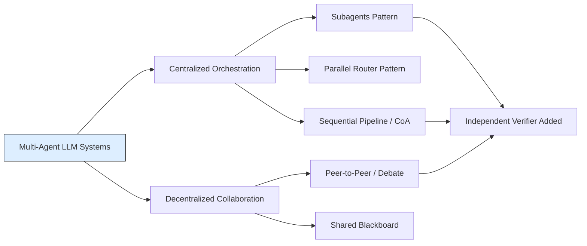

# Executive Summary  
Multi-agent LLM systems deploy **multiple specialized LLM-based agents** working together on complex tasks.  Unlike single-LLM chains, these systems **decompose work** (e.g. research questions or multi-hop reasoning) into parallel threads, often under a central coordinator.  Architectural patterns include *orchestrator–worker*, *parallel routers*, *sequential pipelines*, and *shared-blackboard* designs.  Common components are *planners* (coordinators), *researchers/executors*, *verifiers/critics*, *synthesizers*, *tool controllers*, and *memory*.  Agents may share context (a “blackboard” or conversation), pass messages, or operate independently (e.g. separate prompt contexts).  Independence is crucial: agents with separate contexts reduce correlated errors, whereas shared-context designs risk **confirmation bias**.  State is often represented as claims backed by evidence: some systems explicitly track *evidence traces* and contradictions.  Coordination can be synchronous or asynchronous; many designs use a leader–worker model, while others use peer-to-peer communication or voting.  Tools (search APIs, code runners, databases, etc.) and retrieval (RAG) are tightly integrated so agents can gather and verify evidence.  

Empirical trade-offs arise: multi-agent setups typically **consume far more compute** (Anthropic found ~15× the tokens of a single-agent chat), but parallelization drastically cuts latency (e.g. ~90% time reduction in Anthropic’s tests).  The **cost vs. benefit** depends on the task: subagents can greatly reduce context size (e.g. LangChain reports 67% token saving), but add extra model calls (subagents needed 4 calls vs 3 for one-shot tasks).  Typical use-cases include multi-step question answering, research, code generation, and decision-making tasks that single agents struggle to handle.

Multi-agent LLMs are still nascent.  Evaluation remains ad hoc: benchmarks like HotpotQA, NarrativeQA, or custom tasks (e.g. corporate research, cybersecurity analysis) test multi-hop and retrieval skills, but standard multi-agent metrics are lacking.  Open problems include **reliability** (avoiding hallucinations and contradiction), **scalability** (efficient protocols for many agents), **memory consistency**, and **governance/interpretability** (tracing evidence through many agents).  Early work suggests emphasizing traceability: recording *claim–evidence* links and execution steps is crucial for trust.  

Recent surveys and prototypes (e.g. Anthropic’s research agent, Google’s Chain-of-Agents) outline key patterns and pitfalls. Future directions include rigorous benchmarks and ablations to isolate design choices (e.g. adding a verifier agent, dynamic budgeting, memory scopes), as well as “hybrid” designs blending hierarchical and peer coordination for both efficiency and fault-tolerance. The following sections analyze definitions, patterns, components, communication modes, and more, with diagrams and references to illustrate the landscape of multi-agent LLM systems.  

## Definitions and Scope  
A **multi-agent LLM system** is any system that employs *multiple autonomous LLM-based agents* to solve a task.  Each agent typically has a specialized role or knowledge scope, and they **interact or coordinate** to achieve a global objective.  For instance, agents may independently search different information sources and then combine results. This mimics human teams: *“multiple autonomous agents collaboratively engage in planning, discussions, and decision-making, mirroring the cooperative nature of human group work”*. 

 *Figure: Conceptual architecture of an LLM-based multi-agent system. Agents are **profiled** (with goals, capabilities, etc.), interact via communication channels (top center), and use internal state (beliefs, memory, retrieval) and external environment. The *Orchestration* layer manages coordination and information flow.*  In such systems each agent has an internal state (beliefs, memory of past actions) and **goals**. The environment could be nonexistent (pure text debate), a data corpus, or even a simulated world. Agents are often organized hierarchically: a leader (orchestrator) guides lower-level workers.  Alternatively, agents may interact in a flat peer-to-peer network. 

What counts as “multi-agent”? We include **any system with >1 LLM making decisions**, even if implemented as chained prompts. This covers systems where LLMs are “specialized” via system prompts, external tools, or separate model instances. For example, an LLM that first plans and then separately executes a solution via a second LLM is multi-agent. Conversely, a single LLM chat (even with many tool calls) is *not* considered multi-agent in our context. We also include **debate models** (pro/con agents) and **hybrid pipelines** (chain-of-agents) since they involve multiple LLM “roles”.  Older multi-agent AI (non-LLM) is beyond our scope except as historical context.

## Architectural Patterns  
Researchers have identified several **high-level patterns** for multi-agent LLM architecture.  We summarize key patterns below:  

- **Orchestrator–Subagents (Centralized)**: A lead agent (manager) orchestrates a team of specialized *subagents*, calling them as needed. Subagents are usually stateless tools that perform specific tasks (e.g. search, math, coding) and return results. The orchestrator keeps the shared context and aggregates outputs.  *Example*: Anthropic’s research agent uses a “LeadResearcher” that spawns many web-search subagents in parallel.  This is a common pattern for complex tasks: the manager breaks work into subproblems and collects subagent findings.

- **Parallel Router**: A dispatcher (“router”) classifies the input and simultaneously dispatches queries to multiple specialized agents or tools. All agents work in parallel on different aspects, and a central aggregator then merges their outputs. This differs from subagents in that agents act in parallel from the start rather than in a request–response chain. It’s often used for multi-domain queries (e.g. fetch text from a wiki agent, table from a data agent, image from a vision agent, then combine).

- **Pipeline (Chain-of-Agents)**: A series of agents is arranged sequentially, each passing its output as input to the next. This is essentially *multi-step chain-of-thought*, distributed across agents. Each agent processes part of the problem or a chunk of data and produces intermediate results. Finally a *manager* or final agent synthesizes the collected information into an answer. *Example*: Google’s Chain-of-Agents (CoA) breaks a long document into chunks: a chain of worker agents each reads a segment and communicates a summary to the next, then a manager synthesizes the answer.

- **Sequential Handoffs**: Like a pipeline, but viewed as stateful handoff between agents in a dialogue. The active agent can transfer control to a different agent depending on the evolving conversation context. Each agent “hands off” the conversation to the next when a subtask is done. This pattern suits goal-oriented dialogues, where one agent is responsible at a time but can bring in other agents for expertise.

- **Skills (One-Agent with Dynamic Tools)**: Technically this uses a single LLM, but it behaves like many by loading **skills** or expert prompts on demand. The agent calls different prompt-based “skill functions” (or prompts) for different subtasks. It isn’t truly multiple models, but it modularizes functionality similarly. Because all context is still in one agent, these systems can suffer from state bloat; however they simplify orchestration since there is only one “actor”.

- **Debate/Adversarial**: Two or more agents take opposite stances on a question and exchange arguments. They may each have roles (e.g. proponent, opponent, judge). The final answer is reached by negotiation or voting. Debate models emphasize *communication of contradicting claims*; agents may be identical models with different system prompts.  

- **Shared Blackboard (Blackboard Architectures)**: All agents read from and write to a **shared memory or message pool**. There is no strict sequence – agents continually publish “notes” and react to the shared state. For example, MetaGPT uses a shared message pool where any agent can consume or post messages. This enables many-to-many communication, but requires governance (to avoid conflicts and ensure consistency).

- **Verifier/Critic Pattern**: A specialized design where one agent generates output (solution, answer, code) and another *independently verifies* it. Crucially, the verifier does **not** see the generator’s internal reasoning – it only sees the final answer and original question. This breaks the context chain and helps catch unsupported claims (prevents the system simply affirming itself).

Many systems combine these patterns. For instance, an orchestrator might also run an independent verification stage, or a pipeline might occasionally publish findings to a shared memory. Figure [20] below (from Anthropic’s research assistant) illustrates a typical orchestrator–parallel-workers design. 

 *Figure: Example orchestrator–worker pattern. A lead “researcher” agent (centre) plans and launches multiple subagents in parallel (right). Each subagent has its own context and searches for evidence, then returns results to the lead, which synthesizes them. A memory store holds the plan, and a final citation agent generates references.*

Another illustration from HuggingFace’s smolagents (Figure [46]) shows a Manager Agent delegating to a Code-Interpreter agent and a Web-Search agent, each using specialized tools. These examples underscore that the **pattern taxonomy** spans from single-manager trees to flat networks (see the mermaid diagram in *Taxonomy* below). 

## Component Roles  
Multi-agent LLM systems typically assign **semantic roles** to agents. Key roles include:

- **Planner/Orchestrator**: This agent (sometimes called *manager* or *lead*) sets the overall strategy. It decomposes the task into subtasks, tracks overall progress, decides which agents to invoke, and integrates their outputs. For example, in Anthropic’s system a LeadResearcher agent “thinks through the approach” and spawns subagents for each aspect. The planner may use a “plan memory” to save the decomposition.

- **Researcher/Worker Agents**: These are domain-specific specialists. For instance, one agent might search the web, another query a database, and another perform logical reasoning. Each worker focuses on its subtask (e.g. “find source X”) and returns *findings* (text summaries, extracted facts) to the planner. They may use tools (search, calculators, code exec) to gather evidence.

- **Verifier/Critic**: As noted, a dedicated verifier reviews results from other agents. By re-generating answers from scratch or checking evidence, it flags unsupported claims. In practice, the orchestrator may launch the verifier after an initial answer to check consistency.

- **Synthesizer/Writer**: After gathering sub-results, one agent (often the orchestrator or a final pass) composes the final output. It weaves together evidence into coherent answers and formats citations. For example, Anthropic uses a “CitationAgent” that reads the draft answer and documents to add proper citations.

- **Tool Controllers**: In tool-augmented MAS, certain agents manage interactions with external services. They take parsed queries from higher-level agents and translate them into API calls or code execution. For example, a “Browser Agent” might handle web queries, or a “Math Agent” might call a calculator. These are often subagents in the above patterns.

- **Memory/Context Store**: Not an agent per se, but a critical component. Systems may include a *memory module* that persists information across iterations. Agents write their intermediate conclusions and evidence to memory, and others can query it. For example, a planner might save the current plan to memory so it persists beyond prompt length. *Governed* memory (with access controls, provenance) has been proposed to avoid issues like stale or leaking data.

- **Knowledge Base / Retrieval System**: Often an integrated retriever (e.g. RAG) acts as a semi-agent. Agents issue queries to a vector DB or search engine and use the returned documents as evidence.

These roles can overlap: a single LLM can perform both planning and synthesis in a chain-of-agents, or workers might self-verify. Figure [21] shows roles in action: a LeadResearcher uses Memory and spawns two Subagents (web searchers), then a CitationAgent wraps up the answer. 

 *Figure: Multi-agent research workflow (from Anthropic). The LeadResearcher plans the research, saves the plan to Memory, and creates specialized Subagents. Each Subagent searches and evaluates independently, then returns findings to the LeadResearcher, which synthesizes results. A CitationAgent (bottom) then processes the document and report to generate citations.*

## Communication and Topology  
Agents can **communicate and coordinate** in various ways:

- **Message Passing vs Shared State**: Some designs use explicit messaging between agents. For example, pipeline agents pass messages along a chain (like CoA’s sequential agents sending summaries). Others use a shared memory or blackboard: all agents read/write to a common store (MetaGPT’s shared message pool is one instance). Shared blackboards simplify broad cooperation but can introduce conflicts (requiring locking or governance).

- **Chained Prompts vs Direct Calls**: In centralized patterns, the orchestrator may call subagents via APIs or function calls (stateless tool invocations). Alternatively, agents might interact by **prompting each other** in a dialogue. The “handoffs” pattern is essentially passing the conversation turn between agents.

- **Topology**: In a *star* topology, one central agent is hub (e.g. orchestrator-worker). In *bus* or *blackboard*, there is a shared channel. In *fully connected*, every agent can message every other (rare in practice). Hierarchical (tree) topologies are common for scalability. Some systems have **layered architecture**: for instance, managers oversee middle-level agents who coordinate lower-level workers. Others are flat peer-to-peer (common in debate systems).  

- **Coordination Mode**: Communication can be synchronous (agents wait on each other) or asynchronous (agents act independently and respond when ready). Asynchronous parallelism (e.g. fire off many sub-tasks) can greatly speed up processing, but complicates merging results. Sequential (synchronous) approaches (like CoA’s chain) ensure step-by-step consistency but may be slower.

- **Content and Protocols**: Agents exchange not just data but also intent and belief. Protocols vary: a **planning language** might structure sub-task assignments, or agents might use predefined APIs (like a ‘REQUEST-QUERY’ message). Some systems implement *human-like protocols* (e.g. Socratic debate, or contract-net negotiation), but most current MAS use implicit prompt-driven coordination. 

In summary, multi-agent LLM communication spans a spectrum from **fully shared** (common context or memory) to **loosely coupled** (only passing final answers). For example, in Anthropic’s Research system subagents each maintain their own context (minimizing crosstalk), whereas systems like MetaGPT intentionally broadcast outputs to all agents via a blackboard.

## Agent Independence vs. Correlation  
A key concern is whether agents truly provide **independent computation** or just echo each other. If multiple agents are identical in prompt and context, their outputs will correlate. For example, having the same LLM read the same information twice usually yields near-identical answers. This limits diversity and reduces the value of “multiple” agents.  

Research advocates decoupling agents to increase independence. For instance, the verifier pattern requires the verifying agent *not* see the generator’s chain-of-thought. MindStudio warns that if verifier and generator share the same context, “the agent tends to confirm its own biases” (confirmation bias). Instead, using separate model instances, different prompts, or withholding chain data can yield more robust checks. 

By contrast, agents with shared context or memory become highly correlated: one agent’s conclusion can anchor others. Some systems deliberately **share outputs** so new agents build on prior agents’ reasoning. That can speed convergence, but also create groupthink. The trade-off is evident: *independence* (diverse viewpoints and error checking) vs *correlation* (faster consensus and state sharing). There is no single answer; designers choose based on the task. For fact-verification tasks, independence (e.g. a fresh LLM checking claims) is often better. For exploratory tasks, incremental chaining (thus correlated reasoning) can be effective. 

## Evidence and State Representation  
Handling **evidence and belief** is central. Many systems build explicit structures for state: for example, a graph of *claims* vs *supporting evidence*. Each claim might track which sources back it, any contradictory findings, and a confidence score. Although few frameworks enforce a formal schema yet, recent work calls for *provenance graphs* linking claims to evidence. 

Practically, systems often separate answer content from citations. For instance, the output might list atomic claims with bullet-point evidence and exact references. Agents may annotate claims with confidence (e.g. “likely”, “very confident”) based on how many high-quality sources agree. Contradictions can be flagged when two sources disagree on a claim. Some designs store contradictions explicitly in memory, prompting agents to reconcile or note uncertainty. 

**Evidence** usually means retrieved text snippets, documents, or tool outputs. Systems might retrieve multiple candidate sources per claim and use voting or scoring to decide support. For instance, AgentTraces (AgentOps) proposes linking each generated claim to specific retrieved passages or code executions. This addresses hallucination: a claim without solid evidence link is suspect. 

**Confidence** may be quantified heuristically (e.g., fraction of sources agreeing, or model-provided probabilities) rather than a raw LLM “likelihood”. Designing good confidence is an open problem. Ideally, a system can answer “insufficient evidence” if support is weak. Some proposals explicitly allow an agent to output “I don’t know” when contradictions persist.

## Coordination Protocols  
In multi-agent systems, **coordination protocols** define how agents sequence their actions:

- **Synchronous vs. Asynchronous**: In *synchronous* protocols, agents act in rounds: e.g., the orchestrator waits until all subagents report back before proceeding. In *asynchronous* schemes, agents work at their own pace; new agents may launch even before previous ones finish. Anthropic found that parallel (asynchronous) subagents dramatically cut response time, but noted it complicates result merging and error handling. 

- **Leader Election / Hierarchies**: Most LLM MAS use a fixed leader (the planner). However, more democratic protocols could elect leaders on-the-fly. For example, a debate system might designate the next speaker by majority vote or random. In hierarchical schemes, intermediate “team leaders” might coordinate clusters of agents (multi-layer hierarchies).

- **Arbitration and Conflict Resolution**: When agents disagree, a mechanism is needed. Some systems have a designated *arbitrator* agent (sometimes the manager) make the final call. Others might aggregate answers statistically (e.g. majority voting among agent answers). Complex designs use weighted voting based on agent confidence. The *verifier* agent can act as an arbiter by overruling unsupported claims. 

- **Iteration and Replanning**: Protocols often allow replanning: if agents find insufficient evidence or contradictions, they can loop back and refine the plan. Anthropic’s planner repeatedly spawns new subagents if needed. The decision of *when to stop* (see below) is part of the protocol.

Overall, protocol design is about balancing **throughput** (parallelism) against **safety and consistency**. Fully asynchronous, peer-to-peer protocols maximize throughput but require careful conflict handling. Centralized synchronous protocols are simpler to reason about but slower.

## Tool and Retrieval Integration  
Multi-agent systems heavily rely on external tools and retrieval for knowledge. Common integrations include:

- **Search/Database Tools**: Agents often call web search or document DBs. For example, a “Web Searcher” agent uses a browser or search API to retrieve texts; a “Database Agent” might run SQL queries on a knowledge base. Many systems use *Retrieval-Augmented Generation (RAG)*: on each query, retrieval agents find top relevant documents, which agents then read or summarize. 

- **APIs and Execution Tools**: Agents can use calculators, code interpreters, or even control robots. For instance, a code-specialist agent might call a Python interpreter to validate computations. This extends LLMs beyond text; e.g. one agent might be a vision model or a numerical solver, with the orchestrator coordinating multi-modal inputs.

- **Tool Controllers**: Often there is an agent role specifically for managing tools. It interprets sub-requests (“calculate this sum”, “fetch this page”) and calls the appropriate API. This can be built in (like LangChain’s toolkit) or explicit.

Integration is typically modular: the orchestrator or researcher composes a query, then one agent issues it to a tool. Tools return structured data that agents re-encode as text to continue reasoning. This design mirrors classical agent frameworks (MRKL) where LLMs are controllers around external modules.

## Evaluation Metrics and Benchmarks  
Evaluating multi-agent LLMs is challenging due to lack of standard benchmarks. However, current efforts include:

- **Task Accuracy/Factuality**: Ultimately measure correctness of the final answer (e.g. on QA or summarization benchmarks). Systems like CoA are evaluated on multi-hop QA (HotpotQA, NarrativeQA, GovReport, etc.) and consistently beat baselines like RAG. Fact-checking systems might use code correctness or logical consistency as metrics.

- **Citation and Evidence Metrics**: In research-style tasks, metrics track *coverage*: fraction of claims backed by cited evidence, or precision/recall of supporting facts. For instance, ALCE and RAGAS are frameworks evaluating how well generated statements are supported by retrieved evidence.

- **Efficiency and Cost**: Measure latency, token count, and monetary cost. Anthropic reported a **time-per-query** metric, showing 10× faster answers with parallel agents at similar reliability. Others compute “cost per correct claim” to quantify return-on-compute.

- **Multi-Agent Specific**: New metrics measure *consensus* or *heterogeneity*. For example, one could measure how often independent agents disagree (indicator of robustness), or track the rate of hallucinated vs. verified claims. Crowd-worker evaluation might judge answer coherence and persuasiveness.

- **Simulation/Task Benchmarks**: Some research uses multi-agent game or simulation environments (e.g. GPT-Dungeon-like tasks, social simulations) to test agent coordination. The LLM-based Multi-Agents survey lists numerous settings (software dev, robotics, policy sims). Multi-agent RL benchmarks (like PettingZoo) are being adapted by replacing RL with LLM policies.

- **Agent Evaluations (AgentBench)**: Agent-centric benchmarks (AgentBench, WebArena) evaluate agents on interactive tasks (web navigation, tool use). These indirectly measure how multi-agent setups improve over single-agent in such environments.

In practice, evaluation often involves **ablations**: e.g. comparing multi-agent vs. single-agent, or with/without a verifier. The brief explicitly requires an ablation on a design choice, reflecting the need for such controlled experiments.

## Cost, Latency, and Compute Trade-offs  
Multi-agent architectures generally use **more resources** than single agents. Reported trade-offs include:

- **Token Usage**: Every agent invocation consumes context tokens. Anthropic measured that its multi-agent pipeline used about **15× more tokens** than a comparable single chat-based agent. LangChain similarly notes that splitting tasks across agents can drastically *reduce* the context each agent sees (good), but at the expense of extra calls. For instance, one example showed the “Subagents” pattern used **67% fewer tokens** than a single-agent “Skills” approach on a multi-part question.

- **Model Calls**: More agents mean more LLM invocations. In a one-shot query scenario, LangChain found the orchestrator-subagent pattern needed 4 model calls (1 to spawn agents, 3 agents run, then 1 to collect) vs 3 calls for other patterns. Each extra call adds latency and cost. Running agents in parallel (asynchronous) can mitigate wall-clock time but still costs in compute.

- **Latency**: Parallelism pays off in speed. Anthropic achieved up to **90% reduction in response time** by launching subagents and parallel tool use. LangChain notes “Parallel patterns save time, whereas sequential can be slow for complex tasks.”. However, synchronization overhead (waiting for slowest agent) can also limit gains.

- **Compute Budgeting**: Some systems budget tokens or calls dynamically. For easy sub-tasks they stop early; for hard ones they may allocate more search iterations. This adaptive allocation is an open design question, but clearly multi-agent setups enable fine-grained budgeting across sub-problems.

- **Communication Overhead**: Having separate contexts means each agent holds its own memory. Passing data between agents (like transferring sub-results to the orchestrator) adds back-and-forth overhead. This overhead must be balanced with gains from specialization.

Overall, multi-agent systems trade **cost for quality**. They demand higher compute (and sometimes GPU parallelism) but can unlock reasoning capacities single models lack. Designers must gauge whether the quality gain justifies the resource hit. In corporate or high-value domains (e.g. legal research, scientific inquiry), paying extra compute to get better-cited answers may be worthwhile.

## Failure Modes and Mitigation  
Multi-agent setups introduce new failure risks on top of single-LLM issues (like hallucination). Key failure modes include:

- **Hallucinated Claims**: With no single “ground truth,” agents may independently fabricate facts. Without cross-checking, falsehoods can slip into the final answer. The independent verifier pattern is one mitigation, as is explicit evidence-tracking.

- **Contradictions and Misalignment**: Agents may draw conflicting conclusions. For example, two subagents retrieving from different sources might get opposing data. If the system blindly averages or picks one, critical contradictions go unnoticed. Mitigation: maintain contradiction tags or confidence gaps, and design conflict resolution (perhaps calling for human review).

- **Coordination Overhead and Loops**: As noted, spawning many agents can lead to runaway behavior (endless loops or exploding search trees). The Anthropic blog warns of “infinite agent loops” if not properly guarded. Mitigation: cap recursion depth, use a central plan to track progress, or bring human oversight into the loop if necessary.

- **Memory Issues**: Shared memory can suffer *staleness* (old data not invalidated) or *leakage* (one agent seeing another’s private info). The MemClaw paper identifies failures: *unauthorized leakage*, *stale propagation*, *contradiction persistence*, and *provenance collapse*. For instance, an agent might overwrite a belief with incorrect info and never fix it. Mitigation involves scoped memories (agents only write to their area) and provenance tracking to know where facts originated.

- **Overconfidence and Bias**: LLMs tend to be overconfident. In a multi-agent context, if one agent confidently states a claim, others may defer to it. This effect can entrench errors. Strategies include calibrating confidence, actively searching for refutations, or resetting context (e.g. independent verifier).

- **Tool Misuse and Errors**: Agents calling tools can misuse them (bad queries) or face tool failures. If a search API returns no hits, an agent might hallucinate an answer instead. Robust agents check tool success and fallback (e.g. try alternate queries or skip that evidence).

- **Security/Gaming**: Not widely studied yet, but multi-agent systems might be tricked by adversarial agents. One example is “biased consensus”: if adversarial agents lead the discussion, they could steer the answer (related work on biased consensus). Ensuring fair arbitration is an open problem.

To mitigate these, strategies include **independent verification**, **diverse prompts/models**, **human-in-the-loop checks**, and **clear logging**. For instance, always logging each agent’s sources allows post-mortem error analysis. Renney et al. emphasize validation pipelines and human oversight as essential before production deployment. Tools like AgentTrace log each step for debugging. In summary, careful system design, limiting infinite cycles, and requiring high-quality evidence are key to robustness.

## Open Research Problems and Directions  
The multi-agent LLM field is rapidly evolving. Key open issues include:

- **Reliability and Trustworthiness**: How to ensure correct answers and avoid cascading errors. This includes robust hallucination detection, multi-agent self-audit, and rigorous confidence calibration. As Renney *et al.* note, strengthening validation pipelines and guardrails will be crucial. Relatedly, developing formal methods for inter-agent agreement (when to trust consensus) is open.

- **Scalability and Efficiency**: While parallelism can speed things up, truly scaling to dozens or hundreds of agents poses challenges. Research is needed on efficient coordination (e.g. caching results, early stopping of unpromising branches) and on standards (e.g. how to architect a million-token conversation across agents). Lifetime and resource management across agents are unexplored.

- **Unified State/Evidence Schema**: As discussed, representing the *trace* of a multi-agent execution is an open problem. Standardizing how to record claims, evidence links, contradictions, and agent interactions (perhaps via provenance graphs) is an active area. Such schemas would enable new evaluation metrics and interoperability between systems.

- **Benchmarking and Evaluation**: Currently most evaluations are ad-hoc. We need public **benchmarks** specifically for multi-agent LLMs: multi-hop QA datasets, collaborative reasoning tasks, and synthetic tasks where ground truth multi-agent strategies are known. Ablation studies (e.g. with/without verifier, different topologies) should become standard, as the assignment suggests.

- **Memory and Long-term Coordination**: How can agents build and share long-term memories safely? MemClaw’s work highlights the need for *governed memory*. More research is needed on memory expiry, conflict resolution over time, and learning (can agents update each other over multiple sessions?).

- **Inter-Agent Learning and Adaptation**: Can agents learn to collaborate or negotiate more effectively? Current systems are mostly few-shot. Techniques for *continual learning* (e.g. dynamically adjusting agent prompts based on past interactions) are an open frontier.

- **Safety, Ethics, and Governance**: Multi-agent systems combine LLM risks (bias, toxicity, misinformation) with distributed systems concerns (security of communications, multi-agent authorization). Research must address how to audit agent networks, prevent malicious agents, and enforce policies across collaborating AIs.

- **Cross-Disciplinary Insights**: Lessons from classical MAS (coordination protocols, contract nets, market-based control) may inform LLM designs. Conversely, LLM capabilities could revolutionize MAS fields (e.g. by making negotiation more natural). Surveys like Moore’s *Taxonomy of Hierarchical MAS* suggest blending hierarchical and peer approaches for balance.

These directions all point to one theme: **bringing structure and governance** into agentic LLM systems so they can be reliably used in real-world settings. As one survey puts it, while MAS architectures accelerate prototyping, “variability in LLM behavior and hallucination remain critical barriers to production”. Future work must close that gap.

## Comparative Summary of Patterns  

| Pattern             | Agent Independence | Evidence Sharing           | Verification    | Compute Cost       | Typical Use-Cases            |
|---------------------|--------------------|----------------------------|-----------------|--------------------|------------------------------|
| **Subagents**       | Medium – subagents have isolated contexts, orchestrator centralizes state | Orchestrator aggregates; subagents do not see each other’s data until returned | None built-in (unless add verifier) | High tokens & calls – extra round-trip to aggregating agent | Complex multitask research (e.g. parallel web search), multi-domain Q&A |
| **Skills** (single-agent) | Low – one context | All evidence accumulated in one thread | No separation – “verifier” would have same context | Lower – one agent, no extra calls | Chatbots with dynamic knowledge, single-stream tasks |
| **Handoffs**        | Low – sequential context passing (shared) | Context is passed along, effectively shared | No by design (sequential chain) | Moderate – one agent at a time, sequential calls | Multi-turn dialog or workflows (customer support, guided instructions) |
| **Router**          | High – parallel agent calls from same input | No direct sharing; results fused by orchestrator | None inherently (orchestrator could incorporate) | Moderate-High – 1 call to router + N parallel calls | Multi-vertical queries (fetch different formats) |
| **Pipeline** (CoA)  | Medium – chained but separate roles | Passed in sequence (each uses predecessor’s output) | None inherent – final aggregator synthesizes | High – sequential agent calls (like pipeline) | Long-context processing (e.g. reading large documents in parts) |
| **Verifier**        | High – independent agent (no shared memory) | Sees only final answer and original prompt | Yes – gives pass/fail or critique | Moderate – additional agent call per check | Code validation, fact-checking answers |
| **Debate**         | Medium – agents argue with each other (partial independence) | Evidence and arguments are shared/revealed through exchange | Often a judge or meta-agent adjudicates | Moderate – at least 2+ agents conversing | Polarized QA (pro/con), open-ended discussions, adversarial QA |
| **Blackboard**      | Low – fully shared context | Fully shared memory; all agents see all published info | No (unless layer an arbiter) | Variable – depends on agent count; may reduce duplication | Complex simulations, multi-agent planning in shared world (e.g. tactical planning) |

*Notes:* Patterns vary widely. “Independence” indicates whether agents operate in isolated contexts (high) or within a common context (low). “Evidence Sharing” describes whether agents see each other’s intermediate data immediately. “Verification” notes if the pattern inherently includes a checking agent. Compute cost combines model calls and token usage; e.g. Subagents in one-shot required 4 calls and used far fewer tokens per agent. Use-cases are illustrative: e.g., Router suits gathering diverse info in parallel, while Verifier is typical for final answer checking.

## Suggested Experiments and Ablations  
To isolate design choices, one could run studies such as:

- **Single vs. Multi-Agent**: Compare a single-LLM pipeline (with tools) against a multi-agent version on the same task. Measure answer accuracy, evidence count, and cost. This shows whether coordination adds value beyond more complex prompting or recall.

- **Independence Test**: For a given architecture, compare having agents with separate contexts versus sharing a common context. For example, run a task with a verifier agent once with no shared memory (ideal) and once where the verifier sees the generator’s chain-of-thought (suboptimal). Evaluate error detection rate.

- **Verifier Ablation**: On knowledge-intensive queries, run the system with and without a verifying agent. Check how many unsupported claims make it into the answer in each case. This isolates the benefit of explicit verification.

- **Parallel vs. Sequential**: Implement research as parallel subagent calls (like Anthropic) versus sequentially spawning one agent at a time. Measure throughput and quality. This evaluates the *asynchronous* advantage.

- **Dynamic Budgeting**: Give fixed search budgets vs. adaptive budgets. For instance, allow unlimited subagent searches on one claim but limit others. Compare efficiency (answers per compute). This tests hypotheses about focusing effort on “hard” parts.

- **Evidence Tracing vs. No Tracing**: Track claims with linked evidence versus letting the model freely cite. Check factuality. This explores the impact of explicit evidence tracking on answer correctness.

- **Memory vs. No Memory**: For tasks requiring multiple reasoning steps, test having a persistent memory (storing intermediate conclusions) vs. pure prompt context. Measure consistency over the task.

Each experiment should hold all else equal except the design choice. For example, use the same LLM models and number of total queries.  Metrics would include final answer correctness, number of evidence citations, hallucination rate, and compute costs. Such ablations can directly answer prompts like “Does an independent verifier reduce unsupported claims?” or “How much speedup does asynchronous execution provide?”.

## Visual Taxonomy (Mermaid Diagram)  

This taxonomy highlights major categories and how patterns relate. The *orchestration-driven* branch (left) includes classical orchestrator–subagent designs (a manager spawning workers, parallel routers, or sequential pipelines like Chain-of-Agents). The *decentralized* branch (right) includes more egalitarian designs (peer-to-peer chat or debate, shared blackboards). We also note that an **independent verifier** agent can be added to many architectures (dotted connections), overlaying a verification step onto subagents, pipelines, or peer debates.  

## Reading List (Annotated)  
- **Guo *et al.* (2024)** – *Large Language Model based Multi-Agents: A Survey*. Comprehensive review of LLM multi-agent systems, defining them and categorizing current work. Covers communication paradigms (cooperative, debate, competitive) and agent profiling.  
- **LangChain (2026)** – *Choosing the Right Multi-Agent Architecture*. Blog post outlining four key patterns (Subagents, Skills, Handoffs, Router) and their trade-offs. Includes tables of token usage and call counts for each pattern.  
- **Anthropic Blog (2023)** – *How we built our multi-agent research system*. Describes a deployed LLM research assistant: an orchestrator-worker design with lead agent, parallel web-search agents, memory, and citation postprocessing. Reports performance gains from parallelism and lessons on coordination.  
- **Lyu *et al.* (2026)** – *From Agent Traces to Trust: Evidence Tracing and Execution Provenance in LLM Agents*. ArXiv survey on accountability in LLM agent systems, formalizing “evidence tracing” (linking claims to sources) and execution provenance. Highlights the need to record evidence flows to diagnose failures.  
- **MindStudio Blog (2026)** – *Verifier Pattern in LLM Agents*. Explains the independent generator–verifier loop. Shows how a separate LLM can check another’s output with no shared chain-of-thought, reducing bias and catching errors.  
- **Margalit *et al.* (2026)** – *Governed Shared Memory for Multi-Agent LLMs*. ArXiv paper on memory architecture. Introduces MemClaw, a system for scoping and governing what each agent sees in memory. Identifies multi-agent memory pitfalls (stale info, unauthorized leakage) and suggests system-level solutions.  
- **Cemri *et al.* (2026)** – *Chain-of-Agents (CoA): LLM Collaboration over Long Contexts* (Google Research Blog). Presents a two-stage multi-agent model for processing long documents via sequential worker agents and a manager. Demonstrates large speed-ups and accuracy gains on multi-hop QA tasks.  
- **Moore (2026)** – *Taxonomy of Hierarchical Multi-Agent Systems*. A broader MAS survey (non-LLM focus) outlining control hierarchies and communication flows. Useful for comparing LLM-MAS to classic multi-agent design: e.g. trade-offs of hierarchical vs decentralized.  
- **HuggingFace SmolAgents Tutorial (2024)** – Illustrated example of a Manager Agent with subagents (code interpreter, web search). Demonstrates orchestrator-subagent design in practice with external tools.  
- **Pan *et al.* (2024)** – *STORM: A Study of Coding & Vulnerability Detection with LLM Agents*. A case study of multi-agent (security) tasks, discussing coordination costs as agent count grows and noting misalignment issues (local vs global goals).  

Each of these sources provides perspectives on multi-agent LLM design, from high-level surveys to concrete implementations and case studies. They collectively map out the state of the art and the open questions described above.

