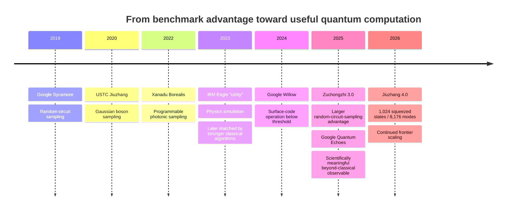
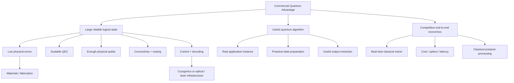

# How Close Are Quantum Computers to Commercially Useful Advantage?

## Executive summary

As of **August 31, 2026**, quantum computing has crossed one threshold but not the one businesses ultimately care about. **Quantum computational advantage on carefully chosen benchmark tasks is established**: superconducting and photonic processors have repeatedly executed sampling experiments for which the best published classical simulation estimates are vastly more expensive. Google’s 2019 Sycamore random-circuit-sampling experiment, USTC’s photonic Jiuzhang experiments, Xanadu’s Borealis experiment, and USTC’s 2025 Zuchongzhi 3.0 experiment all belong in this category. citeturn12search0turn12search2turn11search0turn13search0

The more important development is that the field is beginning to move beyond deliberately hard sampling benchmarks. Google’s **2025 Quantum Echoes experiment** measured higher-order out-of-time-order correlators on a 65-qubit superconducting processor and reported roughly **2.1 hours of quantum execution versus an estimated 3.2 years on Frontier for the corresponding tensor-network calculation**, or about a 13,000-fold difference. A subsequent independent 2026 analysis found another leading tensor-network strategy infeasible for that experiment. This is materially more relevant than random-circuit sampling because the quantity being calculated is a scientifically meaningful observable and can be used for Hamiltonian learning. citeturn4search0turn1academia36

However, **I did not find convincing primary-source evidence of an end-to-end, economically meaningful workload for which a quantum computer has yet delivered better cost, time-to-solution, or solution quality than the best classical alternative under realistic operating conditions**. That is a stronger criterion than “quantum advantage,” “quantum utility,” or “classically hard.” IBM’s 2023 127-qubit utility experiment illustrates why the distinction matters: it initially demonstrated calculations beyond straightforward brute-force classical methods, but several independent groups quickly developed tensor-network and sparse-Pauli simulations that reproduced or surpassed the experimental accuracy efficiently. citeturn6search5turn6academia35turn6academia36turn6academia37

My assessment is therefore:

| Maturity level | State as of Aug. 31, 2026 | Assessment |
|---|---|---|
| Quantum device beats known classical methods on a specially designed benchmark | Repeatedly demonstrated | **Established** |
| Quantum device performs a scientifically meaningful calculation beyond strong classical simulation | Emerging; strongest evidence is recent | **Promising but narrow** |
| Quantum device improves a real scientific workflow end-to-end | Early proof-of-concept evidence | **Not yet established as a general advantage** |
| Quantum computer beats the best classical alternative on an economically important workload | No robust demonstration found | **INSUFFICIENT_EVIDENCE** |
| Fault-tolerant quantum computer routinely executes large commercial algorithms | Hardware and error-correction demonstrations remain far smaller than projected requirements | **Not demonstrated** |

That distinction is increasingly recognized inside the field itself. A 2025 Google Quantum AI perspective argues that finding concrete problem instances that actually exhibit quantum advantage and connecting them to useful applications remains an underdeveloped challenge; application-oriented benchmarking efforts likewise emphasize **solution quality and time-to-solution**, rather than qubit count alone. citeturn1search12turn2search14

The biggest obstacle is no longer a single missing breakthrough. It is a **stack of interacting engineering constraints**: physical and logical error rates, logical-qubit count, connectivity, coherent circuit depth, control and decoding, quantum-error-correction overhead, cryogenic/control infrastructure for superconducting machines, optical loss for photonics, and fabrication/material variability. Google has now demonstrated surface-code error suppression below threshold, and alternative codes promise dramatically lower overhead, but present demonstrations are still orders of magnitude away from many large fault-tolerant workloads. citeturn1search0turn10search3turn7academia24

The most defensible conclusion is therefore:

> **Quantum advantage is real; commercially useful quantum advantage is not yet established. The gap between those statements has narrowed substantially, especially for quantum simulation and Hamiltonian-learning-style scientific problems, but crossing it will require both better hardware and much stronger application-level evidence.**

### Operational definition used in this report

Because “commercial quantum advantage” has no universally enforced benchmark, I use a deliberately stringent definition:

> A **commercially useful quantum advantage** occurs when a quantum system achieves materially superior end-to-end **solution quality, time-to-solution, cost, or another economically relevant metric** on a useful workload compared with the strongest practically available classical alternative, including realistic state preparation, error mitigation/correction, preprocessing, postprocessing, and repeated runs.

This is stricter than merely showing a calculation is difficult to simulate classically. That choice is motivated by the history of quantum-advantage claims being weakened by later classical-algorithm improvements and by current work calling for application-level rather than hardware-only benchmarks. citeturn6academia35turn6academia36turn1search12turn2search14


## What has actually been demonstrated

The history of quantum advantage is best understood as a progression from **artificial-but-clear computational separation** toward **increasingly meaningful scientific calculations**.

The following timeline summarizes the major evidence considered here; importantly, it does **not** imply that every milestone is commercially useful. citeturn12search0turn12search2turn11search0turn6search5turn1search0turn13search0turn4search0turn11search3



### Demonstrated quantum-advantage experiments

| Experiment | Platform | Task | Reported metric | Year | Source ID |
|---|---|---|---|---:|---|
| Google Sycamore | Superconducting, 53 usable qubits | Random circuit sampling | About 1 million samples in ~200 s; original paper estimated ~10,000 years for its classical comparison | 2019 | **S1** citeturn12search0 |
| Jiuzhang | Photonic | Gaussian boson sampling | 50 squeezed states injected into a 100-mode interferometer; demonstrated a sampling regime claimed beyond contemporary classical computation | 2020 | **S2** citeturn12search2 |
| Xanadu Borealis | Photonic, 216 squeezed modes | Programmable Gaussian boson sampling | ~36 μs per sample; authors estimated >9,000 years for an exact sample using the compared classical approach on Fugaku | 2022 | **S3** citeturn11search0 |
| IBM Eagle “utility” experiment | Superconducting, 127 qubits | Kicked-Ising-model observables | Accurate observables beyond brute-force exact computation; **subsequently reproduced more efficiently by improved classical methods**, so it is not strong evidence of durable quantum advantage | 2023 | **S4, S5, S6** citeturn6search5turn6academia35turn6academia36 |
| Zuchongzhi 3.0 | Superconducting, 105-qubit processor; 83 qubits used in cited circuit | 32-cycle random circuit sampling | 1 million samples in a few hundred seconds; authors estimate Frontier would need ~5.9 billion years for the compared simulation | 2025 | **S7** citeturn13search0 |
| Google Quantum Echoes | Superconducting, 65-qubit circuits | Higher-order OTOC / quantum many-body dynamics | ~2.1 h quantum data collection versus estimated ~3.2 years tensor-network calculation on Frontier, roughly 13,000× | 2025 | **S8** citeturn4search0 |
| Jiuzhang 4.0 | Photonic | Gaussian boson sampling | 1,024 squeezed states, 8,176 modes, events involving up to ~3,050 detected photons; substantially expands experimental sampling scale | 2026 | **S9** citeturn11search3turn13search4 |

These experiments should not be treated as equivalent.

**Sycamore, Jiuzhang, Borealis, Zuchongzhi and Jiuzhang 4.0 are compelling demonstrations of computational separation, but their benchmark tasks were largely selected because they are favorable for demonstrating quantum complexity.** They prove that quantum processors can enter computational regimes that are extremely difficult to reproduce classically; they do not by themselves establish economic usefulness. citeturn12search0turn12search2turn11search0turn13search0

A further caution comes from classical algorithm progress. The classical cost assigned to an experiment at publication is not immutable. IBM's 2023 experiment is the clearest case: the original work showed computations beyond direct brute-force classical approaches, yet Tindall et al. and Begušić et al. subsequently demonstrated efficient classical approaches that reproduced the relevant observables to high accuracy. This means a credible advantage claim has to be **red-teamed against evolving classical algorithms**, not merely against whatever solver was standard when the quantum experiment was designed. citeturn6search5turn6academia35turn6academia36turn6academia37

### Why Quantum Echoes is qualitatively different

Google's Quantum Echoes experiment is currently one of the most important pieces of evidence for the transition from “benchmark advantage” to “potentially useful advantage.” The computation concerns **out-of-time-order correlators**, which characterize information scrambling and many-body dynamics rather than simply producing random samples. The Nature paper reports 65-qubit experiments and compares its hardest regime with tensor-network simulation on Frontier, estimating a roughly 13,000-fold computational separation. citeturn4search0

A 2026 independent study specifically tested tensor networks with belief propagation against the experiment and concluded that this approach also could not feasibly simulate the relevant Quantum Echoes circuits. That does not prove that no future classical algorithm will do better, but it makes the classical red-team substantially stronger than a one-time vendor estimate. citeturn1academia36

The experiment also demonstrated a Hamiltonian-learning application, and a related 2025 preprint used many-body nuclear-spin echoes together with Willow simulations to augment inference of molecular geometry, obtaining structural parameters consistent with independent spectroscopy. That is genuine movement toward scientific utility. However, the latter work does **not** establish that the complete quantum-assisted workflow is cheaper, faster, or more accurate than the best conventional approach to molecular structure determination. citeturn4search0turn5academia24

Thus the evidence supports:

```text
Benchmark quantum advantage
        ↓
        ESTABLISHED

Scientifically meaningful beyond-classical calculation
        ↓
        NOW EMERGING

End-to-end commercial advantage
        ↓
        NOT YET ESTABLISHED
```

This distinction is central to the answer.


## Where future advantage is theoretically credible

Quantum algorithms provide strong theoretical reasons to believe useful advantage is possible, but theoretical complexity advantages can shrink dramatically once **input preparation, fault-tolerant resource requirements, data extraction, hardware constants, and continuously improving classical algorithms** are included. citeturn8search0turn7academia24turn7academia26turn1search12

### Theoretical and proposed advantages

| Algorithm / application | Theoretical advantage | Practical caveat | Evidence state | Source IDs |
|---|---|---|---|---|
| **Shor factoring / discrete logarithms** | Polynomial-time quantum algorithms for problems for which the best known general classical factoring algorithms are subexponential | Requires very large fault-tolerant circuits; a 2025 estimate still assumes up to roughly one million noisy physical qubits for RSA-2048 under specified error/cycle-time assumptions | Strong algorithmic case; hardware unavailable | **S10, S11** citeturn9search2turn7academia24 |
| **Quantum amplitude estimation / Monte Carlo** | Near-quadratic improvement in dependence on target precision for broad Monte-Carlo-style estimation settings | Requires coherent preparation of the underlying distribution/oracle and deep reliable operations; end-to-end advantage is application-dependent | Theoretical | **S12** citeturn8academia24 |
| **Quantum linear-system algorithms** | Polylogarithmic dependence on problem dimension under restrictive sparsity, conditioning and data-access assumptions | Output is generally a quantum state rather than an explicitly materialized classical solution; loading and reading classical data can erase much of the apparent gain | Theoretical under access assumptions | **S13** citeturn8search1 |
| **Fault-tolerant quantum chemistry / materials simulation** | Quantum simulation can represent strongly correlated quantum systems directly and may avoid unfavorable classical scaling for selected problems | Logical-qubit and gate counts remain substantial; concrete catalyst studies can still imply extremely long QPU runtimes | Strong domain motivation; commercial crossover unproven | **S14** citeturn7academia26 |
| **Decoded Quantum Interferometry (DQI)** | Superpolynomial advantage over known classical methods for the structured Optimal Polynomial Intersection problem in the analyzed regime | Advantage is problem-specific; in max-XORSAT tests, a specialized classical method beat the general-purpose DQI approach; proposed beyond-classical instances require millions of fault-tolerant gates | Promising theory, no corresponding hardware demonstration | **S15, S16** citeturn8search0turn1search2 |
| **Quantum oracle sketching for classical data** | 2026 theory gives exponential machine-size/sample advantages for certain classification and dimensionality-reduction tasks | Relies on particular quantum access/sketching structure; simulations and application studies are not physical demonstrations of advantage | New theoretical proposal | **S17** citeturn9academia24 |

### Factoring illustrates the hardware gap

Shor's algorithm remains one of the cleanest theoretical cases for transformative quantum advantage. It gives polynomial-time quantum algorithms for integer factoring and discrete logarithms, while no comparable polynomial-time classical algorithms are known. citeturn9search2

Yet the engineering requirements remain far beyond current machines. Craig Gidney's 2025 resource estimate reduced the estimated requirement for factoring an RSA-2048 integer to **fewer than one million noisy qubits and less than one week**, but only under assumptions including roughly 0.1% gate error, a 1-μs surface-code cycle and 10-μs classical reaction time. The significance of the paper is that resource estimates are improving—not that a million-qubit machine currently exists. citeturn7academia24

This comparison is instructive:

```text
Current frontier processors
~10² physical qubits at very high quality
        │
        │ hardware + QEC scaling
        ▼
Large fault-tolerant processors
10²–10³+ useful logical qubits for many ambitious workloads
and potentially ~10⁶ physical qubits for cryptographic-scale factoring
        │
        ▼
Commercially transformative fault-tolerant algorithms
```

The exact numbers depend heavily on architecture and algorithm, but the order-of-magnitude mismatch is real. Google's Willow error-correction demonstration used 101 physical qubits for a distance-7 surface-code memory, while modern fault-tolerant resource estimates still envision far larger systems for ambitious applications. citeturn1search0turn7academia24

### Chemistry may be closer, but not automatically economic

Quantum chemistry and materials simulation are often considered among the strongest candidates for early useful fault-tolerant advantage because the underlying systems are quantum mechanical. Yet concrete resource studies prevent an overly optimistic reading.

A 2024 analysis of homogeneous catalyst discovery found candidate problems for which fault-tolerant quantum computation could eventually be scientifically valuable, but for its highest-utility case it estimated roughly **139,000 fault-tolerant QPU-hours** under conservative assumptions, compared with approximately **400,000 CPU-hours** for the considered DMRG alternative. That is evidence of a possible future computational crossover, not evidence of a commercially attractive present-day one. citeturn7academia26

### Optimization and quantum machine learning are particularly uncertain

The DQI results make a broader point. The 2025 Nature work finds a strong asymptotic separation for a specially structured optimization problem, but on another benchmark, max-XORSAT, a tailored classical solver can outperform the quantum approach even where the quantum algorithm beats a generic simulated-annealing baseline. citeturn8search0

That is precisely the standard commercial applications must survive:

> The relevant competitor is not a generic textbook classical algorithm. It is the **best specialized classical method available for the actual workload**.

For optimization and classical-data machine learning, that requirement makes broad claims of imminent advantage considerably weaker than the underlying quantum-complexity results suggest. citeturn8search0turn9academia24turn1search12


## Technical barriers between today's systems and commercial advantage

There has been real progress on essentially every hardware axis. The important question is whether the axes can improve **simultaneously**, because increasing qubit count while losing fidelity, or improving gates without scalable wiring and decoding, does not produce a useful computer.

### Major barriers

| Barrier | Current evidence | Why it still blocks commercial advantage | Assessment | Source IDs |
|---|---|---|---|---|
| **Error rates** | Willow demonstrated below-threshold surface-code scaling; its distance-7 memory reported ~0.143% logical error per cycle. Ion-trap work has demonstrated individual two-qubit gates below \(10^{-4}\) error in a specialized experiment. | Long algorithms multiply opportunities for failure; physical gate fidelity alone is not equivalent to low logical error across an entire computation | **Major** | **S18, S19** citeturn1search0turn3academia12 |
| **Qubit counts** | Current high-quality processors are on the order of tens to low hundreds of physical qubits; Zuchongzhi has 105 physical qubits, Willow's largest cited surface-code memory uses 101, and Quantinuum's Helios is a 98-ion system | Fault-tolerant commercial algorithms can require hundreds of logical qubits and, depending on code and workload, vastly more physical qubits | **Major** | **S7, S18, S20, S11** citeturn13search0turn1search0turn10search18turn7academia24 |
| **Connectivity** | Superconducting architectures rely on constrained local connectivity; IBM's proposed low-overhead qLDPC implementation needs degree-6 connectivity. IBM has also demonstrated workload partitioning across processors to work around local hardware limits | Routing adds gates and errors; more efficient QEC codes can demand harder connectivity | **Major** | **S21, S22** citeturn10search3turn10search15 |
| **Coherence / sustained depth** | Error correction now preserves logical information better as code distance grows on Willow, but rare correlated-error events remain | Commercial value depends on executing long *logical circuits*, not merely preserving a memory or running shallow physical circuits | **Major** | **S18** citeturn1search0 |
| **Control and decoding** | Willow's real-time decoder demonstration reports tens-of-microseconds decoding latency while surface-code cycles are around the microsecond scale; superconducting systems also require extensive microwave-control infrastructure | Millions of qubits cannot each acquire an unconstrained room-temperature control stack; feedback and decoding must scale without becoming the bottleneck | **Major** | **S18, S23** citeturn1search0turn11search6 |
| **Quantum error-correction overhead** | Surface codes have demonstrated genuine below-threshold behavior; IBM's qLDPC work theoretically reduces physical-qubit overhead dramatically | Low-overhead alternatives impose other engineering requirements and have not yet been demonstrated at the required scale | **Probably the central scaling barrier** | **S18, S21** citeturn1search0turn10search3 |
| **Cryogenics** | Conventional superconducting-qubit control involves large numbers of microwave lines into cryogenic environments; published photonic-control work explicitly identifies wiring complexity and heat load as scaling constraints | A million-qubit superconducting system cannot simply replicate today's per-qubit cabling architecture | **Major for superconducting platforms; not universal** | **S23** citeturn11search6 |
| **Materials / fabrication / loss** | Willow observed rare correlated error events whose origin remains an issue; photonic work continues to focus heavily on loss, source efficiency, detector efficiency and manufacturable interconnects | Small correlated-error floors can defeat QEC assumptions; photonic loss destroys quantum correlations; large systems require reproducible device yield | **Major and platform-specific** | **S18, S24, S9** citeturn1search0turn8search5turn11search3 |

### Error correction has crossed an important threshold

Google's Willow experiments are a genuine qualitative milestone. Using distance-5 and distance-7 surface-code memories, the team found that logical error decreased as code distance increased, reporting an error-suppression factor of approximately 2.14 when increasing distance by two. The 101-qubit distance-7 code achieved a reported logical error rate of about **0.143% per cycle** and a logical lifetime about 2.4 times that of the best constituent physical qubit. citeturn1search0

This means the core idea behind scalable fault tolerance is no longer purely aspirational: **larger codes can make information more reliable rather than less reliable**. citeturn1search0

But that does not mean the QEC problem is solved. The same work reports rare correlated events and substantial decoding/control requirements, and a logical **memory** operating below threshold is not equivalent to a processor executing millions of arbitrary logical gates. citeturn1search0

Alternative codes could change the economics dramatically. IBM's 2024 qLDPC analysis proposes a memory storing 12 logical qubits for nearly a million cycles using 288 physical qubits under a 0.1% physical-error assumption, compared with roughly 3,000 qubits in the surface-code comparison. But the proposed code demands more complicated connectivity, including degree-six connectivity and nontrivial syndrome-extraction circuits. This remains a proposed architecture rather than an equivalent large-scale hardware demonstration. citeturn10search3

### Different hardware platforms trade one bottleneck for another

There is no single hardware trajectory.

Superconducting systems such as Google, IBM and Rigetti have relatively fast gates and semiconductor-like fabrication approaches, but face cryogenic wiring, local connectivity, materials defects and scaling challenges. Rigetti's 2025 modular 36-qubit chiplet system, for example, reported 99.5% median two-qubit fidelity while demonstrating a multi-chip architecture intended to support larger processors; that is progress toward scalability, not evidence of quantum advantage. citeturn2search9

Trapped-ion systems have demonstrated exceptionally high gate fidelities. A 2025 IonQ-affiliated trapped-ion experiment reported two-qubit errors of approximately \(8.4\times10^{-5}\) without requiring ground-state cooling of all modes. Quantinuum's Helios commercial launch reported a 98-ion processor and company-measured average two-qubit fidelity of 99.921%. These are strong engineering results, but neither figure by itself demonstrates end-to-end commercial advantage. citeturn3academia12turn10search18

Photonics avoids some cryogenic-qubit constraints but has its own central problem: **photon loss**. PsiQuantum's 2025 manufacturability work reported high-quality state preparation/readout, interference, fusion and chip-to-chip interconnect components, while the 2026 Jiuzhang 4.0 result emphasizes higher source and system efficiency precisely because preserving photons is fundamental to maintaining useful quantum correlations. citeturn8search5turn13search4

The competitive landscape therefore looks more like:



A weakness in any one branch can eliminate the practical advantage even if the quantum kernel itself has superior asymptotic complexity. This is also why qubit count alone is a poor commercial-progress metric. citeturn1search12turn2search14

### Roadmaps are evidence of intent, not evidence of arrival

Industry roadmaps are aggressive. IBM's current roadmap describes a goal of delivering its Starling fault-tolerant system in 2029 with approximately **200 logical qubits and 100 million quantum gates**. IBM has separately described a goal of demonstrating quantum advantage before that fault-tolerant stage. These are engineering targets, explicitly subject to roadmap revision, rather than experimentally established future capabilities. citeturn10search6turn10search7

Similarly, IonQ has marketed systems using its algorithmic-qubit metric and has framed newer systems as approaching or enabling commercially relevant workloads. These statements are useful indicators of vendor strategy, but they do not substitute for independent application benchmarks against state-of-the-art classical implementations. citeturn2search3turn2search14

Consequently, I do **not** assign a calendar date such as “commercial advantage will happen in 2027.” The current evidence does not support that precision.


## Evidence ledger and research state

### Evidence ledger

The ledger below distinguishes evidence that a computational separation exists from evidence that the separation is economically useful.

| Claim ID | Claim | Supporting evidence | Contradicting / qualifying evidence | Confidence | Status |
|---|---|---|---|---|---|
| **C1** | Quantum computational advantage on specialized benchmark tasks has been experimentally demonstrated. | S1, S2, S3, S7, S9 | Classical algorithms can substantially reduce previously quoted simulation costs, but no evidence found reverses the broad claim that beyond-classical benchmark regimes have been reached. | **HIGH** | **SUPPORTED** |
| **C2** | There is not yet compelling evidence of repeatable, end-to-end **commercial** quantum advantage over the best classical alternative on an economically significant workload. | S4–S6 show how “utility” can disappear against better classical methods; S25 identifies application discovery as an outstanding challenge; S8's strongest recent demonstration stops short of commercial comparison. | Vendor roadmaps and application claims anticipate commercial advantage, but these are projections rather than demonstrated end-to-end superiority. | **HIGH** | **SUPPORTED** |
| **C3** | Google's 2025 Quantum Echoes work materially narrows the gap between artificial benchmark advantage and useful scientific computation. | S8, S26; S27 independently red-teams an additional classical simulation strategy. | S26 does not show that the full scientific workflow is economically superior to classical alternatives. | **HIGH** | **SUPPORTED** |
| **C4** | Quantum error correction has crossed an important feasibility threshold, but current logical systems remain far below the scale/depth needed for many fault-tolerant commercial algorithms. | S18, S21, S11 | Better codes and rapidly improving logical demonstrations could reduce overhead substantially. | **HIGH** | **SUPPORTED** |
| **C5** | Large theoretical quantum speedups do not automatically translate into commercial speedups because state preparation, readout, QEC, constants and stronger classical algorithms can dominate. | S10–S17, S25 | Some problems such as factoring have unusually clean theoretical separations and could become decisive once sufficient FT hardware exists. | **HIGH** | **SUPPORTED** |
| **C6** | Quantum simulation / Hamiltonian learning currently appears more plausible as an early scientifically useful advantage area than broad generic optimization or classical-data ML. | S8, S14, S25, S26 | S15–S17 establish potentially strong optimization/ML separations for structured problems, so the ordering is not settled. | **MEDIUM** | **WEAK** |
| **C7** | Near-term vendor projections should not be treated as demonstrated commercial advantage. | S20 and IBM roadmap sources state hardware capabilities/targets; S25 emphasizes missing application-level proof. | Vendors report rapidly improving systems and application benchmarks. | **HIGH** | **SUPPORTED** |
| **C8** | Scaling requires simultaneous progress in errors, QEC overhead, qubit count, connectivity, control, cryogenics/optics and materials—not merely larger qubit counts. | S18, S21–S24 | Different architectures alleviate different subsets of the constraints, so no single barrier is universal. | **HIGH** | **SUPPORTED** |
| **C9** | Advantage claims made on noisy pre-fault-tolerant hardware are especially vulnerable to subsequent classical-algorithm improvement. | S4, S5, S6 and related classical simulations | S8/S27 show that more aggressive classical red-teaming can make newer claims more robust. | **HIGH** | **SUPPORTED** |

The supporting evidence for **C1** spans independent superconducting and photonic implementations, making the existence of narrow computational advantage highly secure. citeturn12search0turn12search2turn11search0turn13search0turn11search3

**C2 is deliberately stronger.** I found no primary experiment that simultaneously establishes an economically meaningful workload, compares against the best known classical solution, includes relevant end-to-end overhead, and demonstrates a durable commercial metric advantage. Recent Google work gets substantially closer scientifically, but the paper itself frames it as a path toward practical advantage rather than proof that the commercial threshold has been crossed. citeturn4search0turn1search12

The confidence in **C9** is driven especially by the IBM Eagle case, in which improved tensor-network and sparse-Pauli calculations materially altered the interpretation of the original “utility” result. citeturn6search5turn6academia35turn6academia36turn6academia37

### Research gaps

| Gap ID | Gap | Importance | Related claims | Status |
|---|---|---|---|---|
| **G1** | Lack of independent end-to-end benchmarks comparing quantum and best-classical **cost, wall-clock time, solution quality, preprocessing and postprocessing** on an economically meaningful workload | **HIGH** | C2, C5, C6 | **OPEN** |
| **G2** | Need continued independent classical red-teaming of Quantum Echoes and related Hamiltonian-learning applications as classical tensor-network algorithms improve | **HIGH** | C2, C3, C9 | **OPEN** |
| **G3** | Insufficient cross-platform evidence on sustained **logical gate depth**, rather than logical memory or isolated encoded operations, at commercially relevant scales | **HIGH** | C4, C8 | **OPEN** |
| **G4** | Sparse public data on total operating economics: QPU utilization, calibration downtime, energy, cooling/control cost, queue latency and effective cost per successful solution | **HIGH** | C2, C7, C8 | **OPEN** |
| **G5** | Uncertainty over which application family will first survive aggressive classical specialization: chemistry, materials, optimization, ML/data analysis, or another niche | **MEDIUM** | C5, C6 | **OPEN** |
| **G6** | Vendor-reported 2025–2026 performance would benefit from more independently reproduced application-level benchmarking | **MEDIUM** | C4, C7 | **OPEN** |
| **G7** | The latest large sampling experiments need continual comparison against newly developed classical simulation algorithms before headline speedup factors are considered durable | **MEDIUM** | C1, C9 | **OPEN** |

These gaps are not merely consequences of an incomplete literature search. Several are intrinsic to the present state of the field: the 2025 Google application perspective itself argues that identifying concrete advantage-bearing problems and connecting them to meaningful use cases remains unresolved. citeturn1search12


## Research decision and overall conclusion

### Prioritized next research decision

```yaml
needs_more_research: true

reason: >
  The strongest unresolved issue is not whether quantum advantage exists;
  it is whether any reported application survives an end-to-end comparison
  against the strongest specialized classical workflow on metrics that matter
  economically. Resolving that gap would most directly change the conclusion.

target_type: GAP
target_id: G1

next_search_query: >
  "2025 2026 end-to-end quantum advantage industrial application
  benchmark quantum vs best classical time-to-solution solution quality
  cost chemistry materials optimization fault-tolerant"
```

Because the question asks **“how close?”**, G1 has higher decision value than simply finding another processor with a better gate fidelity. A convincing G1 result could change C2 from “no demonstrated commercial advantage” to a much stronger conclusion; another hardware benchmark probably would not.

Secondary searches should target G3 and G4:

```text
"logical quantum computation benchmark sustained logical circuit depth
2025 2026 error corrected processor logical gate fidelity"

"quantum computing application benchmark total time to solution
classical preprocessing QPU execution postprocessing cost energy 2026"
```

### Executive-style conclusion

There are three different races occurring under the label “quantum advantage,” and conflating them creates most of the hype.

**The first race has already been won:** quantum processors can perform certain computations that are extraordinarily difficult to reproduce on conventional computers. This is supported by multiple independent superconducting and photonic experiments from 2019 through 2026. citeturn12search0turn11search0turn13search0turn11search3

**The second race—useful scientific advantage—is beginning to become credible.** Google's Quantum Echoes result is stronger evidence than earlier sampling demonstrations because the beyond-classical calculation concerns a meaningful many-body observable, has undergone substantial classical red-teaming, and connects to Hamiltonian learning. Related molecular-geometry work shows how such measurements could fit into a scientific workflow. citeturn4search0turn1academia36turn5academia24

**The third race—commercial advantage—has not yet been won on the evidence reviewed here.** There is no robustly established case in which a quantum computer solves an economically meaningful problem better end-to-end than the strongest classical alternative while including realistic system overhead. citeturn1search12turn2search14

Error correction is improving fast enough that dismissing quantum computing as perpetually impractical is no longer justified. Google's below-threshold surface-code result demonstrates the mechanism needed to suppress logical errors, while IBM's qLDPC work illustrates how future codes could lower overhead substantially. Yet the gap from **roughly hundred-qubit experimental systems and early logical processors to large, reliable fault-tolerant computations remains substantial**. citeturn1search0turn10search3turn7academia24

Accordingly, the best-supported assessment on August 31, 2026 is:

> **Commercially useful quantum advantage is closer than it was even two years ago, but it should still be described as an emerging possibility rather than an achieved capability.**

The strongest near-term evidence is likely to come not from a generic claim that “quantum is faster,” but from a narrow application where four conditions coincide:

1. the problem has genuine economic or scientific value;
2. its quantum formulation has a defensible complexity or quality advantage;
3. available hardware can execute it reliably enough;
4. the complete quantum workflow beats an aggressively optimized classical competitor.

No source reviewed here establishes all four simultaneously. That remaining gap should be the central benchmark for claims of commercial quantum advantage.


## Source catalog and provenance

The research prioritized peer-reviewed primary papers, arXiv manuscripts from the relevant research groups, and first-party technical material where peer-reviewed data were unavailable. **No specific bibliographic database was prescribed by the question**; discovery here used publisher indexes, arXiv and official laboratory/company research pages rather than an exhaustive Scopus, Web of Science or INSPEC systematic-review protocol.

| ID | Source metadata | URL |
|---|---|---|
| **S1** | Frank Arute, Kunal Arya, Ryan Babbush et al. **“Quantum supremacy using a programmable superconducting processor.”** *Nature* 574, 2019. citeturn12search0 | `https://doi.org/10.1038/s41586-019-1666-5` |
| **S2** | Han-Sen Zhong, Hui Wang, Yu-Hao Deng, Ming-Cheng Chen et al. **“Quantum computational advantage using photons.”** *Science* 370, 2020. citeturn12search2 | `https://doi.org/10.1126/science.abe8770` |
| **S3** | Lars S. Madsen, Fabian Laudenbach, Mohsen Falamarzi Askarani et al. **“Quantum computational advantage with a programmable photonic processor.”** *Nature* 606, 2022. citeturn11search0 | `https://doi.org/10.1038/s41586-022-04725-x` |
| **S4** | Youngseok Kim et al. **“Evidence for the utility of quantum computing before fault tolerance.”** *Nature* 618, 2023. citeturn6search5 | `https://doi.org/10.1038/s41586-023-06096-3` |
| **S5** | Joseph Tindall, Matt Fishman, Miles Stoudenmire, Dries Sels. **“Efficient tensor network simulation of IBM's Eagle kicked Ising experiment.”** arXiv, 2023. citeturn6academia35 | `https://arxiv.org/abs/2306.14887` |
| **S6** | Tomislav Begušić, Johnnie Gray, Garnet Kin-Lic Chan. **“Fast and converged classical simulations of evidence for the utility of quantum computing before fault tolerance.”** arXiv, 2023. citeturn6academia36 | `https://arxiv.org/abs/2308.05077` |
| **S7** | Dongxin Gao, Daojin Fan, Chen Zha et al. **“Establishing a New Benchmark in Quantum Computational Advantage with 105-qubit Zuchongzhi 3.0 Processor.”** *Physical Review Letters* 134, 2025. citeturn13search0 | `https://doi.org/10.1103/PhysRevLett.134.090601` |
| **S8** | Google Quantum AI and collaborators. **“Observation of constructive interference at the edge of quantum ergodicity.”** *Nature* 646, 2025. citeturn4search0 | `https://doi.org/10.1038/s41586-025-09526-6` |
| **S9** | Jiuzhang 4.0 collaboration. **“Gaussian boson sampling with 1,024 squeezed states in 8,176 modes.”** *Nature*, 2026. citeturn11search3 | `https://www.nature.com/articles/s41586-026-10523-6` |
| **S10** | Peter W. Shor. **“Polynomial-Time Algorithms for Prime Factorization and Discrete Logarithms on a Quantum Computer.”** *SIAM Journal on Computing* 26, 1997. citeturn9search2 | `https://doi.org/10.1137/S0097539795293172` |
| **S11** | Craig Gidney. **“How to factor 2048 bit RSA integers with less than a million noisy qubits.”** arXiv, 2025. citeturn7academia24 | `https://arxiv.org/abs/2505.15917` |
| **S12** | Ashley Montanaro. **“Quantum speedup of Monte Carlo methods.”** arXiv / *Proceedings of the Royal Society A*, 2015. citeturn8academia24 | `https://arxiv.org/abs/1504.06987` |
| **S13** | Andrew M. Childs, Robin Kothari, Rolando D. Somma. **“Quantum Algorithm for Systems of Linear Equations with Exponentially Improved Dependence on Precision.”** *SIAM Journal on Computing* 46, 2017. citeturn8search1 | `https://doi.org/10.1137/16M1087072` |
| **S14** | Nicole Bellonzi et al. **“Feasibility of accelerating homogeneous catalyst discovery with fault-tolerant quantum computers.”** arXiv, 2024. citeturn7academia26 | `https://arxiv.org/abs/2406.06335` |
| **S15** | Stephen P. Jordan, Noah Shutty, Mary Wootters et al. **“Optimization by decoded quantum interferometry.”** *Nature* 646, 2025. citeturn8search0 | `https://doi.org/10.1038/s41586-025-09527-5` |
| **S16** | Tanuj Khattar, Noah Shutty, Craig Gidney et al. **“Verifiable Quantum Advantage via Optimized DQI Circuits.”** arXiv, 2025. citeturn1search2 | `https://arxiv.org/abs/2510.10967` |
| **S17** | Haimeng Zhao, Alexander Zlokapa, Hartmut Neven et al. **“Exponential quantum advantage in processing massive classical data.”** arXiv, 2026. citeturn9academia24 | `https://arxiv.org/abs/2604.07639` |
| **S18** | Google Quantum AI and collaborators. **“Quantum error correction below the surface code threshold.”** *Nature* 638, 2025; published online Dec. 2024, corrected Apr. 2026. citeturn1search0turn1search1 | `https://doi.org/10.1038/s41586-024-08449-y` |
| **S19** | A. C. Hughes, R. Srinivas, C. M. Löschnauer et al. **“Trapped-ion two-qubit gates with >99.99% fidelity without ground-state cooling.”** arXiv, 2025. citeturn3academia12 | `https://arxiv.org/abs/2510.17286` |
| **S20** | Quantinuum. **Helios commercial-system technical announcement.** 2025. Vendor source reporting a 98-qubit trapped-ion system and hardware performance. citeturn10search18 | `https://www.quantinuum.com/press-releases/quantinuum-announces-commercial-launch-of-new-helios-quantum-computer-that-offers-unprecedented-accuracy-to-enable-generative-quantum-ai-genqai` |
| **S21** | Sergey Bravyi, Andrew W. Cross, Jay M. Gambetta, Dmitri Maslov, Patrick Rall, Theodore J. Yoder. **“High-threshold and low-overhead fault-tolerant quantum memory.”** *Nature*, 2024. citeturn10search3 | `https://research.ibm.com/publications/high-threshold-and-low-overhead-fault-tolerant-quantum-memory--2` |
| **S22** | Almudena Carrera Vazquez, Caroline Tornow, Diego Ristè et al. **“Combining quantum processors with real-time classical communication.”** *Nature*, 2024. citeturn10search15 | `https://research.ibm.com/publications/combining-quantum-processors-with-real-time-classical-communication` |
| **S23** | F. Lecocq, F. Quinlan, K. Cicak, J. Aumentado, S. A. Diddams, J. D. Teufel. **“Control and readout of a superconducting qubit using a photonic link.”** *Nature* 591, 2021. citeturn11search6 | `https://doi.org/10.1038/s41586-021-03268-x` |
| **S24** | PsiQuantum team. **“A manufacturable platform for photonic quantum computing.”** *Nature* 641, 2025. citeturn8search5 | `https://doi.org/10.1038/s41586-025-08820-7` |
| **S25** | Ryan Babbush, Robbie King, Sergio Boixo et al. **“The Grand Challenge of Quantum Applications.”** Google Quantum AI / arXiv, 2025. citeturn1search12 | `https://arxiv.org/abs/2511.09124` |
| **S26** | C. Zhang, R. G. Cortiñas, A. H. Karamlou et al. **“Quantum computation of molecular geometry via many-body nuclear spin echoes.”** arXiv, 2025. citeturn5academia24 | `https://arxiv.org/abs/2510.19550` |
| **S27** | Pablo Bermejo, Benjamin Villalonga, Brayden Ware, Guifre Vidal, Aaron Szasz. **“Tensor Networks with Belief Propagation Cannot Feasibly Simulate Google's Quantum Echoes Experiment.”** arXiv, 2026. citeturn1academia36 | `https://arxiv.org/abs/2604.15427` |

For the Reinforce Labs evaluation context, this report deliberately separates **claims, evidence, confidence, disagreement and unresolved gaps**, matching the take-home's requirement that research output distinguish claims from evidence and expose uncertainty rather than merely generate plausible prose. fileciteturn0file0