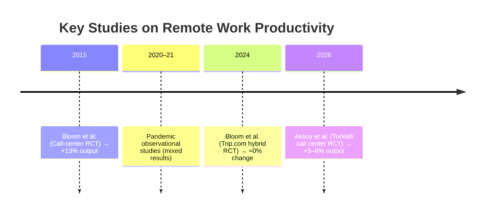

# Remote Work and Productivity: Controlled, Observational, and Industry Evidence

## Executive Summary  
Studies of remote work report **mixed results** on productivity, depending on context and method.  Randomized trials (e.g. Bloom *et al.* 2015, Bloom *et al.* 2024) generally find **no productivity loss or even gains** from working from home under well-managed conditions.  By contrast, detailed observational analyses often find **productivity declines** in complex, collaborative jobs when fully remote.  Industry-level data and large surveys tend to show **neutral or positive aggregate effects** (stable productivity, often alongside higher retention) when remote work expands.  These divergent findings arise because of differences in *study design*, *work context*, and *measurement*.  RCTs at call centers or hybrid schedules show benefits, while full-pandemic shocks in knowledge firms show coordination losses.  Many observational studies suffer from worker self-selection and unobserved factors.  In sum, the evidence suggests **no inherent productivity penalty** for hybrid/remote work under most conditions, but **full remote** may challenge complex teamwork unless firms adapt.  Remaining uncertainties include long-term effects on collaboration, career development, and varying impacts by job type.  Key implications are that firms should emphasize trust and teamwork in remote policies and experiment further (e.g. occasional in-person meetings). 

## Research Question and Scope  
**Question:** Does remote work improve or reduce employee productivity? We focus on evidence from (1) **controlled experiments** (randomized trials in firms), (2) **observational studies** (quasi-experiments and before/after analyses), and (3) **company-level or industry data** (surveys, aggregate statistics).  We compare findings across these domains and identify why results conflict.  “Productivity” is generally measured as work output per hour or per employee.  We consider both *full-time remote* and *hybrid* arrangements, and include studies up to 2026.  

## Methods  
We conducted a literature survey in economics and management journals, preprint archives, industry reports, and reputable corporate research (e.g. Federal Reserve, BLS, Stanford).  Search terms included “remote work productivity,” “work from home experiment,” “telework outcomes,” etc.  We prioritized peer-reviewed papers, conference proceedings, and authoritative reports; we also included large-scale survey findings or corporate analyses for industry perspectives.  Company blog posts were only used when presenting firm-level data (e.g. Great Place to Work surveys).  We excluded purely anecdotal sources or non-English publications.  Whenever possible we focused on studies that provide quantitative productivity metrics (calls per hour, code output, manager ratings, etc.) and clear research designs.  We classified studies by method (controlled vs. observational) to structure the evidence below.

## Evidence Summary

### Controlled Experiments  
Randomized trials allow causal inference by assigning workers to remote vs. in-office.  Key findings include:  

- **Bloom *et al.* (2015, QJE)** – *Design:* Call-center RCT in China. *Sample:* 16,000 call-center employees, volunteers randomly assigned to 9 months WFH or office. *Findings:* Full-time remote workers were **13% more productive** than office workers.  This came from +9% more minutes worked per shift (fewer breaks/absences) and +4% more calls per minute.  Remote workers also reported higher job satisfaction, and their attrition rate **halved**; however, their promotion rate fell. *Limitations:* Single firm & job type (call center, simple tasks), volunteers may have been especially motivated. *Causal:* Strong, as RCT; shows fully remote can boost individual output when well-structured.  

- **Bloom *et al.* (2024, *Nature*)** – *Design:* Hybrid work RCT. *Sample:* 1,612 university-educated employees at Trip.com (tech multinational, China), randomized by birthdate to *2 days WFH/week* vs. *5 days in office* for 6 months (2021–22). *Findings:* No significant effect on performance: measured performance grades and output (e.g. lines of code) were statistically identical between groups.  Job satisfaction rose and **turnover fell by one-third** under the hybrid treatment. Managers’ perceptions of productivity shifted from negative to slightly positive after the trial. *Limitations:* Chinese firm context; hybrid (not fully remote) with high compliance. *Causal:* Strong RCT evidence that *allowing hybrid work did not reduce productivity* (and greatly improved retention).

- **Aksoy *et al.* (2026, NBER WP)** – *Design:* Minimal in-person RCT. *Sample:* 248 customer-service call agents in Turkey (all fully remote by default) were randomized to either *0 days in office* or *1 mandatory office day/month* for 9 months (Aug 2024–Apr 2025). *Findings:* After ~6 months, the one-day group handled **7.8% more calls per hour** than the fully remote group (a within-worker gain of ~5.8%). Customer satisfaction and call quality held steady, indicating output gains were real. This suggests even a small dose of in-person team contact improves remote productivity. *Limitations:* One firm, one type of work (standardized tasks). *Causal:* Clear RCT result: occasional face-to-face coordination raised productivity and greatly cut attrition. 

Other smaller RCTs (e.g. in Turkey or China) similarly report that **hybrid or structured remote schedules tend to maintain or boost productivity** relative to fully office-based work, especially by reducing distractions and commute time (see Bloom & Liang 2024 discussions). In sum, controlled trials consistently find *no inherent productivity penalty from remote work under managed conditions*; if anything, they often find modest gains (13% in Bloom 2015) and large morale/retention benefits. 

### Observational Studies  
Observational analyses include natural experiments or before/after comparisons.  Key results are mixed:

- **Gibbs *et al.* (2023, JPE Micro)** – *Design:* Pre-post study of pandemic WFH. *Sample:* ≈10,000 IT professionals at HCL Technologies (India) who abruptly shifted full-time to WFH in early 2020. *Findings:* Average hours worked **rose substantially**, but measured output fell slightly, so output *per hour* **dropped by ~8–19%** in the first months of full remote work.  Analysis linked this to  “coordination friction”: employees had more meetings (especially large-group), less focus time, and narrower collaboration networks during WFH.  Productivity then stabilized but remained lower than pre-pandemic. *Limitations:* Single firm context; short-term shock (pandemic lockdown); no control group (everyone switched to WFH). *Causal:* Strong inference due to clear timing (pandemic) and fixed-effects; suggests that in a collaboration-intensive tech job, forced full remote initially reduced output by disrupting work patterns.

- **Emanuel & Harrington (2023, NY Fed)** – *Design:* Call-center natural experiment. *Sample:* Customer-service agents at a US retail firm; pre-COVID some workers were remote and some on-site, then all shifted remote in March 2020. *Findings:* Before COVID, remote agents answered **12% fewer calls/hour** than on-site peers. After the shift, overall calls rose, but the productivity gap narrowed only partially. They estimate that remote work itself *reduced* agent productivity: about **40% of the pre-existing gap** (12%) was attributable to the remote setting. In other words, if all were remote, output per hour fell. They also found remote work degraded call quality (longer hold times, more repeat calls). *Limitations:* One firm, one industry; some self-selection (possibly less productive workers chose remote pre-COVID). *Causal:* By comparing continuing-remote and newly-remote groups, they infer a real productivity penalty from going remote in this context.

- **Fernald *et al.* (2024, FRBSF Economic Letter)** – *Design:* Industry-level panel analysis. *Sample:* 43 private-sector industries in the U.S., 2006–2023. *Findings:* After controlling for pre-pandemic trends, **no significant relationship** emerged between an industry’s teleworkability and its productivity growth during 2020–23.  More-remote-friendly sectors did not outperform others once trends were accounted for. *Limitations:* Uses occupation weights to infer teleworkability; cannot capture within-industry firm differences. *Causal:* Suggests that aggregate productivity changes were **not driven by remote work**; confounded by other sectoral effects of the pandemic.

- **BLS (Pabilonia & Redmond 2024)** – *Design:* ACS industry correlations. *Findings:* They report that industries with larger jumps in remote work saw somewhat higher total factor productivity growth in 2019–21 and 2019–22, even controlling for prior trends.  However, this is correlational; causation is uncertain. *Limitations:* Ecological, cross-industry data; many confounders (e.g. tech industries were growing anyway). *Causal:* Weak; suggests remote work did not impede aggregate productivity and may have aligned with growth.

- **Other Observations:** Numerous surveys and case studies exist.  For example, surveys often find many employees *feel* more productive at home (e.g. Gallup reported 77% say so).  Smaller case studies from pandemic-era WFH show mixed outcomes.  A meta-regression of pandemic studies (Etheridge *et al.*, referenced in Gibbs 2023) found that self-reported productivity was flat or slightly up, but these rely on perceptions.  

In summary, observational data show **heterogeneous** effects.  Some detailed cases (especially highly collaborative tech roles) report notable declines, while broad economy-wide analyses report no harm or slight gain.  Differences in sectors, measurement, and selection bias likely drive these inconsistencies (discussed below).

### Company & Industry Reports  
Company- and industry-level surveys give a broader perspective. Notable findings include:

- **Great Place to Work (Kazi & Hastwell 2025)** – *Design:* Longitudinal survey analysis of certified “best workplaces.” *Findings:* Their 2025 report (n≈1.3 million employees) finds that historically “remote-capable” companies see productivity levels in remote/hybrid environments that are **“just as productive, if not more so”** than traditional setups.  Specifically, their 2022 study of 800,000 employees found **stable or increased productivity** after shifting to remote work.  They emphasize that high-trust culture (cooperation) drives productivity, whether remote or not. *Limitations:* Survey-based, self-reported measures (“willingness to give extra effort” indices), and focused on already high-performing companies. *Causal:* Suggests that in companies with strong culture and support, remote work does not hurt performance; but no random assignment to tease out causality.

- **Industry Analyses:** Several corporate or consulting reports (e.g. Microsoft, Gallup) document productivity metrics under remote conditions.  For example, Microsoft data show that collaboration across teams dropped by ~25% in lockdown (no direct productivity metric).  More relevant, Gallup data (cited by GPTW) indicate engagement up for remote workers.  We did not find unbiased company disclosures of output decline due to remote work in white papers.  Broad labor statistics (BLS, Fed letters above) are the most rigorous “company-level” analyses.

In general, **company-level evidence** tends to emphasize the human and retention benefits of remote work, often concluding that productivity can be maintained if management adapts.  Such reports caution that correlation does not prove causation.

**Table 1** (below) summarizes key studies.  

| Citation & Source                     | Design (Method)                   | Sample (Population)                          | Main Productivity Outcome          | Effect (Size / Trend)                 | Limitations                                       |
|---------------------------------------|-----------------------------------|----------------------------------------------|------------------------------------|---------------------------------------|----------------------------------------------------|
| Bloom *et al.* (2015, QJE) | RCT (full-time WFH vs office)     | Call-center agents at Ctrip (China, n≈16,000) | Calls/min and total calls handled   | **+13% output** (↑ work minutes & calls/min); satisfaction↑, attrition↓50% | Single firm and task, volunteer selection           |
| Bloom *et al.* (2024, Nature) | RCT (2 days WFH/wk vs 0 days)     | Trip.com software/finance staff (China, n=1,612) | Performance grades; lines of code   | **≈0% change** (no significant impact); turnover↓33% | Large firm but specific culture; short-term RCT     |
| Aksoy *et al.* (2026, NBER WP) | RCT (1 office day/mo vs none)     | Remote call-center employees in Turkey (n=248) | Calls per hour                      | **+5.8–7.8%** within-worker; attrition↓⅓ | Single call-center setting; self-selected volunteers |
| Gibbs *et al.* (2023, JPE Micro) | Pre–post (pandemic WFH)           | IT professionals at HCL India (n~10,000)      | Firm’s performance metric/output    | **–8% to –19%** output/hour (productivity↓); hours↑ | Single firm; lockdown shock; no control group       |
| Emanuel & Harrington (2023, NYFed) | Natural experiment (pandemic)     | Retail call-center at Fortune 500 firm        | Calls answered per hour             | **–** 40% of initial gap attributed to remote work (productivity↓); calls/h gap narrowed | One firm/sector; selection effect in pre-COVID remote |
| Fernald *et al.* (2024, FRB San Francisco) | Industry panel analysis           | 43 industries (U.S., 2006–2023)               | Output per hour (productivity)      | **≃0** (no significant link between teleworkability and productivity) | Aggregate industry data; many confounders           |
| BLS (Pabilonia & Redmond 2024) | Cross-industry correlation        | 61 industries (U.S., 2019–22)                 | Total Factor Productivity growth    | **Positive** correlation: more remote ⇒ higher TFP growth | Correlational; broad industry categories; hybrid mix |
| Mang & Anwar (2026, ILR Review) | Meta-analysis (82 studies)        | ~3,574 estimates (pre- and post-COVID)       | Various (hours, output)             | **Small positive** net effect (publication bias present) | Meta‐analysis; heterogeneity across designs         |
| Great Place To Work (2025)    | Survey analysis (self-report)    | Certified workplaces (n≈800,000 employees)    | Perceived effort & adaptability      | **Stable or ↑** productivity (post-WFH) | Self-reported measures; high-trust companies only   |

### Why Results Differ  
The conflicting findings arise from differences in **methodology, context, and measurement**:

- **Design differences:** RCTs isolate the *treatment effect* of remote work, whereas observational studies often mix treatment with selection biases. For example, Bloom 2015 randomly assigned motivated volunteers, yielding a +13% gain, while in Emanuel & Harrington’s observational case, less-productive agents may have self-selected remote roles pre-COVID, exaggerating productivity declines. Meta-analyses note that experimental methods tend to report positive effects, whereas purely observational methods report more negative or mixed effects.

- **Task and industry context:** Simple, individual tasks (call-center work) often benefit from remote conditions (quieter environment, fewer idle breaks). Highly collaborative or creative work (software teams, innovation tasks) can suffer from lost “watercooler” interactions and more meeting overhead. In Gibbs *et al.*’s IT firm study, productivity fell sharply due to more meetings and fragmented work time, whereas in Trip.com’s hybrid RCT (creative roles) output was unchanged. At the industry level, sectors with high teleworkability already trended upward, making causal effects hard to disentangle.

- **Hybrid vs. fully remote:** Many hybrid-work studies (few days remote) show neutral effects, while studies of **fully remote, long-term** arrangements often show declines. For instance, Bloom 2024’s hybrid (2 days remote) had no productivity loss, whereas Gibbs 2023’s fully remote had large drops. The Aksoy 2026 experiment suggests that even minimal in-person contact can recover some losses, implying context matters a lot.

- **Measurement and outcome:** Some studies measure output quantity (calls, code), others use manager ratings or self-reports. Self-reported productivity is often inflated by respondents’ preferences (e.g. Barrero *et al.* 2021 surveys showed high perceived productivity). Objective metrics (e.g. calls/hour) sometimes show declines. Also, short-term vs. long-term horizons vary: initial pandemic shocks might depress productivity due to adjustment, whereas stable hybrid setups may perform differently.

- **Publication bias:** Positive findings (WFH “works”) are newsworthy, possibly biasing the literature. The meta-analysis found evidence of publication bias. Hence, absence of negative findings is not proof of no effect.

### Overall Assessment and Uncertainties  
Synthesizing the evidence, **there is no consensus answer**, but patterns emerge. Causal evidence from RCTs and meta-analysis suggests that *on average* remote or hybrid work **does not harm productivity and can even slightly improve it**, especially by cutting commutes and motivating employees. Observational real-world data, however, reveal that *implementation and context matter greatly*. In complex, collaborative jobs, full-time remote shifts (especially sudden, unprepared ones) have shown **notable productivity declines**. Company and industry aggregates show that widespread remote work has **not clearly depressed overall productivity growth**.  

Uncertainties remain. Most RCT evidence comes from large tech or call-center firms; it is unclear how well it generalizes to all sectors. Long-term career and innovation effects are hard to measure; one concern (not fully addressed) is whether remote work impedes informal learning and mentorship over years. There is also variation by worker (e.g. less experienced employees, or parents, appear to lose more productivity when remote). Finally, many studies occur in a post-COVID era with hybrid norms; fully remote in non-crisis times might yield different results. 

Given this mixed picture, we judge that **flexible remote work policies can maintain productivity on average**, but firms must manage *how* remote work is implemented. The weight of evidence leans toward remote work **not being inherently detrimental**, particularly if accompanied by proper coordination mechanisms. Key gaps for future research include: long-term randomized trials in diverse industries (beyond tech), studies of career impacts, and evaluations of interventions (like periodic in-person meetings or communication tools) to enhance remote productivity.

### Policy and Practice Implications  
- **Embrace hybrid models:** Given the lack of productivity loss (and large retention gains) from hybrid work, organizations should allow employees flexibility. For most knowledge jobs, two to three days at home can be offered without productivity sacrifice.  
- **Support collaboration:** In fully remote settings, explicitly invest in teamwork tools and occasional in-person touchpoints. Even minimal office interaction (e.g. one day/month) has been shown to boost productivity and retention. Encourage regular team meetings, mentorship, and events to offset isolation.  
- **Measure outputs, not face time:** Management should focus on clear productivity metrics (e.g. deliverables, output per hour) rather than informal signals (see Gibbs *et al.* on lost focus time). Performance evaluations should account for remote contributions fairly.  
- **Target interventions to context:** For roles requiring heavy coordination (engineering, R&D), special support (virtual “open hours”, smaller meetings) may be needed, as these saw the largest output drops. Conversely, routine tasks (customer service, data entry) often thrive with remote flexibility.  
- **Flexible, evidence-based policies:** Policymakers and executives should avoid one-size mandates (fully in-office vs remote). Instead, pilot hybrid options and use data (surveys and productivity tracking) to guide decisions. The meta-analysis suggests outcomes depend on context, so policies should be tailored and re-evaluated.  
- **Future experiments:** Companies could conduct their own random or quasi-random trials when changing policies (as Trip.com and the Turkish firm did), to generate firm-specific evidence. Similarly, researchers should run field experiments on remote work frequencies, or study “return-to-office” mandates as interventions.  

## Appendix: Cited Sources  

- Bloom, N., Liang, J., Roberts, J., & Ying, Z. J. (2015). *Does working from home work? Evidence from a Chinese experiment*. *Quarterly Journal of Economics*, 130(1), 165–218.  
- Bloom, N., Han, R., & Liang, J. (2024). *Hybrid working from home improves retention without damaging performance*. *Nature*, 630, 920–925.  
- Aksoy, C. G., Bloom, N., Davis, S. J., Marino, V., & Ozguzel, C. (2026). *Should you come to the office? A large-scale experiment (one day a month).* NBER Working Paper.  
- Gibbs, M., Mengel, F., & Siemroth, C. (2023). *Work from Home and Productivity: Evidence from personnel and analytics data on IT professionals*. *Journal of Political Economy – Microeconomics*, 1(1).  
- Emanuel, N. L., & Harrington, E. (2023). *Is work-from-home working?* Liberty Street Economics (NY Federal Reserve).  
- Fernald, J., Li, H., & Goode, E. (2024). *Does working from home boost productivity growth?* FRB San Francisco Economic Letter, Jan. 2024.  
- U.S. Bureau of Labor Statistics (2024). *The rise in remote work since the pandemic and its impact on productivity*. *Beyond the Numbers*, Vol. 13, No. 8 (Oct. 2024).  
- Mang, C. F., & Anwar, A. (2026). *Does working from home improve productivity? Empirical evidence from a meta-analysis*. *ILR Review* (July 2026).  
- Great Place To Work (Kazi & Hastwell, 2025). *Remote Work Productivity Study: Surprising Findings From a 4-Year Analysis*. Blog report.  
- (Additional sources: BLS American Community Survey data; Barrero, Bloom & Davis (2021) survey reports; multiple web articles summarizing studies.) 

**Key Studies Timeline:** The chart below highlights major experiments and observations on remote-work productivity over time.

