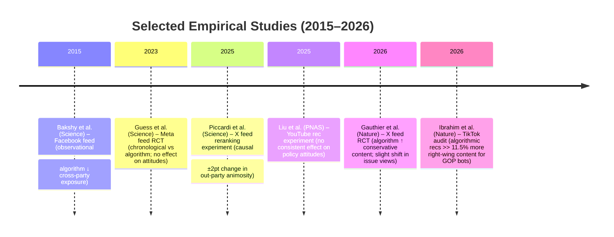

# Executive Summary  
Evidence on algorithms’ impact on polarization is mixed. Algorithms clearly **shape exposure**: for example, Facebook’s News Feed algorithm slightly reduces cross-cutting political news, and TikTok’s “For You” algorithm systematically skews recommendations by ideology (Republican-seeded bots saw ~11.5% more co-partisan content than Democrats saw). Recent field experiments also find algorithmic feeds dramatically alter what users see. Gauthier *et al.* (2026) randomly assigned Twitter/X users to algorithmic vs chronological feeds and found the algorithm promoted ~0.35 SD more conservative posts, yielding about 9 percentage points more conservative content overall. 

By contrast, **belief/behavioral effects are usually small or null**. In Gauthier *et al.*’s X experiment, 7-week exposure to the algorithmic feed modestly shifted policy attitudes conservative (e.g. +0.03 on a 0–1 scale) but did *not* affect partisanship or affective polarization. Similarly, Piccardi *et al.* (2025) reranked X feeds for anti-democratic/partisan hostility and found ±2-point changes (out of 100) in out-party animosity. A large YouTube experiment (Liu *et al.* 2025) manipulated video recommendations for ~9,000 users (filter-bubble vs balanced) and observed **no robust effects on policy attitudes**: the only significant shift was +0.03 on a 0–1 issue index for one conservative subgroup. Nor did Meta’s 2023 field trial (tens of thousands of Facebook/Instagram users switched to a chronological feed) change users’ political views. Overall, algorithms can push exposure toward extreme or partisan content, but causal effects on users’ beliefs are typically very small, asymmetrical, or hard to detect.

# Exposure Effects (What Users See)  
- **Facebook (Bakshy *et al.*, 2015)** – *Observational; USA, Facebook News Feed; N≈10,000:* The News Feed algorithm modestly **reduced cross-cutting news**. After algorithmic ranking, conservatives saw only ~5% of cross-party content (vs co-partisan content) (risk ratio ≈0.05), and liberals ~8%. Crucially, users’ own click choices played a larger role: conservative users clicked only 17% as many cross-cutting links as co-partisan ones (liberals 6%). **Limitation:** non-experimental, Facebook-only, self-selected sample; cannot isolate algorithm from social network effects.  

- **Twitter/X (Gauthier *et al.*, 2026)** – *Field experiment; USA, X platform; N≈4,965 active users:* Randomly switching users between chronological and algorithmic feeds showed **substantial exposure shifts**. Turning the algorithm *on* increased the share of conservative content by +0.35 SD (95% CI 0.06–0.64; *p*=0.018), especially conservative activist posts (+0.37 SD), while liberal news posts fell (–0.43 SD). By contrast, switching *off* the algorithm had no comparable effect on content. Accounting for new follows, algorithm-exposed users’ chronological feeds had 9.0 percentage points (60%) more conservative posts. **Limitation:** Active (mostly liberal-leaning, 83% white) X users only; short-term (7-week) intervention; X’s algorithm at a specific time under Elon Musk.  

- **TikTok (Ibrahim *et al.*, 2026)** – *Audit experiments; USA, TikTok “For You” feed:* 323 sock-puppet accounts were seeded with partisan videos and harvested ~280,000 recommendations over 27 weeks around the 2024 election. Republican-seeded bots received **11.5% more** co-partisan recommendations than Democratic-seeded bots, whereas Democratic bots saw 7.5% more cross-partisan (anti-Dem) content. Skews persisted after adjusting for engagement. High-reach conservative channels drove much of this disparity. **Limitation:** Bot-based audit (no real users), US-only, cannot fully separate algorithmic bias from content supply or user simulation artifacts.  

- **Other observational findings:** Audits of YouTube and Twitter generally find **ideological segregation** in consumption (users’ feeds contain mostly congenial content), but no direct causal estimate. (Studies of search/YouTube algorithms have mostly found small or no “rabbit-hole” effects.)

# Attitudinal/Behavioral Effects (Polarization Outcomes)  
- **X Feed Experiment (Gauthier *et al.*, 2026)** – *Field experiment; USA, X; N≈4,965:* Switching chronologically-fed users *on* to the algorithmic feed shifted **policy attitudes** modestly rightward. For example, these users (after 7 weeks) were ~0.03 points higher on a 0–1 “conservative policy index” (e.g. favoring immigration, crime) than controls. Effects were concentrated among Republicans/Independents. No effect appeared when switching the algorithm *off*. The algorithmic feed also increased engagement (time on platform) and led users to follow more conservative activist accounts, changes which persisted after the treatment ended. **Effect size:** ~3 points on a 0–100 scale (very small). **Limitations:** Sample of self-selected active X users (83% White); platform-specific algorithm; short treatment. 

- **Facebook/Instagram Experiment (Guess *et al.*, 2023)** – *Field experiment; USA, Meta platforms; N≈ tens of thousands:* Meta researchers randomly assigned consenting users to chronological vs algorithmic news feeds during late 2020 election. Replacing the algorithm with a simple reverse-chronological feed (for 3 months) **did not significantly change** any polarization measures: no detectable effect on issue attitudes, affective polarization, partisanship, political knowledge or turnout. Similarly, experiments “turning off” features (resharing, friend-sorting) changed content diversity but did *not* move users’ opinions or polarization levels. **Limitation:** Short experimental window (few months), U.S. election context, heavy censorship by platform, volunteers only; measure of short-term effects only. 

- **YouTube Recommendation Experiment (Liu *et al.*, 2025)** – *Controlled experiment; custom YouTube-like platform; N≈8,800:* Participants could freely choose from a recommended slate. Researchers created “balanced” vs “slanted” recommendation regimes on two issues (guns, minimum wage). Despite large manipulations (creating a de facto filter bubble vs mixed feed), **almost no polarization effect** emerged. The only significant result was that conservative participants in one study shifted by +0.03 on a 0–1 issue scale under slanted recs. Across studies, algorithmic changes moved the ideological slant of what users watched by ~6–12 percentage points (more liberal for liberals, more conservative for conservatives), but corresponding attitude shifts were tiny (≤3 points on a 0–100 scale) and often not statistically significant. **Limitation:** Short-term (10 days), simulated environment (not the actual YouTube site), US participants; may miss long-run or niche effects. 

- **Affective Polarization (Piccardi *et al.*, 2025)** – *Field experiment; USA, X; N=1,256:* Using an independent platform to rerank users’ actual X feeds via an extension, the study increased or decreased exposure to tweets expressing anti-democratic or partisan animosity (AAPA). They found **causal effects on affective polarization**: raising AAPA exposure increased negative feelings toward out-party by ~2 points (on a 0–100 “feeling thermometer”); lowering AAPA reduced hostility by ~2 points. No differential effects by party. **Limitation:** Short intervention (10 days), small sample, external reranking tool (not the real platform algorithm), focused only on one dimension (affective attitude), and effect size is modest (≈2%). 

- **Observational surveys:** Many correlational studies show heavy algorithm use often *co-occurs* with polarization (e.g. partisan news diets, eg billboards), but such studies cannot disentangle whether algorithms *cause* polarization or simply reflect user preferences and network structure. 

| **Study (ref.)**                 | **Platform/Country**       | **Type**        | **Sample**       | **Method**                       | **Outcome**           | **Findings (effect size, CI)**                                                 | **Limitations**                   |
|:-------------------------------|:---------------------------|:---------------|:---------------|:-------------------------------|:----------------------|:-------------------------------------------------------------------------------|:----------------------------------|
| Bakshy *et al.* (2015) | Facebook (USA)           | Observational  | ~10k users      | Click logs; compare chron vs algorithmic feeds | Content exposure (cross-cutting news) | Algorithmic ranking *slightly* reduced cross-party news: risk ratio 5% (cons) vs 8% (lib); individual clicks further cut cross-view (RR 17% cons, 6% lib).  | Non-experimental; users self-selected; only Facebook; measured clicks (not attitudes). |
| Gauthier *et al.* (2026) | X/Twitter (USA)         | Experiment     | 4,965 active users | RCT: Chronological vs Algorithmic feed (7 weeks) | Content exposure (ideological slant) | Algorithmic feed raised conservative posts by +0.35 SD (95% CI 0.06–0.64), adding ~9 pp more conservative content. Liberal content fell (–0.43 SD). | Active, US X users; short term; platform-specific; compliance via extension for ~599 users. |
| Ibrahim *et al.* (2026) | TikTok (USA)            | Audit Experiment | 323 bot accounts | Seeded “For You” with Dem/Rep content, collected recs (27 weeks) | Content exposure (recommendations) | TikTok’s algorithm showed **Republican skew**: Rep-seeded bots got 11.5% more co-party videos, Dem-seeded got 7.5% more anti-Dem content. Asymmetry concentrated in certain topics (immigration, abortion, etc.) | Bot simulation (no real users); cannot fully isolate algorithm from content availability; single campaign period. |

| **Study (ref.)**                    | **Platform/Country**   | **Type**       | **Sample**      | **Method**                       | **Outcome**             | **Findings (effect size, CI)**                                                      | **Limitations**                    |
|:-----------------------------------|:-----------------------|:--------------|:---------------|:-------------------------------|:------------------------|:------------------------------------------------------------------------------------|:-----------------------------------|
| Gauthier *et al.* (2026) | X/Twitter (USA)       | Experiment    | 4,965 users    | RCT: Chronological→Algorithmic feed (7 wk) | User beliefs/behavior      | Turning on the algorithmic feed *slightly* shifted issues: +0.03 on a 0–1 conservative-policy index. No effect on partisanship or affective polarization. Algorithm-on raised engagement/time. | As above; outcomes self-reported (policy priorities, views on Trump/Ukraine). |
| Guess *et al.* (2023)   | Facebook/Instagram (USA) | Experiment | ~10,000s users | RCT: Algorithmic vs Chronological feed (3 months) | User attitudes/polarization | **No detectable effect**: chronological feed did *not* change issue attitudes, affective polarization or partisanship. Removing algorithm slightly cut engagement but didn’t shift beliefs. | Short span (election campaign); U.S.-centric; reliance on self-reports. |
| Liu *et al.* (2025)  | YouTube-like (simulated) | Experiment | ~8,800 users | 4 experiments manipulating recommendation slate | User attitudes (policy)    | Filter-bubble manipulations had **limited effect** on attitudes. Only finding: conservative ideologues shifted +0.03 (0–1) on one issue under slanted recs. No robust polarization changes; null results for other groups. | Lab setting; short exposure (~10 days); not actual YouTube service; may miss subtle or long-term effects. |
| Piccardi *et al.* (2025) | X/Twitter (USA)        | Experiment    | 1,256 users    | Feed reranking (LLM) for Anti-Democratic/Partisan content | Affective polarization (out-group warmth) | Increasing/decreasing hostile content shifted **out-party animosity** by ~±2 points (on a 0–100 scale). Provides causal link between exposure to inflammatory content and negative feelings. | Short duration (10 days); independent reranking (not platform’s real algorithm); focused on one affect measure. |
| (Meta 2023 studies) | Facebook/Instagram (USA) | Experiment | millions of users (via Meta data) | Platform-coop RCTs (chron feed, filter, etc.) | Various (issue, affective pol, misinformation) | Replacing algorithms with chronological newsfeeds, turning off Reshare, or mixing friend exposure **did not measurably change** polarization or attitudes. | Multiple interventions, broad sample; short-term (3mo); cannot gauge long-term or other platforms. |

# Why Results Differ  
- **Measurement choices:** Studies use different outcomes (content exposure vs specific attitudes vs affective polarization vs engagement). For example, Gauthier *et al.* measure policy priorities and news opinions, while others measure only party feelings. Short-term experiments may only capture immediate attitude shifts, not long-term identity change. 
- **Methodology:** Observational analyses (Bakshy) rely on naturally occurring feeds and can be confounded by users’ choices; experiments (Meta 2023, X 2026) ensure causality but often last only days/weeks. Experiments often cannot fully “blindingly” isolate algorithm effects from supply (cf. TikTok audit vs real users). 
- **User heterogeneity:** Susceptibility varies. Gauthier found Republican-leaning users were more influenced (stronger rightward shift). Liu *et al.* saw tiny shifts only in conservative ideologues. Piccardi found effects were uniform across parties. If effects exist mainly for already aligned or extreme users, averaging over all users masks them. 
- **Time scale:** Many studies run only days or weeks; however, users “stuck” with a feed algorithm for years might accumulate larger shifts. For instance, Gauthier’s X experiment suggests persistent follow-changes, meaning longer use could amplify effects. In contrast, short deactivations (Meta) see no immediate attitude change. 
- **Platform differences:** Each algorithm is different. TikTok’s “For You” feed is purely recommender-driven, whereas Facebook/Instagram allow mixed chronological viewing. X’s algorithm (2023) favored sensational/engagement content. Algorithms also evolve constantly, so findings on one platform/time may not generalize. 
- **User selection:** A consistent theme is that users tend to self-select into congenial content. Even without algorithms, social networks and personal searches create echo chambers. Meta’s experiments suggest people will seek liked content even on a chronological feed. Thus algorithms often “help users do what they already want”, limiting net effect on opinions. 
- **Publication bias and context:** Null results (e.g. Liu 2025, Meta 2023) may understate subtle subgroup effects. Conversely, high-profile findings (e.g. X experiment, TikTok audit) can exaggerate generality. Differences in study timing (election vs normal periods) and cultural context (mostly US) also matter.

# Policy Implications and Research Gaps  
Algorithms **do influence exposure**: as Gauthier *et al.* note, they “are not politically neutral” and even short-term use can nudge what people believe. Policy debates should not assume algorithms are harmless. Regulations (e.g. transparency, independent audits, content diversity requirements) may be warranted. However, these studies caution against simplistic solutions. Simply offering a chronological feed or tweaking the algorithm had *no quick fix* on polarization, because users’ own preferences dominate. Platforms should instead consider multi-faceted approaches: giving users more control (e.g. customizable feeds), de-amplifying extremist content, and promoting media literacy. 

Key research gaps remain. **Long-term and real-world outcomes** (voting, civic engagement) are under-studied. Almost all causal evidence comes from short interventions; effects of prolonged algorithmic exposure need examination. Cross-country and non-English studies are sparse. We lack field experiments on newer platforms (e.g. Snap, emerging apps) and on varied populations. The interplay of algorithms with social networks (how content follows beget content) needs more causal work. Finally, as algorithms constantly change, a systematic, ongoing monitoring (perhaps by regulators or auditors) is needed. 

# Conclusion  
Empirical evidence suggests social-media recommendation algorithms **can skew what users see** – often amplifying partisan or sensational content – but their **direct impact on polarization is limited and context-dependent**. Controlled tests on Facebook/Instagram found essentially *no* attitude change when the algorithm was removed, while studies on X and TikTok show small or asymmetric shifts. In other words, algorithms shape the information environment, but users’ own choices and long-standing identities largely determine beliefs. Policy efforts should therefore be cautious: algorithm fixes alone are unlikely to “solve” polarization. Instead, improving platform transparency and encouraging exposure to diverse content (alongside offline interventions) may be more effective. In sum, recommendation systems matter for the filter of news we each see, but they are only one of many drivers of political polarization. 

**Mermaid timeline of key studies:**  

