# Research Report

## Research Question

Map the research landscape of multi-agent LLM systems. Produce a structured report that includes a visual taxonomy or design graph showing the major architectural patterns, how they relate, and where the open problems are.

## Summary

The supplied evidence portrays multi-agent LLM systems as composable collections of specialized agents that coordinate through centralized, hierarchical, decentralized, workflow, debate, critique, and hybrid patterns. The landscape is better represented as overlapping design axes than as a single canonical taxonomy. Centralized supervisor-worker systems provide explicit delegation and aggregation; plan-and-execute and graph workflows make decomposition and control flow explicit; debate and verifier-critic architectures add adversarial or evaluative feedback. Across these patterns, the main unresolved issues are semantic drift, coordination and communication overhead, scaling, failure recovery, security, explainability, evaluation, and the absence of standardized cross-architecture comparisons.

## Findings

### Finding 1

**Claim**

LLM-based multi-agent systems generally consist of multiple specialized agents with distinct roles that communicate and collaborate, often using tools, memory, task decomposition, and result aggregation.

**Confidence:** High

**Why this confidence level**

Multiple sources directly reinforce the definition and the role of structured coordination.

**Evidence**

- Sources define multi-agent systems as collections of specialized or autonomous agents that communicate, collaborate, exchange structured information, decompose tasks, use tools or memory, and assemble results. [S1] [S4] [S6] [S8]

### Finding 2

**Claim**

The most defensible taxonomy is multidimensional and compositional rather than a mutually exclusive list of categories.

**Confidence:** High

**Why this confidence level**

The claim preserves the ledger’s conflicting taxonomy formulations: the sources support recurring design dimensions but disagree on the category set and partitioning scheme.

**Evidence**

- Sources propose overlapping sets of centralized, decentralized, hierarchical, specialized, hybrid, publish-subscribe, workflow, swarm, and adversarial patterns, while also distinguishing organizational topology from collaboration style and adaptivity. [S3] [S6] [S8] [S9] [S10] [S13]
- Alternative taxonomies divide the field differently—for example, collaborative versus competitive versus orchestration-oriented patterns, or centralized/decentralized/hierarchical topologies—so the evidence does not establish one canonical partition. [S2] [S6] [S8]

### Finding 3

**Claim**

Centralized or hierarchical supervisor-worker architectures decompose tasks, route subtasks to specialized workers, and aggregate results.

**Confidence:** High

**Why this confidence level**

Multiple sources directly document the topology and its associated centralization weakness.

**Evidence**

- Sources directly describe supervisors or managers delegating subtasks to specialists and integrating outputs, including nested hierarchical delegation. [S1] [S2] [S10] [S13]
- The same topology introduces centralization risks: the supervisor may become a routing bottleneck or single point of failure. [S13]

### Finding 4

**Claim**

Plan-and-execute systems separate planning from execution, while graph-based workflows encode dependencies, branching, parallel fan-out, convergence, and termination explicitly.

**Confidence:** High

**Why this confidence level**

The distinction and the workflow capabilities are directly supported by multiple sources.

**Evidence**

- Sources describe planners producing execution plans and graph workflows coordinating complex dependencies. [S2] [S4]
- A documented research workflow uses planning, parallel specialist dispatch, synthesis, gap analysis, citation auditing, writing, refinement, and bounded iteration; explicit workflows can define concurrency and downstream consolidation directly. [S5] [S13]

### Finding 5

**Claim**

Debate and verifier-critic architectures use disagreement, critique, scoring, auditing, or revision to challenge and improve generated outputs, but universal performance gains are not established.

**Confidence:** High

**Why this confidence level**

The architecture is well supported, while the evidence explicitly cautions against inferring universal improvement or superiority.

**Evidence**

- Sources describe opposing-agent debate, rubric-based verifier-critic revision, skeptic stages, citation audits, and refinement loops. [S1] [S2] [S5] [S9]
- A survey of 141 multi-agent-debate studies identifies participant, interaction, and agreement-protocol dimensions, but reports that common configurations—such as fully connected exchange, verbatim messages, short-term memory, and voting—are conventions rather than validated universally superior choices. [S9]

### Finding 6

**Claim**

A useful functional view decomposes multi-agent systems into agent profile, perception, self-action, mutual interaction, and evolution; an orchestration view emphasizes task allocation, communication/context sharing, state persistence, control flow, and error recovery.

**Confidence:** High

**Why this confidence level**

Both decompositions are directly stated in supplied survey evidence, though they are frameworks rather than demonstrated field-wide standards.

**Evidence**

- A survey explicitly presents the five-component workflow-oriented decomposition. [S4]
- Another survey identifies five orchestration mechanisms: task decomposition and allocation, communication and context sharing, state management and persistence, control-flow sequencing, and error detection and recovery. [S6]

### Finding 7

**Claim**

The principal open architectural problems concern semantic and contextual drift, protocol-induced information loss, coordination overhead, token and resource scaling, state management, failure propagation, verification, security, explainability, and human oversight.

**Confidence:** High

**Why this confidence level**

The challenge set is supported across surveys, architecture discussions, and a practical workflow, although validated general mitigations remain absent.

**Evidence**

- Sources identify contextual drift, semantic loss, coordination overhead, token scaling, state-management difficulty, error recovery, failure propagation, and central bottlenecks. [S2] [S3] [S6] [S8] [S10] [S13]
- Additional concerns include security, explainability, computational cost, human-in-the-loop requirements, unreliable implicit design choices, and the need for cost-aware benchmarking and automated tuning. [S9] [S12]
- One practical workflow addresses some risks with citation audits, gap analysis, bounded iterations, and partial finalization, but this is an implementation example rather than a general guarantee. [S5]

### Finding 8

**Claim**

The supplied evidence does not establish a validated universal taxonomy, a reliable ranking of architectures, or general quantitative superiority of multi-agent systems over single-agent baselines.

**Confidence:** High

**Why this confidence level**

The ledger preserves both the evidence for fragmentation and the broader unsupported assertions; the supplied material is insufficient for universal ranking or superiority claims.

**Evidence**

- Sources characterize the field as fragmented, report unreliable cross-study comparison when design decisions are implicit, and provide frameworks or architecture-specific results rather than standardized matched comparisons. [S6] [S8] [S9] [S12] [S13]
- Some sources make broader or opposing-sounding assertions—for example, that a set of patterns covers most production systems, that hierarchical systems usually outperform swarms, or that large efficiency gains occur—but the supplied excerpts do not provide enough comparative design or benchmark detail to validate those claims generally. [S2] [S3]

## Conflicts and Uncertainty

- Taxonomy disagreement: sources propose different category sets and organizational axes. The evidence supports a compositional landscape, but not a single definitive partition or formal design graph. [S2] [S3] [S6] [S8] [S9] [S13]
- Some sources report broad production coverage, hierarchical superiority, or large efficiency gains, whereas other evidence states that standardized cross-architecture comparisons are insufficient. These broad claims should not be generalized beyond their reported contexts. [S2] [S3] [S6] [S8] [S9] [S12] [S13]
- Debate design conventions are documented, but their prevalence does not demonstrate that those configurations are optimal or that debate reliably improves outcomes across tasks. [S9]

## Remaining Gaps

- G1: No standardized, cross-domain empirical comparison is supplied for centralized, decentralized, graph, debate, verifier-critic, and hybrid architectures against single-agent baselines.
- G2: The sources do not define a consensus taxonomy or formal design graph that cleanly specifies how categories compose, overlap, or transition.
- G3: Evidence is insufficient for consistent evaluation of semantic drift, coordination failures, hallucination reduction, citation quality, cost, latency, and reliability.
- G4: The material identifies scaling, protocol loss, failure propagation, and human oversight concerns but provides no general mitigation guarantees or validated resource-allocation methods.
- G5: No matched-workload comparison of LangGraph, AutoGen, CrewAI, or other frameworks is supplied.

## Conclusion

The research landscape is best understood as a design space with intersecting axes: organizational topology (centralized, hierarchical, decentralized, or publish-subscribe), workflow control (implicit delegation versus explicit graphs and plans), agent specialization (role-based teams), interaction objective (cooperative, competitive, or critique-oriented), and adaptivity or evolution. The following visual taxonomy is therefore a synthesis of the supplied claims, not a source-established canonical graph:

```mermaid
graph TD
  MAS[Multi-agent LLM system]
  MAS --> Topology[Organizational topology]
  MAS --> Control[Workflow and control]
  MAS --> Interaction[Interaction objective]
  MAS --> Composition[Composition]
  MAS --> Crosscut[Cross-cutting mechanisms]

  Topology --> Central[Centralized supervisor-worker]
  Topology --> Hier[Hierarchical / nested delegation]
  Topology --> Decent[Decentralized collaboration]
  Topology --> PubSub[Publish-subscribe / blackboard]

  Control --> Plan[Plan-and-execute]
  Control --> Graph[Explicit graph workflow]
  Graph --> Parallel[Parallel fan-out]
  Graph --> Converge[Synthesis / convergence]
  Graph --> Bounds[Bounded iteration / termination]

  Interaction --> Coop[Cooperative role specialization]
  Interaction --> Debate[Debate / competitive interaction]
  Interaction --> Critic[Verifier-critic loop]

  Composition --> Hybrid[Hybrid architectures]
  Central --> Hybrid
  Graph --> Hybrid
  Debate --> Hybrid
  Critic --> Hybrid

  Crosscut --> Decomp[Task decomposition and allocation]
  Crosscut --> Comm[Communication and context sharing]
  Crosscut --> State[State, memory, persistence]
  Crosscut --> Recovery[Verification and error recovery]
  Crosscut --> Adapt[Dynamic / adaptive control]

  MAS -. open problem .-> Eval[Standardized evaluation and baselines]
  MAS -. open problem .-> Drift[Semantic drift and protocol information loss]
  MAS -. open problem .-> Scale[Token, latency, and coordination scaling]
  MAS -. open problem .-> Failure[Failure propagation and bottlenecks]
  MAS -. open problem .-> Trust[Security, explainability, and human oversight]
```

The graph’s main implication is that architectures are commonly assembled rather than selected from exclusive alternatives—for example, a hierarchical team may use explicit graph control, parallel specialist execution, and a verifier-critic loop. However, the ledger does not supply enough evidence to identify a universally best architecture, quantify cross-domain advantages, or guarantee that any mitigation pattern resolves the open problems.

## Sources

- [S1] Multi-agent LLMs in 2026 [+frameworks] — https://www.superannotate.com/blog/multi-agent-llms
- [S2] Agent Architecture Patterns: 2026 Taxonomy Guide — https://www.digitalapplied.com/blog/agent-architecture-patterns-taxonomy-2026
- [S3] LLM Agent Orchestration Patterns: Architectural ... — https://www.c-sharpcorner.com/article/llm-agent-orchestration-patterns-architectural-frameworks-for-managing-complex
- [S4] A survey on LLM-based multi-agent systems - Springer Nature — https://link.springer.com/article/10.1007/s44336-024-00009-2
- [S5] How to Build a Multi-Agent Deep Research System with ... — https://medium.com/data-science-collective/building-a-multi-agent-deep-research-agent-with-langgraph-203547b5fb12
- [S6] LLM-Based Multi-Agent Orchestration: A Survey of ... — https://www.preprints.org/manuscript/202604.2147
- [S7] LLM-Based Multi-Agent Orchestration: A Survey of Frameworks, Communication Protocols, and Emerging Patterns — https://www.mdpi.com/1999-5903/18/6/326
- [S8] Multi-Agent Architectures — https://www.emergentmind.com/topics/multi-agent-architectures
- [S9] Multi-Agent Debate Strategies: Survey, Taxonomy, and Challenges — https://arxiv.org/html/2607.26212v1
- [S10] Multi-Agent LLM Systems: Architecture, Communication, and ... — https://samiranama.com/posts/LLM-Based-Multi-Agent-Systems-Architectures-and-Collaboration
- [S11] A survey on LLM-based multi-agent systems: workflow, infrastructure, and challenges | Semantic Scholar — https://www.semanticscholar.org/paper/A-survey-on-LLM-based-multi-agent-systems%3A-and-Li-Wang/fc8ce12d6186ddaa797e2b36d5e8eb7921425308
- [S12] Multi-Agent Systems and Their Evolution: A Comparative Survey[v1] | Preprints.org — https://www.preprints.org/manuscript/202606.0358
- [S13] A field guide to multi-agent architectures | by Tituslhy — https://medium.com/mitb-for-all/a-field-guide-to-multi-agent-architectures-f6f8c689c406
