# Research Landscape of Multi-Agent LLM Systems

## Executive summary

Multi-agent LLM systems combine multiple language-model-driven agents—often with distinct roles, tools, memories, or objectives—to solve tasks through interaction. The field sits at the intersection of:

1. **Classical multi-agent systems (MAS):** coordination, negotiation, planning, distributed constraint solving, mechanism design, communication protocols.
2. **LLM agents:** planning, tool use, memory, self-reflection, web interaction, code execution.
3. **Software engineering and workflow systems:** orchestration, task decomposition, message passing, observability, reliability, and production deployment.

The main architectural divide is between:

- **Centralized orchestration:** a controller decomposes tasks and delegates to agents.
- **Decentralized interaction:** agents communicate or negotiate peer-to-peer.
- **Hierarchical teams:** managers supervise subteams or recursive agent populations.
- **Role-based simulation:** agents interact in an environment or social world.
- **Self-organizing systems:** the system dynamically creates, assigns, evaluates, and retires agents.

The strongest evidence so far suggests that multiple agents are useful when tasks have **genuine modularity, parallelism, heterogeneous expertise, or adversarial verification needs**. They are less reliably useful when the task is simple, when communication overhead dominates, or when agents share the same model and produce correlated errors.

The central unresolved question is not whether systems can make agents converse, but:

> **How should an agent society allocate work, information, authority, computation, and risk under uncertainty?**

---

# 1. Scope and terminology

## 1.1 What counts as a multi-agent LLM system?

A system is treated here as a multi-agent LLM system if it contains at least two language-model-driven decision-making entities that:

- have separate interaction histories, roles, goals, or execution contexts;
- communicate directly or indirectly;
- jointly affect task execution or a shared environment.

This excludes:

- a single LLM producing multiple textual personas in one context, unless those personas have operationally distinct state or actions;
- ordinary tool calling where tools are passive APIs rather than agents;
- static ensembles that vote independently without interaction, although these are relevant comparison baselines;
- simple prompt pipelines with no autonomous or semi-autonomous decision-making.

The boundary is fluid. A “subagent” may be:

- another LLM invocation with a specialized prompt;
- a smaller model used for planning, retrieval, or verification;
- a human or external service represented through an agent interface;
- a simulator-generated agent in a virtual environment.

## 1.2 Key concepts

| Concept | Meaning |
|---|---|
| Agent | An LLM-based entity with goals, state, tools, and the ability to act |
| Role | A specialization such as planner, researcher, coder, critic, or manager |
| Environment | External world, software repository, game, browser, database, or simulated society |
| Coordination | Organizing agents so their actions contribute to shared objectives |
| Communication | Exchange of messages, artifacts, plans, observations, or actions |
| Delegation | Assigning subtasks to other agents |
| Aggregation | Combining multiple outputs into a final answer or action |
| Reflection | Evaluating or revising prior reasoning, plans, or artifacts |
| Emergence | System-level behavior not explicitly scripted by the designer |
| Agent topology | Who can communicate with whom and under what constraints |
| Protocol | Rules governing message format, turn-taking, authority, voting, negotiation, or termination |

---

# 2. Historical roots

Multi-agent LLM research builds on several older research traditions.

## 2.1 Classical multi-agent systems

Important inherited ideas include:

- **blackboard systems:** agents contribute to a shared workspace;
- **contract-net protocols:** a manager announces tasks and agents bid;
- **distributed planning:** multiple agents construct compatible plans;
- **belief-desire-intention architectures:** agents maintain beliefs, goals, and intentions;
- **negotiation and voting:** agents resolve conflicts over resources or preferences;
- **organizational models:** roles, authority, teams, norms, and institutions;
- **multi-agent reinforcement learning:** decentralized policies operating in shared environments;
- **mechanism design:** designing incentives and communication rules to achieve system-level outcomes.

LLM agents replace or augment symbolic policies with general-purpose language models. This increases flexibility but introduces non-determinism, hallucination, context-window limits, strategic ambiguity, and correlated failure.

## 2.2 LLM agents before multi-agent LLM systems

Several lines of work supplied components later used in multi-agent systems:

- chain-of-thought and self-consistency;
- tool-using agents such as ReAct;
- planning and decomposition systems;
- retrieval-augmented generation;
- code-generating and code-executing agents;
- reflection and self-critique;
- simulated environments and generative agents.

The key transition was from **one model producing multiple reasoning traces** to **multiple stateful model instances interacting through explicit roles and protocols**.

---

# 3. Visual taxonomy and design graph

The following graph presents a practical taxonomy. It is organized from system architecture to mechanisms to applications and open problems.

```mermaid
flowchart TD
    A[Multi-agent LLM system]

    A --> B[Architecture]
    A --> C[Coordination protocol]
    A --> D[Agent capabilities]
    A --> E[Environment and memory]
    A --> F[Evaluation and governance]

    B --> B1[Centralized orchestration]
    B --> B2[Decentralized peer-to-peer]
    B --> B3[Hierarchical organization]
    B --> B4[Role-based simulation]
    B --> B5[Dynamic/self-organizing]

    B1 --> B11[Planner → workers → synthesizer]
    B1 --> B12[Manager–critic–executor]
    B1 --> B13[Parallel ensemble + aggregator]

    B2 --> B21[Debate]
    B2 --> B22[Negotiation]
    B2 --> B23[Blackboard/shared workspace]
    B2 --> B24[Market/contract-net]

    B3 --> B31[Recursive delegation]
    B3 --> B32[Department/team structure]
    B3 --> B33[Supervisor tree]

    B4 --> B41[Society simulation]
    B4 --> B42[Game/world agents]
    B4 --> B43[Organization simulation]

    B5 --> B51[Agent creation/recruitment]
    B5 --> B52[Topology adaptation]
    B5 --> B53[Protocol/self-improvement]

    C --> C1[Fixed turn-taking]
    C --> C2[Event-driven messaging]
    C --> C3[Voting/consensus]
    C --> C4[Argumentation/debate]
    C --> C5[Negotiation/incentives]
    C --> C6[Tool/API-mediated interaction]

    D --> D1[Planning]
    D --> D2[Tool use]
    D --> D3[Memory/retrieval]
    D --> D4[Critique/verification]
    D --> D5[Code execution]
    D --> D6[Model heterogeneity]

    E --> E1[Private context]
    E --> E2[Shared memory]
    E --> E3[Artifact repository]
    E --> E4[External environment]
    E --> E5[Long-term episodic memory]

    F --> F1[Task success]
    F --> F2[Communication cost]
    F --> F3[Robustness]
    F --> F4[Safety/security]
    F --> F5[Fairness and social behavior]
    F --> F6[Reproducibility]

    B11 -. open .-> O1[When does decomposition help?]
    B21 -. open .-> O2[Correlated errors and persuasive false consensus]
    B31 -. open .-> O3[Authority, credit assignment, cascading failures]
    B41 -. open .-> O4[Validity of simulated social behavior]
    B51 -. open .-> O5[Controlling emergent populations]

    C3 -. open .-> O6[Meaningful consensus vs majority hallucination]
    C5 -. open .-> O7[Incentive compatibility]
    C6 -. open .-> O8[Protocol interoperability]

    D6 -. open .-> O9[How to exploit heterogeneous models]
    E2 -. open .-> O10[Memory poisoning and provenance]
    E4 -. open .-> O11[Action safety in open environments]

    F1 -. open .-> O12[No standard benchmark]
    F2 -. open .-> O13[Cost/latency scaling laws]
    F4 -. open .-> O14[Prompt injection, collusion, misuse]
    F6 -. open .-> O15[Scientific reproducibility]
```



## 3.1 Architectural axes

The taxonomy is not a set of mutually exclusive categories. A system can simultaneously be:

- hierarchical;
- role-based;
- tool-using;
- debate-based;
- dynamically reconfigurable;
- connected to a shared artifact store.

A useful design representation is:

\[
\mathcal{S} =
(G, \mathcal{A}, \mathcal{P}, \mathcal{M}, \mathcal{E}, \mathcal{O})
\]

where:

- \(G\): communication graph;
- \(\mathcal{A}\): agent roles and capabilities;
- \(\mathcal{P}\): communication and decision protocol;
- \(\mathcal{M}\): private and shared memory;
- \(\mathcal{E}\): environment and tools;
- \(\mathcal{O}\): objectives, constraints, and termination rules.

This representation makes clear that “multi-agent” is not a single technique. It is a design space.

---

# 4. Major architectural patterns

## 4.1 Centralized planner–worker systems

### Structure

```text
User task
   ↓
Planner / manager
   ├── Research agent
   ├── Coding agent
   ├── Data agent
   └── Verification agent
   ↓
Synthesizer / executor
```

The manager decomposes the task, assigns subtasks, monitors progress, and integrates results.

### Strengths

- easy to implement and debug;
- explicit task decomposition;
- predictable communication;
- straightforward access control;
- good fit for software engineering and research workflows.

### Weaknesses

- manager becomes a bottleneck;
- poor decomposition causes downstream failure;
- central controller may hallucinate task status;
- agents may optimize locally but fail globally;
- limited adaptability when the task changes.

### Representative systems

- **AutoGen:** programmable multi-agent conversations and human-in-the-loop workflows.
- **AgentVerse:** framework for task-solving and simulation-oriented agent teams.
- **MetaGPT:** role-based software organization with structured artifacts and procedures.
- **ChatDev:** simulated software company using role-based communication.
- **CrewAI:** practical role/task/crew orchestration framework, widely used in industry and education.

### Research questions

- Can task decomposition be learned rather than prompted?
- How should a manager estimate agent reliability?
- How should subtasks be allocated under cost and latency constraints?
- Can the system detect when centralization is harmful?

---

## 4.2 Debate, critique, and deliberation

### Structure

```text
Question
  ├── Agent A proposes answer
  ├── Agent B challenges answer
  ├── Agent C checks evidence
  └── Judge synthesizes or selects
```

The agents may have identical or distinct roles. Debate can be sequential, parallel, adversarial, or iterative.

### Intended benefits

- expose hidden assumptions;
- reduce individual hallucinations;
- improve reasoning through critique;
- approximate expert review;
- generate uncertainty or competing hypotheses.

### Main risks

- **correlated errors:** identical models may converge on the same wrong answer;
- **persuasion bias:** rhetorically strong arguments may beat correct ones;
- **false consensus:** repeated agreement is mistaken for evidence;
- **judge failure:** the final evaluator may be less capable than the agents;
- **cost explosion:** multiple rounds can multiply token and tool use.

Debate is most credible when agents have independent evidence, different tools, distinct models, or externally verifiable outputs. Merely assigning different personas is a weak form of diversity.

### Representative research

- multi-agent debate for mathematical and factual reasoning;
- “society of mind” and expert-mixture prompting;
- critique-and-revision systems;
- debate-based alignment and scalable oversight.

---

## 4.3 Hierarchical organizations

### Structure

```text
Executive agent
   ├── Planning department
   │     ├── Researcher
   │     └── Analyst
   ├── Implementation department
   │     ├── Coder
   │     └── Tester
   └── Risk department
         ├── Auditor
         └── Security reviewer
```

Hierarchies impose authority, reporting lines, and abstraction boundaries.

### Strengths

- supports large tasks;
- reduces communication complexity;
- allows specialized intermediate managers;
- naturally supports budgets, escalation, and approval gates.

### Weaknesses

- cascading errors;
- information loss across abstraction layers;
- difficult credit assignment;
- authority can suppress useful dissent;
- hierarchy may add ceremony without improving outcomes.

The key unresolved issue is whether hierarchy should be designed manually or emerge adaptively based on task structure.

---

## 4.4 Shared workspace and blackboard architectures

Agents communicate through a shared artifact or memory store rather than direct dialogue.

```text
Research notes ─┐
Plans ──────────┼──> Shared workspace ──> Synthesizer
Code ───────────┤
Tests ──────────┘
```

Examples include:

- shared documents;
- vector databases;
- structured task boards;
- code repositories;
- knowledge graphs;
- event logs;
- executable artifacts.

### Advantages

- supports asynchronous work;
- preserves provenance;
- reduces repetitive conversation;
- allows agents to inspect and build on artifacts;
- maps naturally to software engineering.

### Problems

- stale or contradictory information;
- memory poisoning;
- unclear authority;
- difficult provenance;
- retrieval errors;
- accidental overwriting;
- context pollution.

A major research direction is **typed, provenance-aware shared memory**, in which every claim records source, confidence, timestamp, dependencies, and verification status.

---

## 4.5 Negotiation and market-based systems

Agents may bid for subtasks, negotiate resources, exchange contracts, or vote over alternatives.

Classical MAS provides mature conceptual tools here:

- contract-net protocols;
- auctions;
- bargaining;
- voting;
- coalition formation;
- mechanism design;
- reputation systems.

LLM agents add natural-language negotiation and flexible proposal generation, but also create new concerns:

- agents may misrepresent capabilities;
- language can hide strategic behavior;
- incentives are difficult to specify;
- token-based communication costs distort behavior;
- agents may collude against the system objective.

These systems are underdeveloped relative to dialogue-based orchestration. Most current implementations use informal prompts rather than well-defined mechanisms.

---

## 4.6 Role-playing and social simulation

In this pattern, agents represent people, organizations, or characters and interact over time.

Applications include:

- social science simulation;
- game characters;
- urban and economic simulations;
- organizational modeling;
- educational simulations;
- testing social policies;
- synthetic data generation.

Representative work includes **Generative Agents**, which models believable behavior using memory, reflection, and planning.

### Value

- provides a flexible laboratory for social interaction;
- supports long-horizon behavior;
- enables synthetic populations;
- allows testing of communication and norms.

### Limitations

- simulated behavior is not automatically a valid model of humans;
- agents can exhibit prompt-induced stereotypes;
- long-term consistency is fragile;
- social realism is often judged by anecdotal plausibility;
- population-level results may be highly sensitive to model version and prompt.

The field needs calibration against real behavioral data rather than only human impressions.

---

## 4.7 Self-organizing and dynamically generated teams

These systems let agents:

- create new agents;
- recruit specialists;
- choose communication partners;
- modify roles;
- change topology;
- decide when to terminate or restart;
- propose new protocols.

This is the most ambitious architectural direction and the least mature.

### Potential benefits

- adaptive specialization;
- resource-aware scaling;
- resilience to unexpected tasks;
- reduced need for handcrafted workflows.

### Risks

- uncontrolled agent proliferation;
- reward hacking;
- hidden communication channels;
- recursive delegation loops;
- unpredictable emergent behavior;
- inability to audit why the team formed.

A practical compromise is **bounded self-organization**: agents may adapt within a typed role library, fixed budget, restricted tool permissions, and explicit approval gates.

---

# 5. Coordination mechanisms

## 5.1 Communication topology

Common topologies include:

| Topology | Description | Typical use |
|---|---|---|
| Star | Central manager communicates with all agents | Workflow orchestration |
| Chain | Agents pass outputs sequentially | Pipelines, refinement |
| Ring | Each agent communicates with neighbors | Iterative consensus |
| Complete graph | Every agent can message every other | Small debates |
| Tree | Hierarchical reporting | Large organizations |
| Blackboard | Agents read/write shared state | Asynchronous collaboration |
| Dynamic graph | Links change based on task state | Adaptive teams |

Communication cost grows rapidly with dense graphs. If \(n\) agents exchange pairwise messages, a complete topology has \(O(n^2)\) possible communication links, while a star has \(O(n)\). Dense communication may increase deliberation quality for small teams but quickly becomes expensive and difficult to control.

## 5.2 Turn-taking and event scheduling

Systems may use:

- fixed rounds;
- manager-selected speaker;
- event-driven activation;
- self-selection;
- priority queues;
- deadline-driven scheduling;
- interrupt-based escalation.

Fixed turns are simple but wasteful. Self-selection is flexible but can create monopolization, loops, or silence. Event-driven architectures are promising for long-running agents but require robust state management.

## 5.3 Information sharing

Agents can exchange:

- raw messages;
- summaries;
- structured plans;
- claims and evidence;
- executable code;
- test results;
- confidence scores;
- embeddings;
- state transitions;
- tool outputs.

Structured communication is generally more auditable than free-form dialogue. However, overly rigid schemas can prevent agents from expressing uncertainty or discovering novel coordination strategies.

## 5.4 Consensus and aggregation

Aggregation methods include:

- majority vote;
- weighted vote based on estimated reliability;
- judge agent;
- verifier agent;
- rank aggregation;
- debate followed by selection;
- execution-based validation;
- external ground-truth checking.

A central open issue is that **agreement is not the same as correctness**. A useful aggregator should consider evidence quality, independence, calibration, and task-specific verification—not only the number of agents supporting an answer.

---

# 6. Agent capabilities and system substrate

## 6.1 Planning and task decomposition

Planning approaches range from:

- prompt-based decomposition;
- hierarchical task networks;
- code-generated plans;
- search over action sequences;
- planning with external simulators;
- replanning after failed execution.

LLMs are good at proposing plausible decompositions but weaker at proving completeness, avoiding dependency errors, and maintaining globally consistent plans.

## 6.2 Tool use and environmental action

Tools include:

- web search;
- browsers;
- code interpreters;
- databases;
- APIs;
- robotic controls;
- simulation engines;
- enterprise software.

Multi-agent tool use creates coordination issues absent from text-only debate:

- conflicting actions;
- race conditions;
- duplicate execution;
- irreversible side effects;
- shared resource contention;
- unclear responsibility.

Tool permissions should therefore be scoped by role and task, with transaction logs and approval mechanisms.

## 6.3 Memory

Relevant memory types:

1. **Private working memory:** each agent’s current context.
2. **Shared episodic memory:** prior interactions and outcomes.
3. **Semantic memory:** persistent facts and documents.
4. **Procedural memory:** reusable workflows and skills.
5. **Artifact memory:** code, reports, plans, and test results.
6. **Reputation memory:** historical reliability of agents.

Research challenges include retrieval quality, stale knowledge, memory compression, access control, and poisoning.

## 6.4 Model heterogeneity

Teams may combine:

- frontier and open-weight models;
- large and small models;
- text-only and multimodal models;
- specialized code, math, vision, or planning models;
- deterministic symbolic components;
- humans and automated agents.

Heterogeneity can create genuine diversity, lower cost, and improve specialization. It can also make communication harder and produce incompatible assumptions. A major empirical question is whether the benefits come from **capability diversity**, **sampling diversity**, or simply increased computation.

---

# 7. Representative research clusters

## 7.1 Foundational LLM-agent frameworks

### ReAct

Yao et al. introduced a pattern that interleaves reasoning and acting. It is not inherently multi-agent, but it underpins many agent implementations.

### Reflexion

Shinn et al. explored verbal reinforcement and self-reflection to improve future attempts. Multi-agent systems often generalize this by assigning reflection to a separate critic.

### Generative Agents

Park et al. modeled memory, reflection, and planning in a simulated society. This established a major branch of LLM-based social simulation.

## 7.2 Role-based collaboration

### CAMEL

Li et al. studied role-playing cooperation between agents, especially through role assignment and task prompting.

### ChatDev

Qian et al. represented a software company whose agents perform roles such as CEO, CTO, programmer, reviewer, and tester.

### MetaGPT

Hong et al. introduced structured software-company workflows in which agents use standardized intermediate artifacts and role procedures.

These systems demonstrate the value of organizational priors, but often rely on handcrafted role prompts and relatively fixed workflows.

## 7.3 Programmable agent orchestration

### AutoGen

Wu et al. presented a framework for building multi-agent conversations, including human participation, tool use, and nested workflows. Its importance lies in making agent interaction a programmable systems problem rather than only a prompting technique.

### AgentVerse and related frameworks

These frameworks support task-solving teams, simulated agents, agent registries, and customizable interaction patterns.

### LangGraph, CrewAI, Semantic Kernel

These are primarily orchestration and application frameworks, but they influence research practice by making graph-based workflows, role assignment, memory, and tool execution easier to implement.

## 7.4 Multi-agent debate and reasoning

Work in this cluster investigates:

- debate between model instances;
- critique and revision;
- judge-based evaluation;
- majority voting;
- self-consistency;
- verifier-guided reasoning;
- scalable oversight.

The literature often reports gains on mathematics, reasoning, and factual tasks, but results are sensitive to:

- model family;
- number of agents;
- prompt design;
- judge quality;
- token budget;
- whether agents are independent;
- whether answers are externally verifiable.

## 7.5 Embodied and interactive agents

Systems such as **Voyager** demonstrate an LLM agent operating in an open-ended environment, generating skills and interacting with a world. Multi-agent extensions are relevant to:

- collaborative games;
- robotics;
- embodied household tasks;
- navigation;
- multi-user virtual worlds;
- collective exploration.

Here, success depends on state synchronization and action reliability, not just language quality.

## 7.6 Software engineering agents

Software engineering is one of the strongest application areas because it offers:

- naturally modular roles;
- executable artifacts;
- objective tests;
- persistent repositories;
- clear task decomposition.

Typical teams include:

```text
Product manager → architect → coder → tester → security reviewer
```

Important systems and related lines include ChatDev, MetaGPT, SWE-agent-style agents, OpenHands/CodeAct-style execution systems, and multi-agent coding benchmarks.

Open issues include test gaming, insecure code, dependency conflicts, architectural drift, and difficulty measuring real-world productivity rather than benchmark completion.

---

# 8. Evaluation landscape

## 8.1 What should be measured?

A complete evaluation should measure at least six dimensions:

### 1. Task outcome

- accuracy;
- pass rate;
- reward;
- code test success;
- factuality;
- robustness to task variation.

### 2. Resource efficiency

- number of model calls;
- tokens;
- wall-clock latency;
- tool calls;
- monetary cost;
- memory usage.

### 3. Coordination quality

- redundant work;
- unresolved conflicts;
- information coverage;
- successful delegation;
- plan consistency;
- communication relevance.

### 4. Reliability

- run-to-run variance;
- sensitivity to agent order;
- failure recovery;
- performance under missing agents;
- robustness to noisy messages.

### 5. Safety and security

- prompt-injection resistance;
- data leakage;
- unauthorized tool use;
- collusion;
- privilege escalation;
- harmful emergent behavior.

### 6. Human and organizational value

- user trust;
- interpretability;
- review burden;
- ease of intervention;
- maintainability;
- productivity relative to a single-agent baseline.

## 8.2 Essential baselines

Many studies overstate multi-agent benefits by omitting strong baselines. Every evaluation should compare against:

1. a single LLM with the same total token budget;
2. a single-agent tool-using system;
3. self-consistency or multiple independent samples;
4. a deterministic workflow;
5. a human-in-the-loop workflow, where practical;
6. a heterogeneous-model team, if the proposed system claims diversity benefits.

The comparison should equalize **compute budget**, not merely number of agents.

## 8.3 Evaluation problems

Current benchmarks have major shortcomings:

- many tasks are short-horizon and text-only;
- success criteria are often subjective;
- evaluator LLMs may share biases with worker agents;
- interaction traces are not standardized;
- communication cost is ignored;
- reproducibility is weak because prompts and model snapshots change;
- benchmarks rarely test adversarial or degraded conditions;
- “emergence” is often claimed from anecdotes rather than controlled experiments.

## 8.4 Recommended experimental design

A strong study should report:

- exact models and versions;
- prompts and system instructions;
- topology;
- stopping criteria;
- token and time budgets;
- tool permissions;
- random seeds where applicable;
- all failed runs;
- cost and latency;
- ablations over number of agents;
- ablations over role diversity;
- sensitivity to communication noise;
- comparison with single-agent and non-interactive baselines.

---

# 9. Open problems

## 9.1 When does multi-agent structure actually help?

This is the foundational empirical question.

Potential sources of benefit:

- task decomposition;
- parallelism;
- independent sampling;
- specialization;
- adversarial checking;
- access to different tools;
- iterative artifact refinement.

Potential sources of harm:

- communication overhead;
- correlated hallucination;
- coordination failures;
- duplicated work;
- context dilution;
- persuasive but incorrect consensus.

The field needs scaling laws of the form:

\[
\text{utility} =
f(\text{task complexity}, \text{agent diversity}, \text{communication cost},
\text{verification strength}, \text{budget})
\]

rather than isolated demonstrations.

## 9.2 Coordination under partial observability

Agents often have different information and may not know:

- what other agents have done;
- whether a claim is reliable;
- which tasks remain;
- whether another agent is stuck;
- whether the environment has changed.

This resembles decentralized partially observable planning, but LLM systems rarely maintain explicit beliefs or uncertainty models.

Needed capabilities include:

- belief-state tracking;
- uncertainty-aware delegation;
- information-seeking actions;
- conflict detection;
- explicit task-state representations.

## 9.3 Credit assignment

When a team succeeds or fails, which agent contributed what?

This matters for:

- agent selection;
- reputation;
- training;
- payment or incentives;
- debugging;
- replacing weak agents;
- learning better protocols.

Natural-language traces are insufficient. Systems need causal or counterfactual evaluation:

- What would have happened without this message?
- Did this agent’s intervention prevent failure?
- Was a successful result robust to removing a particular agent?

## 9.4 Communication efficiency

Most systems communicate in verbose natural language. This is flexible but expensive and ambiguous.

Open directions:

- learned communication compression;
- structured messages;
- typed APIs;
- event summaries;
- selective disclosure;
- information-theoretic routing;
- message prioritization;
- asynchronous communication.

A key design question is whether agents should communicate **claims**, **plans**, **evidence**, or **state transitions**. These have different verification properties.

## 9.5 Truth-seeking versus consensus-seeking

Consensus mechanisms can reward agreement instead of truth. A robust system should preserve minority hypotheses when:

- evidence is incomplete;
- agents have different observations;
- the task is exploratory;
- the majority may share a systematic bias.

Useful mechanisms could include:

- calibrated confidence;
- evidence-linked claims;
- adversarial minority roles;
- independent verification;
- abstention;
- external execution or retrieval;
- Bayesian or probabilistic aggregation.

## 9.6 Model diversity and correlated failure

Using several copies of the same model does not necessarily produce independent opinions. Correlation arises from:

- shared training data;
- same system prompt;
- same retrieval source;
- same tool errors;
- common evaluator bias;
- shared conversational context.

Research should quantify effective diversity rather than count agents. Diversity may come from:

- different model families;
- different temperatures;
- different tools;
- different observations;
- different planning methods;
- different training objectives.

## 9.7 Memory and provenance

Shared memory is central to long-running teams but creates security and reliability risks:

- one agent can inject false facts;
- outdated information persists;
- summaries erase uncertainty;
- agents cannot distinguish observation from inference;
- malicious documents manipulate downstream agents.

Promising directions:

- provenance graphs;
- signed artifacts;
- versioned memory;
- confidence and expiry fields;
- source reliability models;
- access-controlled memory;
- contradiction-aware retrieval.

## 9.8 Dynamic topology and team formation

Most systems use a fixed graph. More adaptive systems should decide:

- how many agents to instantiate;
- which roles are needed;
- who should communicate;
- when to merge or split teams;
- when to escalate to humans;
- when to terminate.

The challenge is preventing adaptation from becoming uncontrolled complexity. Team formation should be budgeted and auditable.

## 9.9 Learning coordination protocols

Current systems mostly use manually designed prompts. A deeper research program would optimize:

- role assignment;
- routing;
- message formats;
- delegation;
- stopping;
- debate depth;
- verifier selection;
- model allocation.

Possible methods include:

- reinforcement learning;
- evolutionary search;
- offline optimization from traces;
- multi-agent reinforcement learning;
- differentiable or programmatic orchestration;
- bandit-based agent selection.

The main concern is that optimized protocols may exploit evaluator weaknesses or become impossible to interpret.

## 9.10 Safety, security, and governance

Multi-agent systems introduce risks beyond single agents.

### New attack surfaces

- prompt injection propagated through the team;
- malicious or compromised agents;
- collusion;
- covert channels;
- privilege escalation;
- deceptive reporting;
- sabotage of shared memory;
- agent impersonation;
- emergent goal formation;
- runaway self-replication or delegation.

### Governance requirements

Production systems need:

- identity and authentication for agents;
- capability-based tool permissions;
- message and artifact auditing;
- rate limits and budgets;
- human approval gates;
- isolation between tenants;
- rollback and recovery;
- red-team testing;
- explicit shutdown behavior.

Safety evaluation should include adversarial teams, not only cooperative benchmark tasks.

## 9.11 Human–agent teams

Humans may be:

- task owners;
- supervisors;
- domain experts;
- judges;
- participants in simulated environments;
- exception handlers.

Important questions include:

- How should disagreement be presented?
- When should the system interrupt a human?
- How much of the internal debate should be shown?
- Can humans identify agent collusion or shared error?
- Does a large agent team reduce or increase review burden?

A team that achieves higher benchmark accuracy but overwhelms its human operator may be operationally worse.

## 9.12 Long-horizon reliability

Many current demonstrations run for only a few steps. Real systems may operate for hours, days, or months.

Long-horizon failure modes include:

- gradual memory drift;
- role collapse;
- accumulation of small errors;
- stale plans;
- tool-state divergence;
- unauthorized changes;
- repeated retry loops;
- organizational deadlock.

Long-running agents require checkpointing, state reconciliation, monitoring, and recovery policies analogous to distributed software systems.

---

# 10. Design principles emerging from the literature

## 10.1 Use multiple agents for structural reasons

Multi-agent design is most justified when the task has:

- separable subtasks;
- independent evidence sources;
- specialized tools;
- parallel execution;
- conflicting hypotheses requiring adjudication;
- artifacts that benefit from review.

It is less justified when the system only needs a short answer or when all agents have identical capabilities and context.

## 10.2 Prefer artifacts over conversational accumulation

Agents should communicate through:

- plans;
- schemas;
- code;
- test reports;
- claims with citations;
- structured decisions;
- state updates.

Free-form dialogue is useful for exploration, but persistent artifacts are easier to inspect, retrieve, test, and revise.

## 10.3 Separate generation from verification

A strong pattern is:

```text
Generate → execute/check → critique → revise → approve
```

The verifier should ideally have:

- independent evidence;
- different tools;
- a different model or method;
- access to executable tests;
- authority to reject rather than merely comment.

## 10.4 Make uncertainty explicit

Agents should report:

- confidence;
- assumptions;
- missing information;
- evidence;
- dependencies;
- conditions under which the recommendation fails.

This supports better aggregation than treating every message as equally reliable.

## 10.5 Budget communication and computation

Every team should have limits on:

- agent count;
- turns;
- tokens;
- tool calls;
- wall-clock time;
- retries;
- memory growth.

The system should terminate when marginal expected value falls below marginal cost.

## 10.6 Design for failure, not ideal cooperation

Agents should be tested under:

- missing messages;
- inaccurate reports;
- malicious instructions;
- conflicting goals;
- unavailable tools;
- stale memory;
- partial task completion;
- model degradation.

---

# 11. Suggested research agenda

## Near term

1. Establish standardized multi-agent benchmarks with cost accounting.
2. Compare teams against compute-matched single-agent baselines.
3. Develop provenance-aware shared memory.
4. Evaluate communication topologies systematically.
5. Measure model diversity and correlated error.
6. Build reliable tracing and replay infrastructure.
7. Create adversarial safety benchmarks for agent teams.

## Medium term

1. Learn adaptive delegation and routing.
2. Develop calibrated consensus and abstention mechanisms.
3. Integrate classical MAS protocols with LLM agents.
4. Study causal credit assignment.
5. Support long-running asynchronous teams.
6. Develop typed, interoperable agent communication standards.
7. Combine LLM reasoning with symbolic planning and formal verification.

## Long term

1. Self-organizing but bounded agent organizations.
2. Agent institutions with explicit norms and incentives.
3. Scalable human–AI organizations.
4. Mechanism design for truthful and safe agent communication.
5. Formal guarantees for multi-agent tool use.
6. Scientific models of emergent behavior in language-agent societies.
7. General-purpose coordination policies transferable across tasks and models.

---

# 12. Selected literature and systems

The following works are useful entry points. They span foundational agents, multi-agent coordination, social simulation, and frameworks.

## Foundational LLM agents

- Yao et al. (2022), **ReAct: Synergizing Reasoning and Acting in Language Models**.
- Shinn et al. (2023), **Reflexion: Language Agents with Verbal Reinforcement Learning**.
- Schick et al. (2023), **Toolformer: Language Models Can Teach Themselves to Use Tools**.
- Wang et al. (2022), **Self-Consistency Improves Chain of Thought Reasoning in Language Models**.
- Madaan et al. (2023), **Self-Refine: Iterative Refinement with Self-Feedback**.
- Nakano et al. (2021), **WebGPT: Browser-Assisted Question-Answering with Human Feedback**.

## Multi-agent LLM systems

- Li et al. (2023), **CAMEL: Communicative Agents for Mind Exploration of Large Scale Language Model Society**.
- Wu et al. (2023), **AutoGen: Enabling Next-Gen LLM Applications via Multi-Agent Conversation**.
- Hong et al. (2023), **MetaGPT: Meta Programming for Multi-Agent Collaborative Framework**.
- Qian et al. (2023), **ChatDev: Communicative Agents for Software Development**.
- Chen et al. (2023), **AgentVerse: Facilitating Multi-Agent Collaboration and Exploring Emergent Behaviors**.
- Park et al. (2023), **Generative Agents: Interactive Simulacra of Human Behavior**.
- Wang et al. (2023), **Voyager: An Open-Ended Embodied Agent with Large Language Models**.
- Du et al. (2023), **Improving Factuality and Reasoning in Language Models through Multiagent Debate**.
- Liang et al. (2023), **Encouraging Divergent Thinking in Large Language Models through Multi-Agent Debate**.
- Talebirad and Nadiri (2023), **Multi-Agent Collaboration: Harnessing the Power of Intelligent LLMs**.

## Classical MAS foundations

- Smith (1980), **The Contract Net Protocol: High-Level Communication and Control in Distributed Problem Solver**.
- Wooldridge (2009), **An Introduction to MultiAgent Systems**.
- Shoham and Leyton-Brown (2008), **Multiagent Systems: Algorithmic, Game-Theoretic, and Logical Foundations**.
- Jennings (2000), work on **agent-oriented software engineering**.
- Fagin, Halpern, Moses, and Vardi (1995), **Reasoning About Knowledge**.

## Frameworks and practical infrastructure

- Microsoft **AutoGen**.
- **AgentVerse**.
- **LangGraph**.
- **CrewAI**.
- Microsoft **Semantic Kernel**.
- **OpenHands** and related software-engineering agent systems.
- **SWE-bench**, for evaluating software engineering agents.
- **GAIA**, for general assistant and tool-use evaluation.
- **AgentBench**, for evaluating LLM agents across environments.

Because this field changes rapidly, a current literature review should also search recent proceedings and preprints using combinations of:

```text
"multi-agent LLM"
"LLM multi-agent systems"
"multi-agent debate"
"LLM agent coordination"
"language agents communication protocol"
"LLM agent society"
"multi-agent software engineering"
"LLM agent benchmark"
"agent memory provenance"
"LLM agent safety collusion"
```

Useful venues include NeurIPS, ICML, ICLR, ACL, EMNLP, AAAI, AAMAS, IJCAI, COLM, and arXiv categories cs.AI, cs.MA, cs.CL, and cs.SE.

---

# 13. Overall assessment

The field has progressed rapidly from persona-based prompting to programmable organizations with roles, tools, memory, and environments. Its most credible contributions are currently:

- structured workflow orchestration;
- parallel task decomposition;
- artifact-based software development;
- tool-using teams;
- debate and verification under suitable conditions;
- social and embodied simulation.

However, much of the literature still demonstrates **systems engineering patterns rather than general theories of multi-agent intelligence**. The field lacks:

- standardized definitions;
- compute-matched baselines;
- reliable evidence for emergence;
- principled coordination protocols;
- robust evaluation of long-horizon behavior;
- formal safety guarantees;
- causal explanations of when agent multiplicity helps.

The next stage should move from “add more agents and prompt them to collaborate” toward **adaptive, evidence-aware, cost-bounded, auditable coordination**. The strongest systems are likely to be hybrid: LLM agents for flexible interpretation and proposal generation, combined with structured state, classical planning, executable verification, typed communication, and explicit governance.